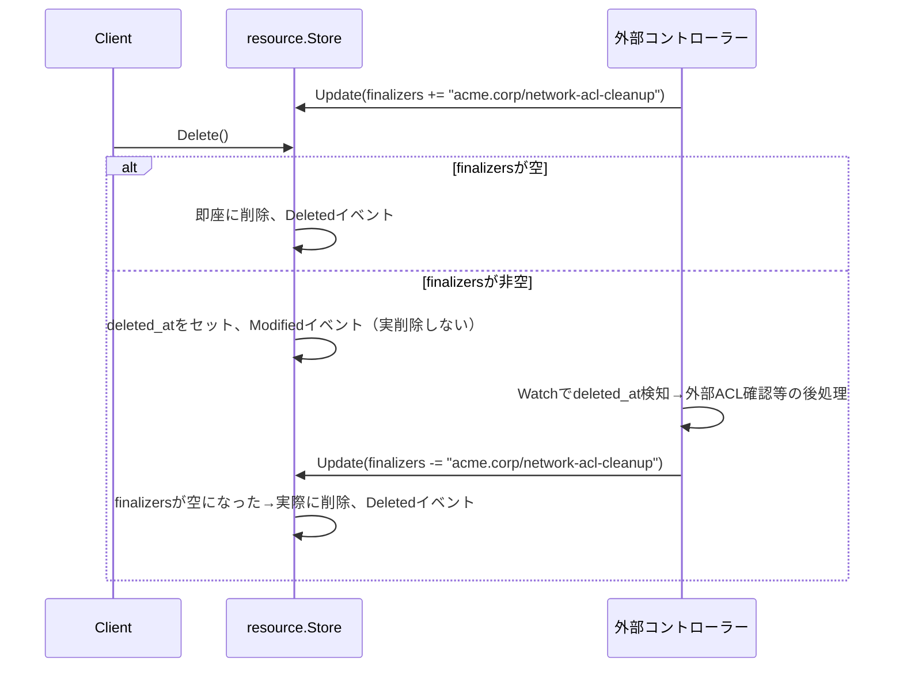

# kyuusha アーキテクチャ設計（ドラフト v0.2）

> ステータス: 実装は進行中（現状は[specs/](specs/README.md)、なぜこの設計かの
> 要約は[why-kyuusha.md](why-kyuusha.md)を参照）。本ドキュメントは
> 設計判断の経緯・議論・トレードオフの記録であり、更新は都度ではなく折に触れて行う。
> 目的: OpenStack同様のマイクロサービス分割によるIaaSの全体像を、他プロジェクト調査目的でまず固める。

## コンセプト

**kyuushaはKaaS(Kubernetes as a Service)の足回りに特化した小さいIaaS。**
IaaS→KaaS→PaaSという積み重ねの中で、VM単体を長期間ペットとして維持する前提を捨て、
KaaSクラスタのハイパーバイザーを供給することに機能を絞る。OpenStack(Nova/Neutron/Cinder)がフル機能を
持つのは「VMがそれ自体で最終利用者に長期間使われる」前提があるからで、kyuushaはその前提を持たない。

### 想定するユーザー像とスケール

大規模なプライベートクラウド基盤を自前で運用するような企業は対象にしない。ターゲットは
「OpenStackを導入するには大きすぎる（運用チームを抱えられない）が、VMwareは一定規模から
ライセンスコストが厳しくなる」という間に落ちる企業。この位置づけが、これまでの機能縮小判断
（ライブマイグレーション不要、フルテナントネットワーク不要、宣言的APIで運用負荷を下げる、等）の
根本的な動機になっている。

想定スケール（1デプロイ＝1リージョン相当）:

- ハイパーバイザー: 〜500台
- 仮想マシン: 〜1万〜2万台
- テナント(KaaSクラスタ): 〜500

この規模であれば、スケジューラの全ハイパーバイザー列挙、サービスごとの単一DB、NATSのheartbeat、
AZごとのVLANプール(4094)といった、これまでの設計判断はそのまま素直な実装で耐える
（検算は「スケジューラ設計」節および「ネットワーク分離の実現方式」節を参照）。
数千ハイパーバイザー・10万VM超のような1桁上のスケールを目指す場合は、スケジューラのキャッシュ/インデックス
戦略、DBの読み取りレプリカ/シャーディング、VLANプールのVXLANへのエスケープパスの実行、
といった前提の見直しが必要になる。

### スコープ縮小の判断

| 領域 | OpenStack | kyuushaでの扱い | 理由 |
|---|---|---|---|
| ライブマイグレーション | Novaの主要機能 | **不要** | ハイパーバイザー障害時の復旧はKaaS層(Pod再スケジュール)が担う。ハイパーバイザーはcattle |
| ディスク永続化 | Cinderがフル機能(スナップショット/レプリケーション等) | **最小限**。ルートディスクはイメージからのephemeral/copy-on-write。永続化が要る場合のみブロックデバイスをattach | VM自体の長期状態保持を前提にしない |
| テナントネットワーク | Neutronがフル機能(overlay per-tenant, router, floating IP, per-tenant security policy) | **最小限**。テナント＝KaaSクラスタ単位の**L2/L3分離のみ**担保。Pod間のマルチテナント分離はCNI/NetworkPolicy層(KaaS側)の責務 | KaaSクラスタ間が疎通しなければ良く、クラスタ内のテナント性はKaaS側の仕事 |
| 外部API設計 | REST、命令的CRUD+ポーリング、プロジェクトごとに規約バラバラ | **宣言的API**。spec/status分離、watch(ストリーミング)、resourceVersionによる楽観的並行性制御。ただしKubernetes CRD/Aggregated API Serverそのものにはしない(実装コストを抑える) | 利用者は人間ではなくKaaSのコントローラー。ポーリングではなくwatchで駆動したい |

## 設計原則: KubeVirtを反面教師にする

KubeVirtがデファクトになれなかった主因は、インターフェース設計ではなく
**VMのライフサイクル/リソースモデルをPod(コンテナ)のそれにそのまま押し込んだこと**にある、という前提に立つ。
具体的には virt-launcher pod によるVMのコンテナ包装、コンテナ向けresource requests/limitsでのvCPU/メモリ表現、
PVC/CDIというコンテナ向けボリューム抽象の流用、CNI(コンテナのnetwork namespace用)をtapデバイスに無理やり接続する構成、
そしてPod eviction前提を満たすためのライブマイグレーション必須化、が挙げられる。

**方針**: APIの見た目（宣言的・spec/status分離・watch・resourceVersion）はKubernetesから借りるが、
**リソースの意味論（オブジェクトモデル）はVMネイティブに独自定義する**。Pod/PVC/CNIのような
コンテナ用に設計された抽象へVMを押し込めない。具体的には：

- VirtualMachineは「Podに包まれたコンテナ」ではなく、compute-agentが直接VMMプロセス(Firecracker/libvirt)を管理する第一級リソース
- VirtualMachineのライフサイクルはコンテナのwaiting/running/terminatedではなく、VMネイティブな状態機械
  （例: `Pending → Scheduled → Provisioning → Running → Stopping → Stopped → Starting → Deleting`）で表現する
- vCPU/メモリはコンテナのresource requests/limitsを模倣せず、`VirtualMachineSpec`にVMの語彙でそのまま持つ
  （将来CPU pinning/NUMA/hugepagesが必要になっても、素直にspecフィールドとして追加できる形にする）
- ボリュームはPVC/CDIのようなコンテナ向け間接層を経由せず、block-storageサービスへの
  Attach/Detach操作として直接扱う
- ネットワークはCNI(コンテナのnetns接続用)を転用せず、network-agentがVMM(Firecracker等)のtapデバイスを
  直接プロビジョニングする
- ハイパーバイザー障害時にライブマイグレーションで穴埋めしようとしない。KaaS層がハイパーバイザー消失を検知して
  Pod再スケジュールする前提を崩さない（cattle前提を維持）

## 設計原則: 難しい分散システムの問題は自前で作らず、CNCF濃度の高い既製品に乗る

これまでの選定を振り返ると、認証(OIDC認証基盤)・認可(OPA)・非同期通信(NATS)・観測性
(Prometheus/OpenTelemetry)・P2P配信(Dragonfly)と、**ほぼ全てCNCFプロジェクトか
CNCF濃度の高いエコシステムに自然と収束している**。偶然ではなく、「枯れていて・Go親和性が高く・
特定ベンダーに縛られない」という選定基準を素直に適用した結果である。

判断基準は一貫している: JWT署名・OAuth2/OIDCフロー・ポリシー評価・分散合意・テレメトリ
パイプラインのような、**間違えると事故に直結する／車輪の再発明が高くつく領域**では、自前実装を
避けて既製品に乗る。逆に、VirtualMachineのライフサイクル状態機械やSagaの補償ロジックのような
**kyuusha固有のドメインロジック**は自前で設計する。新しいコンポーネントを選ぶ際は、
この軸（難しい分散システムの問題かどうか）で自作/既製品を判断する。

## 設計原則: 命名はOpenStackを踏襲しない

コンポーネント分割の対応関係はOpenStackを参考にするが、**リソース名・フィールド名は
OpenStackの実装都合に由来する用語をそのまま輸入しない**。実装の内部事情ではなく、
そのリソースが実際に何であるかを直接表す語を選ぶ。

| OpenStack用語 | 何の内部事情由来か | kyuushaでの表現 |
|---|---|---|
| Port | 仮想スイッチの差し込み口という実装比喩。実態はVirtualMachineに紐づくIP/MACを持つネットワークインターフェース | `NetworkInterface` |
| Instance / Server | 「サーバー」は曖昧（物理/仮想どちらとも取れる） | `VirtualMachine`（既存採用） |
| Flavor | 料理的比喩で意味が読み取れない。固定カタログという間接層自体もQuotaと役割が重複する | `VirtualMachineSpec.vcpu`/`memory_mb`を直接指定（当初`machine_class`という間接層で受けたが、Quotaで統制すれば固定カタログ自体が不要と判断し撤廃。「Quota設計」節参照） |

一方、`Volume`（ブロックストレージの塊）や`Subnet`（CIDRで区切られたネットワーク領域）は
OpenStack固有語ではなく業界共通語として十分直接的なため、そのまま使う。
新しいリソースを追加するたびに「この名前は実装都合の比喩になっていないか」を確認する。

## コンポーネント分割（OpenStack対応表）

| kyuushaコンポーネント | OpenStack対応 | 役割 |
|---|---|---|
| `identity` | Keystone | 認証・認可・テナント（＝KaaSクラスタ）・RBAC・トークン発行 |
| `image` | Glance | イメージのメタデータ管理＋ストレージ |
| `compute` | Nova | VirtualMachineのライフサイクル管理、スケジューリング、compute-agentとの非同期RPC。ライブマイグレーション等の高可用機能は持たない |
| `network` | Neutron | テナント(KaaSクラスタ)単位のネットワーク分離のみ。ルーター/floating IP/per-tenant security policyはスコープ外 |
| `block-storage` | Cinder | ボリュームの作成・attach・detachのみ。スナップショット/レプリケーションは当面スコープ外 |
| `api-gateway` | (Nova-api等の集約) | 外部(KaaS)向けgRPCエンドポイント集約、認証、ルーティング |

※ Object Storage(Swift相当)は当面スコープ外。まずはCompute+Network+Image+Identityで一周させる。

## リソースモデル / API規約

全サービス共通で、Kubernetesの思想（宣言的・spec/status分離・watch・楽観的並行性制御）を
**借用するが、CRD/Aggregated API Serverそのものは実装しない**。プロトコルはgRPC
（watchがサーバーストリーミングと相性が良く、Protobufの型付けがGoコントローラー実装と噛み合うため）。
人間向けの可読性が要る場面(デバッグ/CLI)は後付けで`grpc-gateway`によるREST層を検討する。

### リソース共通の型

```protobuf
message ObjectMeta {
  string id = 1;
  string name = 2;
  string tenant_id = 3;       // = KaaSクラスタ単位のテナント
  int64  resource_version = 4; // 楽観的並行性制御(更新時に一致確認)
  int64  created_at = 5;
  int64  deleted_at = 6;      // Delete呼び出し時に一度だけセット、以後不変。「Finalizer」節参照
  repeated string finalizers = 7; // 空でなければdeleted_at後も実削除をブロックする。同節参照
}

message Condition {
  string type = 1;    // 例: "Ready", "NetworkAttached"
  string status = 2;  // "True" | "False" | "Unknown"
  string reason = 3;
  string message = 4;
  int64  last_transition_at = 5;
}
```

### サービス共通のRPCパターン（例: VirtualMachine）

```protobuf
message NetworkAttachment {
  string subnet_id = 1;
  bool primary = 2; // spec.network_interfaces中、ちょうど1つがtrueであることをCreate時にバリデーション
}

message VolumeRequest {
  string volume_id = 1;   // block-storageで事前に作成済みのVolumeを参照（データボリューム）
  string device_hint = 2; // 省略可。指定時はデバイスパスの希望を伝える
}

enum VmmDriver {
  VMM_DRIVER_UNSPECIFIED = 0; // FIRECRACKERとして扱う
  FIRECRACKER = 1;
  CLOUD_HYPERVISOR = 2; // 2026-09-12までQEMU。実装の変遷はdocs/specs/cloud-hypervisor-boot.md参照
}

message PciDeviceRequest {
  string vendor_id = 1; // 例: "10de"（NVIDIA）
  string device_id = 2; // 例: "20b0"（A100）
  int32  count = 3;
}

message VirtualMachineSpec {
  string image_id = 1;
  int32  vcpu = 2;
  int64  memory_mb = 3;
  repeated NetworkAttachment network_interfaces = 4; // 1台のVirtualMachineに複数インターフェースを許容
  repeated VolumeRequest volumes = 5;  // データボリューム。ルートディスクは常にephemeral（下記「pet/cattleの区別を廃止」参照）
  // 6, 7: 2026-09-12に削除（recovery_policy, persistent_root_disk）。
  // 「pet/cattleの区別を廃止」節参照
  string user_data = 8;               // cloud-init user-data(YAML)。空なら注入しない。実用上64KB程度が目安の上限
  VmmDriver driver_hint = 9;          // 未指定ならFIRECRACKER。I/O性能やPCIパススルーが要るならCLOUD_HYPERVISORを明示指定
  repeated PciDeviceRequest pci_devices = 10; // GPU/SR-IOV NIC等。CLOUD_HYPERVISOR driver_hint時のみ有効
}

message VirtualMachineStatus {
  string phase = 1;           // Pending / Scheduled / Provisioning / Running / Stopping / Stopped / Starting / Deleting / Error
  repeated Condition conditions = 2;
  string hypervisor = 3;            // 配置先ハイパーバイザー
  // 4: 2026-09-12に削除（root_volume_ref）
  repeated string interface_refs = 5; // spec.network_interfacesと同順のNetworkInterfaceへの参照
  repeated string volume_attachment_refs = 6; // spec.volumesと同順のVolumeAttachmentへの参照
}

message VirtualMachine {
  ObjectMeta meta = 1;
  VirtualMachineSpec spec = 2;
  VirtualMachineStatus status = 3;
}

service VirtualMachineService {
  rpc Create(CreateVirtualMachineRequest) returns (VirtualMachine); // name(べき等キー)/dry_runを持つ。詳細は「API消費者の多様化に備える」節
  rpc Get(GetVirtualMachineRequest) returns (VirtualMachine);
  rpc List(ListVirtualMachinesRequest) returns (ListVirtualMachinesResponse);
  rpc Update(UpdateVirtualMachineRequest) returns (VirtualMachine); // resource_versionが不一致ならConflictエラー。dry_runを持つ
  rpc Delete(DeleteVirtualMachineRequest) returns (google.protobuf.Empty); // dry_runを持つ
  rpc Watch(WatchVirtualMachinesRequest) returns (stream VirtualMachineEvent); // ADDED/MODIFIED/DELETED
}
```

メトリクス（CPU/メモリ等）はこのAPIには含めない。`/metrics/resources`というPrometheus
エンドポイントとして別途公開する（詳細は「Observability」節）。

同じパターン(`ObjectMeta` + `spec/status` + `Create/Get/List/Update/Delete/Watch`)を
Subnet, NetworkInterface, Volume, VolumeAttachment, Image にも適用する。KaaS側のコントローラーは
Watchでresourceversionから再開しつつ、実stateをspecに収束させる（reconcileループ）。

### Watchの再開設計

`resource_version`はサービスごとの単調増加カウンタで、Create/Update/Deleteのたびに払い出す。
`WatchRequest`は`since_resource_version`を受け取り、サーバーはそれより新しい変更を
ADDED/MODIFIED/DELETEDとして再生してからライブストリームに切り替える（k8sのList+Watchと同じ発想）。

- **Bookmarkイベント**: 変更が少ないリソース種別でも再接続時に再Listせずに済むよう、
  一定間隔（例: 30秒）ごとにペイロードなしの`Bookmark{resource_version}`イベントを送る。
  クライアントはこれで再開位置を安全に前進させられる
- **履歴保持は無限にしない**: 各サービスは変更履歴を一定期間（例: 直近1時間分、または直近N件）だけ
  保持する。`since_resource_version`が保持範囲より古い場合は`Watch`が「再開不可、再Listせよ」という
  エラーを返す（k8sの410 Goneに相当）。クライアントは`List()`からやり直し、新しいスナップショットの
  `resource_version`から`Watch`を再開する

### API消費者の多様化に備える

現状KaaSコントローラーを主要な呼び出し元として設計してきたが、Terraformプロバイダや
AIエージェントによるリソース管理も将来の消費者になりうる。それぞれ専用のラッパー
（Terraformプロバイダ、MCPサーバー等）を今書くのは時期尚早だが、**どの消費者にも共通して効く
API規約上の改善**は今のうちに反映しておく。

- **Createにクライアント指定のべき等キーを持たせる**: 子リソースの決定的ID(`iface-<vm-id>-<index>`等)と
  同じ発想を、外部から呼ばれるトップレベルのCreate（VirtualMachine等）にも広げる。呼び出し元が
  `name`（または`idempotency_key`）を指定でき、同じキーでの再Createは「既に存在する」として
  安全に扱う。AIエージェントの重複呼び出しやTerraformの再applyに対する頑健性が上がる
- **`dry_run`をCreate/Update/Deleteに持たせる**: 既存のCreate時バリデーション（format対応、
  zone一致、quota判定）を、実際にコミットせず走らせるだけで実現できる。Terraformの`plan`、
  人間の確認を挟むAIエージェントのワークフロー、両方に効く
- **エラーを`Condition`と同じ形（`type`/`reason`/`message`）で構造化する**: 呼び出し元が
  「リトライすべきか」「別のアプローチを試すべきか」を機械的に判断しやすくする
- **gRPC Server Reflectionを有効にする**: 手書きのSDKなしに、ツールやエージェントが実行時に
  APIの形を発見できるようにする

自然言語からの意図解釈やTerraformプロバイダ/MCPサーバーの実装自体はkyuushaの層の外
（エージェント本体やラッパーツール側）の責務とし、ここでは踏み込まない。

### UI: 自前のWeb UIは作らない。CLIとGrafanaに任せる

OpenStackのHorizon(Web UI)を反面教師にする。Horizonは長年APIの新機能に追従できず機能が
遅れがちで、多くのOpenStack運用者がHorizonを使わずCLI/APIを直接叩いている、という実態が
ある。専用UIは「もう1つのプロダクト」を運用し続けることを意味し、想定ユーザー（小さい運用
チーム）にこそその負担が重くのしかかる。

- **CLIをまず作る**（`kubectl`/`terraform`的なもの）。gRPCの宣言的APIをラップするだけなので
  実装コストが低く、対象ユーザー（K8sに慣れた小規模運用チーム）にも馴染みやすい
- **ダッシュボードはGrafanaに任せる**。既に`/metrics`/`/metrics/resources`をPrometheus形式で
  公開しているため、フリート状況の可視化はGrafana側で組めば済む。自前のチャート描画UIは作らない
- 本当にWeb UIが必要になったら、Terraformプロバイダ/MCPサーバーと同じく「後で薄いラッパーとして
  作る」対象にする（クリーンなAPIがあれば安く作れる）。今は着手しない

### identityサービスのリソース: Tenant

`tenant_id`をあちこちのリソースで参照してきたが、その所有者である`Tenant`自体をここで定義する。
KaaSクラスタ1つに対応する。Quota（上限値）もここに持たせる（使用量の集計・強制は各リソース
所有サービスの責務。詳細は「Quota設計」節）。

```protobuf
message QuotaSpec {
  int32 max_vcpu = 1;                  // テナント合計
  int64 max_memory_mb = 2;             // テナント合計
  int64 max_volume_gb = 3;
  int32 max_vms = 4;
  int32 max_vcpu_per_vm = 5;      // 1台あたりの上限。固定カタログ廃止に伴う歯止め
  int64 max_memory_mb_per_vm = 6; // 1台あたりの上限
}

message TenantSpec {
  string display_name = 1;
  QuotaSpec quota = 2;
}

message TenantStatus {
  string phase = 1; // Active / Deleting / Error
  repeated Condition conditions = 2;
}
```

### Quota設計

Quotaの実体（vCPU/メモリ/Volume容量）はidentityではなくcompute/block-storageが持つ概念のため、
**制限値(`QuotaSpec`)はidentityが持つが、使用量の集計・強制は各リソース所有サービスが行う**
（サービス境界の原則をここでも維持する）。

強制ポイントは、「スケジューラ設計」節でHypervisorの`allocatable`/`allocated`を同一トランザクションで
更新した**予約パターンをそのままテナント単位に転用**する。

- compute/block-storageはそれぞれ自分のDBに`tenant_usage(tenant_id, used_vcpu, used_memory_mb,
  used_volume_gb, vm_count)`を持つ
- VirtualMachine/Volumeの`Create`時、対象テナントの`quota`をidentityへ同期Getで取得し、`tenant_usage`への
  加算とリソース作成を**同一トランザクション**で行う。使用量のライブSUM集計はしない
  （レースを避けるため、Hypervisor容量予約と同じ理由）
- 超過していれば**Create自体を同期的に`ResourceExhausted`エラーで拒否する**。VirtualMachineの
  ライフサイクル状態機械節で「quota超過」を`Error`フェーズへ倒す原因の一つとして挙げていたが、
  これは訂正する。quota判定はNetworkAttachmentのzone一致やImage/driver_hintのformat対応と
  同じ**Create時の同期バリデーション**であるべきで、doomedなVirtualMachineオブジェクトを一度作ってから
  `Error`にする必要はない
- 判定ロジック自体（`used + requested <= max`）はOPAのRegoルールとして表現し、認可判定と
  同じ基盤に乗せる
- **per-VM上限（`max_vcpu_per_vm`/`max_memory_mb_per_vm`）も同じCreate時バリデーションで
  チェックする**。固定カタログ(Flavor/machine_class)を廃止し`spec.vcpu`/`memory_mb`を自由記述に
  したため、テナント合計は余裕があっても1台が異常に巨大、という要求を防ぐ歯止めが要る。
  副次的に、物理ハイパーバイザーの最大キャパシティを超えるVirtualMachineをCreate時点で即座に拒否できる
  （`Unschedulable`のまま放置されるのを防ぐ）
- VirtualMachine/Volume削除時、同一トランザクションで`tenant_usage`を減算する

### computeサービスのリソース: Hypervisor

KaaS向けの公開APIではなく、スケジューリングのためのcompute内部管理対象。`Create`はcompute-agent
起動時の自己登録による内部専用RPCとし、外部へは`Get/List/Watch`のみ提供する（読み取り専用の
観測用途）。

```protobuf
message PciDevice {
  string pci_address = 1; // 例: "0000:3b:00.0"
  string vendor_id = 2;   // 例: "10de"（NVIDIA）
  string device_id = 3;   // 例: "20b0"（A100）
  bool   allocated = 4;
}

message HypervisorStatus {
  string phase = 1;                      // Ready / NotReady（heartbeatベース）
  string zone = 2;                       // Availability Zone。agentの自己登録時に申告
  int64  last_heartbeat_at = 3;
  int32  allocatable_vcpu = 4;
  int64  allocatable_memory_mb = 5;
  int32  allocated_vcpu = 6;             // Scheduled以上のVirtualMachineの予約合計
  int64  allocated_memory_mb = 7;
  repeated string supported_drivers = 8; // 例: ["FIRECRACKER", "CLOUD_HYPERVISOR"]
  repeated PciDevice available_devices = 9; // vfio-pci束縛済みのPCIデバイス在庫（GPU/SR-IOV NIC等）
}
```

### networkサービスのリソース: Subnet / NetworkInterface

「Network」と「Subnet」を分けない。テナント(KaaSクラスタ)は1つ以上の`Subnet`を持て、
それぞれが独立してVLAN IDを1つ払い出される（bastionのような多足構成は複数Subnetの作成で表現する）。

```protobuf
message SubnetSpec {
  string zone = 1;         // 必須。このSubnet(VLAN)が属するAvailability Zone
  string cidr = 2;         // 例: "10.0.1.0/24"
  string gateway_ip = 3;
  repeated string dns_servers = 4; // 未指定かつdns_suffix設定時はkyuushaの共有リゾルバIPを補完
  repeated string shared_with_tenant_ids = 5; // 他テナントへの経路共有を許可する意図の宣言（任意）
  string dns_suffix = 6;   // 空なら名前解決は拡張機能として無効。値を設定すると<vm名>.<dns_suffix>で解決可能になる
  string mesh_group = 7;   // 同じ値を持つSubnet同士（同一テナント限定）はデフォルト許可、という意図の宣言（任意、ACL強制はまだ実装なし。docs/specs/network.md参照）
  repeated string allocatable_ip_ranges = 8; // 例: ["10.0.1.10-10.0.1.20"]。空ならcidr全体（ネットワーク/ブロードキャスト/gateway_ip除く）
}

message SubnetStatus {
  string phase = 1;    // Pending(VLAN未払い出し) / Ready / Deleting / Error
  repeated Condition conditions = 2;
  int32  vlan_id = 3;  // 払い出し済みVLAN ID
}

message FirewallRule {
  string protocol = 1;    // tcp/udp/icmp
  string port_range = 2;  // 例: "22", "2379-2380"
  string source_cidr = 3;
  string action = 4;      // allow/deny
}

message NetworkInterfaceSpec {
  string vm_id = 1;
  string subnet_id = 2;
  repeated FirewallRule ingress_rules = 3; // 自Subnet CIDR外からはデフォルト拒否。SecurityGroupのような別リソースは介さない
}

message NetworkInterfaceStatus {
  string phase = 1;    // Pending / Binding(IPAM割当+tap配線中) / Ready / Rebinding(SELF_HEAL再バインド中) / Deleting / Error
  repeated Condition conditions = 2;
  string ip_address = 3;
  string mac_address = 4;
  string hypervisor = 5;     // 現在tapが配線されているハイパーバイザー
}
```

`tenant_id`(`ObjectMeta`)は`Subnet`単位で持ち、同一テナントのVirtualMachineだけがその`Subnet`の
`NetworkInterface`を作成できる。異なるテナントのSubnet間の非疎通性は、VLANタグそのものではなく
**ゲートウェイ側のVRF分離とルートリーク禁止**によって担保する（誤りの訂正含め、詳細は
「ネットワーク分離の実現方式」節）。

**VLAN IDの払い出し**: VLAN IDプールはzoneごとに独立して持つ（同じVLAN番号を別zoneで再利用できる。
副産物として4094の上限もzone数倍まで実質緩和される）。`Subnet`作成時、networkサービス内でDB操作のみで
該当zoneのプールから空きIDを排他的に払い出す（ハイパーバイザーagent不関与、同期で完結）。プール枯渇時は
`Subnet`が`Pending`のまま`Condition{type: VlanPoolExhausted}`を報告する。

**マルチAZにまたがるVirtualMachineは作れない**: `VirtualMachineSpec.network_interfaces`が参照する全`Subnet`の
`zone`は一致していなければならない（Create時にバリデーションし、異なれば拒否）。1台のVirtualMachineは
物理的に1ハイパーバイザー上でしか動かないため当然の制約。マルチAZ冗長性が欲しいテナントは、AZごとに別々の
`Subnet`を作り（`tenant_id`は同じ）、VirtualMachineごとにどちらのzoneに置くかをKaaS側が選ぶ形で表現する。
これによりkyuusha側に新しい仕組みは不要。

### block-storageサービスのリソース: Volume / VolumeAttachment

`Volume`はVirtualMachineより長生きしうる独立リソース、`VolumeAttachment`はVirtualMachineとVolumeの結びつきを
表す一時的なリソース。NetworkInterfaceと同じ「結びつきそのものをリソースにする」パターン。

```protobuf
message VolumeSpec {
  int64 size_gb = 1;
}

message VolumeStatus {
  string phase = 1; // Pending(バックエンド確保中) / Ready / Deleting / Error
  repeated Condition conditions = 2;
}

message VolumeAttachmentSpec {
  string volume_id = 1;
  string vm_id = 2;
  string device_hint = 3; // 省略可
}

message VolumeAttachmentStatus {
  string phase = 1; // Pending / Attaching / Attached / Detaching / Deleting / Error
  repeated Condition conditions = 2;
  string device_path = 3; // 実際に割り当てられたデバイスパス
  string hypervisor = 4;
}
```

`VolumeAttachment`のIDも決定的に生成する: データボリュームは`volattach-<vm-id>-<index>`
（`spec.volumes`のindex基準）、ルートディスクは`volattach-<vm-id>-root`。

ルートディスクを`Volume`/`VolumeAttachment`で表現する(`persistent_root_disk`)案も検討したが、
2026-09-12に見送った（下記「pet/cattleの区別を廃止」参照）——ルートディスクは常に
block-storageを経由せず、compute-agentがVMMドライバ経由でイメージから直接ephemeralな
ディスクを作る。

### imageサービスのリソース: Image

FirecrackerはQEMU(qcow2をまるごとブート)と異なり、BIOS/GRUBを持たずLinuxカーネルバイナリを
直接ロードし、rootfsをvirtio-blockの別デバイスとして渡す方式で起動する。そのため「Image」は
駆動するVMMドライバによって中身が変わる。

```protobuf
enum ImageFormat {
  IMAGE_FORMAT_UNSPECIFIED = 0;
  KERNEL_ROOTFS = 1; // カーネル+rootfsのペア（直接カーネルブートする軽量VMM全般用。Firecracker固有ではない）
  QCOW2 = 2;          // 自己完結ディスクイメージ（QEMU/libvirt/cloud-hypervisor等用）
}

message ImageArtifact {
  string url = 1;    // https(s)等、外部の配信元URL。kyuushaはこれを一切コピー保管しない
  string digest = 2; // sha256:...。取得後の整合性検証に使う
}

enum ImageVisibility {
  IMAGE_VISIBILITY_UNSPECIFIED = 0; // PRIVATE扱い
  PRIVATE = 1; // 既定: 所有テナント + shared_with_tenant_idsのみ参照可
  PUBLIC = 2;  // 全テナントから参照可（shared_with_tenant_idsは無意味）
}

message ImageSpec {
  ImageFormat format = 1;
  ImageArtifact kernel = 2; // KERNEL_ROOTFS時のみ
  ImageArtifact rootfs = 3; // KERNEL_ROOTFS時のみ
  ImageArtifact disk = 4;   // QCOW2時のみ
  string boot_args = 5;     // 直接カーネルブート用の引数（例: "console=ttyS0 reboot=k panic=1 root=/dev/vda rw"）
  ImageVisibility visibility = 6;
  repeated string shared_with_tenant_ids = 7; // visibility == PRIVATE時のみ意味を持つ
}

message ImageStatus {
  string phase = 1; // Pending(URL到達性/digest検証中) / Ready / Deleting / Error
  repeated Condition conditions = 2;
  int64  size_bytes = 3; // 判明していれば
}
```

**Create時のバリデーション**: VirtualMachineが参照する`Image.spec.format`は、`VirtualMachineSpec.driver_hint`が
要求するVMMと対応していなければならない（`KERNEL_ROOTFS`は`FIRECRACKER`・`CLOUD_HYPERVISOR`
どちらでも可、`QCOW2`は`CLOUD_HYPERVISOR`のみ——同じ`KERNEL_ROOTFS`資産を両ドライバが
それぞれの直接カーネルブート機構で起動できるため、
[cloud-hypervisor起動仕様](specs/cloud-hypervisor-boot.md)参照）。不一致ならCreate時に拒否する。
フォーマット変換（自動トランスコード）は行わない。イメージの作成者（運用者、あるいはKaaS側の
イメージビルドパイプライン）が対象driverに合った形式で公開する前提とする。

**マルチテナント対応**: `visibility=PUBLIC`、または`PRIVATE`のまま`shared_with_tenant_ids`に
列挙することで、所有テナント以外からもGet/List/Watch/VM Create時の参照ができる（Update相当の
`SetVisibility`とDeleteは常に所有テナントのみ）。詳細は[Image仕様](specs/image.md)
「マルチテナント対応（可視性/共有）」参照。

**ストレージ: 必須の外部依存にしない**。VolumeとImageは性質が違う。Volumeは「排他的に1台の
VirtualMachineへattachされる可変ブロックデバイス」だが、Imageは常に**外部でビルドされる不変
アーティファクト**（スナップショット由来ではない。kyuusha自体はVolume/VirtualMachineのスナップショット
からのイメージ作成をサポートしない）。

`Image`は`ImageArtifact{url, digest}`という**外部URLへの参照＋整合性検証用digest**を持つだけの
メタデータ層に徹する。`url`にインターネット上の配信URLを直接指定するだけで完結し、追加インフラは
一切不要（＝外部依存ではない）。imageサービスはCreate時にURL到達性とdigestを軽く検証する程度に
留まり、`driver_hint`との`format`対応バリデーションのみ担う。

privateにホストしたい組織のみ、**任意の外部依存**としてS3互換オブジェクトストレージ（MinIO等）を
自前で立てて`url`をそこに向けることができる。kyuusha側に特別な対応は不要（`url`が何を指しているかを
区別しないため、公開URLと同じコードパスで動く）。block-storageの`StorageBackend`は流用しない。
詳細は「インフラ要件」節の「任意の外部依存」を参照。

**ハイパーバイザー間の軽量ピアフェッチ（外部依存ではなく組み込み機能）**: 同じImageを多数のcompute hypervisorが
取得する際、毎回`url`へ直接アクセスすると負荷集中やAZ跨ぎのトラフィックが発生しうる。
kyuusha自身に軽量なピアフェッチを組み込む。

- compute-agentはheartbeat（`ms.compute.evt.<hypervisor>.heartbeat`）に「自分がキャッシュ済みの
  digest一覧」を含めて報告する
- computeサービスはこれを`Hypervisor`の状態の一部として保持する
- compute-agentはキャッシュミス時、まずcomputeサービスに「このdigestを持つハイパーバイザーは？
  （同一zone優先）」を問い合わせ、いれば**そのハイパーバイザーから直接HTTP転送**する（LAN速度）。
  いなければ次段（Dragonfly、または`ImageArtifact.url`）へフォールバックする
- 取得後は自分もそのdigestを持つハイパーバイザーとしてheartbeatで報告し、以降のピアフェッチに応答できる
  ようになる

ただし軽量ピアフェッチで解決できるのは「フリート内の誰かが一度取得済みのImageを、別ハイパーバイザーが
再取得する」ケースに限られる。**「フリート全体にとって初めてのImageを、多数のハイパーバイザーが同時に
必要とする」ケース（バルクVirtualMachine作成×新規Image。KaaSクラスタの新規構築・スケールアウト・
イメージロールアウトという、このプロジェクトの主要ユースケースそのもの）には全く効かない**。
誰も持っていないdigestなので、ピアフェッチが不発に終わり、N台が同時に`url`（origin）へ直接
殺到する「thundering herd」が起きる。速度の問題ではなく、**origin側の負荷問題**である点に注意。

### Dragonfly導入（バルク作成×新規Imageのための必須級コンポーネント）

上記の弱点を埋めるため、**Dragonfly（CNCF、Go製のP2P配信システム）を採用する**。
「必要になったら判断する」という先送りではなく、「バルク作成×新規Image」という具体的な
トリガー条件を満たす本番運用では、事実上必須級の推奨構成として位置づける。

```
                    ┌──────────────────────┐
                    │ Dragonfly Manager/    │  ← 新しいコントロールプレーン
                    │ Scheduler             │     （どのpeerがどのpeerから
                    └──────────┬────────────┘      取得すべきかを調停）
                                │
        ┌───────────────────────┼───────────────────────┐
        ▼                       ▼                       ▼
   ┌─────────┐            ┌─────────┐             ┌─────────┐
   │compute  │            │compute  │             │compute  │
   │-agent + │◀──chunk単位のP2P配信──▶│-agent + │◀───────▶│-agent + │
   │dfdaemon │            │dfdaemon │             │dfdaemon │
   └─────────┘            └─────────┘             └─────────┘
        │
        └──（誰も持っていないchunkのみ）──▶ ImageArtifact.url（origin）
```

- 各compute hypervisorに**Dragonflyのpeerデーモン(dfdaemon)**をcompute-agentと並走させる
  （ブロックストレージのiSCSI/NVMe-oFイニシエータと同じ「ハイパーバイザーに常駐する補助プロセス」の扱い）
- compute-agentのImageCachedステップは、軽量ピアフェッチがミスした場合、`url`への直接フェッチ
  ではなく**ローカルのdfdaemon経由**でフェッチする
- **chunk単位のP2P配信**なので、誰かが完全にダウンロードし終わるのを待たずに、他ハイパーバイザーは
  既に取得済みのchunkからすぐ拾い始められる。originへのリクエストは実質「1回分の完全
  ダウンロード」相当に抑えられ、N台が同時に多重リクエストする事態を避けられる
- 軽量ピアフェッチは廃止せず、Dragonflyが導入されていない/使えない環境向けの
  フォールバックとして残す（`url`直接フェッチとの間に位置づける）

**pre-stagingとの接続**: 以前保留した「pre-staging」も、この構成なら全ハイパーバイザーへの事前配布ではなく
**少数の"seedピア"へだけ事前配布**すれば十分になる。新Image公開時に1〜数台のseedへ流し込んで
おけば、あとはバルク作成時にswarmが自然に広げてくれる。全ハイパーバイザー配布よりずっと安上がり。

**Provisioningフェーズへの反映**: 「VirtualMachineのライフサイクル状態機械」節の`Provisioning`で
挙げた`Condition`（NetworkReady/VolumesReady/Started）に**`ImageCached`を追加**する。
compute-agentはVMM起動前に、(1)対象ハイパーバイザーのローカルキャッシュ（digestキー）を確認し、
(2)無ければ軽量ピアフェッチで他ハイパーバイザーから取得を試み、(3)それも無ければDragonfly経由（未導入
環境では`ImageArtifact.url`へ直接）フェッチする。いずれの経路でも取得後は`digest`で整合性を
検証してからローカルキャッシュに乗せる（任意の外部URLを信頼する以上、検証は必須）。
初回ハイパーバイザーでの初回起動は数GBのpullが発生し得るため、Provisioningの所要時間は常に一定ではない
（キャッシュ済み/ピアフェッチ/Dragonfly配信中なら速い）。

**ephemeralルートディスクの実体**: ルートディスクは常にephemeral（下記「pet/cattleの区別を
廃止」参照）。compute-agentはハイパーバイザーにキャッシュ済みのrootfsブロブを
**VirtualMachineごとにcopy-on-writeクローン**し
（CoW対応ファイルシステム上での`reflink`コピー等）、それをvirtio-blockとしてFirecrackerに渡す。
共有キャッシュ本体には書き込まず、VirtualMachine削除時にクローンだけを破棄する。

**エビクションポリシー（LRU＋参照カウント除外＋サイズ閾値）**: コンテナイメージキャッシュや
CDNエッジキャッシュで実績のある標準的なパターンをそのまま借用する。

- 稼働中のVirtualMachineがCoWクローンの元にしているdigestは、参照がある限りエビクション対象外
- 参照されていないキャッシュ済みdigestのうち、最終使用時刻が古いもの（LRU）から削除対象にする
- キャッシュディレクトリのサイズがハイパーバイザーごとの設定閾値（例: 割り当て容量の80%）を超えたら、
  LRU順に未参照digestを削除して閾値を下回るまで繰り返す
- 最終使用時刻の管理はcompute-agentのローカルな帳簿で十分（ハイパーバイザーごとに独立したキャッシュなので、
  DB/`resource_version`を経由させる理由がない）

**Pre-staging: 専用のpushスケジューラ/ポリシーエンジンは作らず、可視性を提供する**。
全ハイパーバイザーへ積極的にpushする専用機構は自作しない（Dragonflyのseedピア機構がこの役割を担う。
前節参照）。

- ハイパーバイザーごとのキャッシュ済みdigestは、既存の`/metrics`（システム向け）にゲージとして公開する
  （例: `kyuusha_hypervisor_image_cached{hypervisor,digest} 1`）。`resource_version`/Watchには混ぜない、
  という前回のメトリクス設計と同じ理由で、DB経由の正式なAPIリソースにはしない
- 全ハイパーバイザーへの事前配布ではなく、少数の"seedピア"へだけ事前配布すれば、あとはDragonflyの
  swarmが自然に広げてくれる（前節参照）
- 将来ハイパーバイザー単位の個別pre-staging APIが必要になれば、コンソールアクセス（`AttachConsole`）で
  導入した「compute↔compute-agent間の直接gRPC」という抜け道をそのまま拡張点として使える
  （新しい経路は増やさない）

### イメージ作成体験: OCI/Dockerイメージのエコシステムを活用する

Dockerエコシステムが成功したのは`docker commit`のようなスナップショット型のイメージ作成では
なく、**Dockerfileという宣言的・再現可能なビルドレシピ＋レイヤーキャッシュ＋レジストリ**の
組み合わせによるものと捉える。kyuushaでも同じ考え方を採用し、**VM/VirtualMachineのスナップショットから
Imageを作る機能はサポートしない**（既述の通り）。Firecracker自身が持つスナップショット機能
（VMメモリ+vCPUレジスタ+デバイス状態の丸ごとシリアライズ/再開）は実在するが、これは
**コールドスタート短縮のためのwarm boot専用機能**として位置づけ、Image作成の手段としては
使わない（`docker commit`が非推奨であるのと同じ理由: 再現性が無く中身を追跡できないImageを
量産してしまう）。

代わりに、`KERNEL_ROOTFS`フォーマットの**rootfs部分の中身をDockerfile/OCIイメージでそのまま
定義できるようにする**。

- ユーザーは通常のDockerfileを書き`docker build`する（既存のベースイメージ・レイヤーキャッシュ・
  レジストリがそのまま使える）
- kyuusha CLIに`kyuusha image build`のようなサブコマンドを用意し、OCIイメージのレイヤーを
  フラット化してext4のrootfsに変換、対応するカーネル（kyuushaが用意する少数の推奨カーネルから
  自動選択、または明示指定）とペアにして`ImageArtifact`を発行、`Image`リソースのCreateまで
  一気通貫で行う（`docker build && docker push`相当の体験を1コマンドに）
- この変換ツールはkyuusha側の新サービスではなく**CLI側の薄いツール**として位置づける
  （「UI: 自前のWeb UIは作らない」節と同じ判断基準。既存のOCIツールチェインを呼び出すだけで、
  難しい分散システムの問題ではないため自作しても矛盾しない）
- `QCOW2`(QEMU向け、ブートローダー込みの自己完結ディスク)は根本的に別フォーマットのため、
  この変換パスの対象外とする。Packerのqemuビルダーのような別ツールが担当する領域として
  無理に統一しない

### UserData注入: NoCloud seed disk

**実装済み**（`internal/compute-agent/fcvmm/seed.go`、`docs/specs/firecracker-boot.md`
「UserData注入」節参照）。当初iso9660（`genisoimage`）、次にvfat（`mtools`）で作って
みたが、playgroundが使うFirecracker CI配布カーネルの`vmlinux`には
`CONFIG_ISO9660_FS`も`CONFIG_VFAT_FS`も入っておらずゲスト側でどちらもマウントできない
ことがライブ検証（2回とも）で発覚した。最終的に**ext4**（`mkfs.ext4 -d`——
`docker/Dockerfile`の`image-assets`ステージがrootfs自体を作るのに既に使っている手法の
再利用）に切り替えた。ext4はこのカーネルで確実に使えるうえ、cloud-initのNoCloud
データソースは`blkid`でラベルを見つけたあとファイルシステム型を指定せず汎用マウントする
ため、実運用のcloud-initからも問題なく読める（vfat/iso9660限定ではない）。playgroundの
最小自作Alpineゲストには実際のcloud-initが入っていないため、ライブ検証はseed diskが
正しく届いて読めることの確認に留まる（本物のcloud-initを動かすには重量なゲスト
イメージが要る。「この実装がカバーしないもの」参照）。

KaaSがVirtualMachineに初期設定（kubeadm joinスクリプト、SSH公開鍵等）を渡す手段として、
**cloud-initのNoCloud seed disk方式**を採用する。AWS/OpenStack Nova流の
HTTPメタデータサービス（`169.254.169.254`への特別ルーティング）は採用しない。
理由は、compute hypervisorごとのルーティング細工と常駐する応答サービスという追加の可動部を
必要とするため。seed disk方式なら、compute-agentがVM起動直前にローカルで完結して
生成できる（`cidata`ラベル付きのvfat/iso9660イメージに`user-data`＝`spec.user_data`、
`meta-data`＝最小限の`instance-id`/`local-hostname`を書き込み、root diskと並ぶ追加の
virtio-blockデバイスとしてFirecrackerへ渡す）。cloud-initのNoCloudデータソースは
CD-ROM限定ではなく`cidata`ラベルの付いた汎用ブロックデバイスを読めるため、
Firecracker(virtio-block限定、CD-ROMエミュレーションなし)でも問題なく機能する。

ゲスト側の`Image`のrootfsに**cloud-initが事前インストール済み**であることが前提
（イメージビルド側の責務、kyuushaは強制しない）。新しい待機用`Condition`は増やさず、
seed disk生成は既存の`Started`ステップに含める（高速なローカル処理のため）。

**機密情報の扱いに関する注記**: `user_data`はSSH鍵やjoinトークンのような機密情報を
含みうる。転送経路自体はmTLS/JWTで保護されるが、compute側のDBへの保存時暗号化や
ログ・監査証跡からの除外は実装時に検討する（本格的なSecrets管理サブシステムは今は設計しない）。

**IP設定もこのseed diskに相乗りさせる（DHCPは使わない）**: `NetworkInterface.status.ip_address`は
既にnetworkサービスが把握しているため、DHCPサーバーを別途動かさず、seed diskに`network-config`
（cloud-initの静的ネットワーク設定フォーマット。IP/ゲートウェイ/DNSサーバーを指定）として
そのまま書き込む。新しいプロトコルを持ち込まず、user_data注入と同じ経路に相乗りさせる。

### Subnet内のDNS/名前解決: 拡張機能として、networkサービスが権威DNSを兼ねる

IPだけで足りる利用者もいるため、DNSは**Subnetごとのオプトイン拡張機能**とする。
`SubnetSpec.dns_suffix`が空なら無効、値を設定すると有効になる（`dns_enabled: bool`のような
別フラグは作らない。「有効だがsuffix未設定」という無効な状態を作らないため）。suffixに
グローバルな既定値は用意せず、**ユーザーが完全に自由記述する**（間接層を避ける命名原則と一貫）。

`NetworkInterface`の作成/削除イベントは既にnetworkサービスが把握しているため、これを
**そのままDNSレコードの原本とする**。別途「DNSレコード」というリソースは新設しない。

- networkサービス自体（またはそのサイドカー）が、DNSを有効化しているSubnetについてのみ、
  権威DNSリゾルバとしてDNSポートも待ち受ける
- `dns_suffix`が設定されているSubnetに限り、`<vm名>.<dns_suffix>` →
  `NetworkInterface.status.ip_address`を、DB上のNetworkInterfaceレコードから直接引いて
  応答する（PTRレコードも同様）
- 実装はdnsmasq/BINDのような重量級ミドルウェアではなく、**Go実装の軽量DNSレスポンダ**
  （例: `miekg/dns`ライブラリ）で十分。これは認証やポリシー評価のような「難しい分散システムの
  問題」ではなく単純なDB参照サービスなので、「難しい問題は既製品に乗る」原則には反しない自作判断

**リゾルバの到達性は物理側では常時オン**: 新しい仕組みは作らず、「テナント間でのSubnet共有」節で
決めた**共有NATゲートウェイと同じルートリークの仕組み**に相乗りさせる。個々のテナントが
DNSをソフトウェア側で有効化しているかどうかに関わらず、共有リゾルバへの経路は常時全VRFへ
リークしておく（物理ファブリック側の設定をソフトウェアのON/OFFに追従させる結合を避けるため）。
`dns_suffix`が設定され`dns_servers`が未指定のSubnetでは、この共有リゾルバのIPを
`dns_servers`のデフォルト値として補完する。社内の既存DNSを使いたいテナントは上書き可能。

## レイヤー構造

```
                          ┌───────────────┐
     KaaSコントローラー →│  api-gateway   │  (gRPC, 宣言的API: Create/Get/List/Update/Delete/Watch)
                          └───────┬───────┘
        ┌─────────────┬──────────┼──────────┬─────────────┐
        ▼             ▼          ▼          ▼             ▼
   ┌─────────┐   ┌─────────┐┌─────────┐┌─────────┐  ┌─────────────┐
   │identity │   │  image  ││ compute ││ network │  │block-storage│
   └────┬────┘   └────┬────┘└────┬────┘└────┬────┘  └──────┬──────┘
        │             │          │          │              │
        │        各サービス専用DB(share-nothing)             │
        │             │          │          │              │
        └─────────────┴──────────┼──────────┴──────────────┘
                                  │ NATS JetStream (非同期RPC/イベント)
                                  ▼
                         ┌─────────────────┐
                         │  compute-agent   │  (各ハイパーバイザーハイパーバイザーに配置)
                         │  ┌────────────┐  │
                         │  │ VMM driver │  │  ← Firecracker(第一候補) / libvirt
                         │  └────────────┘  │
                         └─────────────────┘
```

compute-agentは複数ハイパーバイザーに分散配置される前提で設計する（スケジューラ、ハイパーバイザー死活監視、
ハイパーバイザーごとのVLAN/tap配線が既にこれを前提にしている）。「単一ホストで動かす」は別モードではなく、
単にハイパーバイザー数が1のマルチハイパーバイザー構成にすぎない。開発時の単一ホスト起動も同じコードパスで賄う。

## 通信方式

- **KaaS → api-gateway → 各コントロールプレーンサービス**: gRPC(宣言的API)。api-gatewayが`identity`でトークン検証し、後段サービスへルーティング
- **コントロールプレーン間**（例: compute→network, compute→image, compute→block-storage）: 下記の原則に従う
- **コントロールプレーン → ハイパーバイザー上のagent**（compute-agent, network-agent等）: NATS JetStream経由の非同期RPC。**サービス境界を跨がない**（例: computeがnetwork-agentへ直接NATSで指示することはしない。必ず相手サービスのgRPC APIを経由する。所有権＝どのサービスのDBが正であるかを常に一意にするため）。agentは対応するsubjectをsubscribeし、処理結果を別subjectでpublishして状態を反映。各サービスはこの状態変化を自身のWatch RPCとしてクライアントへストリーム配信する

### 原則: 書き込みは常に同期・高速、収束は常に非同期・Watch

コントロールプレーン間の呼び出しを個別に同期/非同期判断するのではなく、操作の性質で一律に決める。

| 呼び出し内容 | 方式 |
|---|---|
| 相手サービスのDB上の状態を読む/書く（物理側作業を伴わない） | 同期gRPC (`Get/List/Create/Update/Delete`)。ハイパーバイザーagentが絡まないため常に高速 |
| 物理側の作業完了を知りたい（例: tapデバイス配線完了、実ボリュームattach完了） | 非同期。相手サービスの`Watch`を購読し、`status.phase`の変化を検知する |
| あるサービスのハイパーバイザーagentへの指示 | そのサービス自身の内部NATSのみ。他サービスから直接は触らない |

例（compute→network、VirtualMachine作成時のネットワークインターフェース確保）:
1. compute → network: `CreateNetworkInterface()` を同期gRPC呼び出し。networkはDBに`NetworkInterface{status.phase: Pending}`を書き込み即座に返す（agent不関与、ミリ秒オーダー）
2. computeのVirtualMachineコントローラーはnetwork側の`NetworkInterface`を**Watch**し、`status.phase == Ready`になるまで待つ
3. IPAM割り当て→対象ハイパーバイザーのnetwork-agentへNATSで指示→tapデバイス配線完了→`status`更新、という内部処理は完全にnetworkサービス内で閉じており、computeはその実装を意識しない

`spec.network_interfaces`が複数ある場合、上記1〜3を各エントリに対して並行に実行し、全てが`Ready`になってから`Provisioning`を次に進める。

ブロッキングして完了を待ちたいクライアント（CLI等）には、「Create→Watchで待つ」ヘルパー関数をクライアント側に用意すればよく、API自体を同期にする必要はない（kubectlの`--wait`と同じ発想）。

### NATS JetStream: subject/stream設計

サービス境界を跨がない前提（＝あるサービスと、その自身のハイパーバイザーagent群の間だけで閉じる）のもとで設計する。

**subject命名規則**: `ms.<service>.<方向>.<hypervisor>.<resource-type>.<verb>`

- コマンド（control-plane→agent）: `ms.compute.cmd.<hypervisor>.vm.create` / `ms.network.cmd.<hypervisor>.interface.bind` など
- イベント（agent→control-plane、結果報告・heartbeat）: `ms.compute.evt.<hypervisor>.vm.create-result` / `ms.compute.evt.<hypervisor>.heartbeat`

**ストリームと配信保証**: 性質が異なるので2種類のストリームに分ける。

| ストリーム | 対象subject | Retention | 配信保証 |
|---|---|---|---|
| `<SERVICE>_CMD` | `ms.<service>.cmd.>` | WorkQueue（一度消費されたら消える） | at-least-once。agentは処理完了ではなく**受理**時点でack。冪等な決定的ID（`iface-<vm-id>-<index>`等）により再配送されても安全に再適用できる |
| `<SERVICE>_EVT` | `ms.<service>.evt.>` | Limits（max-age短め、例: 24時間） | heartbeatはack不要のfire-and-forget（次の送信が数秒後に来るので1回の欠落は無害）。結果報告イベントはat-least-onceで、受信側（control-plane）はresource_versionで冪等に反映する |

### 原則: 失敗時のロールバックはSagaパターン（2PCはやらない）

各サービスがDBを個別に持つ以上、サービス跨ぎの分散トランザクション(2PC/XA)は採用しない
（運用コストが高く、「物理完了は非同期Watchで確定する」というモデルとも整合しない）。
代わりに、子リソースを作った側（オーケストレーター）が失敗時に明示的な補償Deleteを行う
**オーケストレーション型のSaga**を採用する。これは特別な仕組みではなく、通常の削除フロー
（`Deleting`状態でのreconcile）と同じコードパスで実現する。

- オーケストレーター（例: VirtualMachine）は、作成した子リソースへの参照を自分の`status`に記録する
  （例: `status.interface_refs`, `status.volume_refs`）
- 後続ステップが失敗したら、記録済みの参照を使って子リソースを補償Delete（VirtualMachine自体は削除しない）。
  完了確認後、VirtualMachineは`phase: Error`に留まり、`status.conditions`に失敗理由を記録する。
  VirtualMachine自体の削除はKaaSが明示的に`Delete()`を呼ぶまで発生しない（詳細は次節「VirtualMachineのライフサイクル状態機械」）
- **クラッシュ耐性**: 「子リソースの`Create`はgRPC的に成功したが、オーケストレーターが
  `status`に参照を書く前にクラッシュした」場合の孤児化を防ぐため、子リソースIDは
  呼び出し元が決定的に生成する（例: `iface-<vm-id>-<index>`。1台のVirtualMachineが複数の
  NetworkInterfaceを持てるため、`spec.network_interfaces`内のindexまで含めて一意にする）。
  再起動後に同じIDで`Create`を再送すれば、相手サービスは「既に存在する」として何もせず返す（べき等）。
  これによりcompute側は安全に`status.interface_refs`を復元できる
- **最終防衛線としてのGC**: べき等リトライでも救えない孤児（オーナー自体が消失した場合等）に備え、
  各サービスは「参照元が存在しない/削除済みのリソース」を定期的に検出して掃除するガベージコレクタを持つ
  （k8sのownerReference + GCコントローラーと同じ発想）。実行間隔は10分に1回程度の定期スイープで十分
  （即時性は不要。孤児は既に無害化されている状態のクリーンアップに過ぎないため）。検出ロジックは
  「`vm_id`を持つ子リソース(NetworkInterface/VolumeAttachment)について、computeへ`Get`し
  `NotFound`が返れば削除」というシンプルな参照チェックで良い

## VirtualMachineのライフサイクル状態機械

VM自体の状態（起動中/停止中）と、依存リソース（NetworkInterface/Volume attachment）の
準備状況を混ぜず、phaseは粗く保ち、詳細は`status.conditions`で表現する。
「粗いphase＋詳細conditions」というパターン自体はKubernetesの設計から借用するが、
状態の中身（各phaseの意味）はVMネイティブに定義する（KubeVirtのようにコンテナの
waiting/running/terminatedをそのまま持ち込まない）。

### Phase一覧

| Phase | 意味 | 駆動主体 |
|---|---|---|
| `Pending` | VirtualMachine作成直後。未スケジュール | compute(スケジューラ) |
| `Scheduled` | 配置先ハイパーバイザー決定（`status.hypervisor`確定） | compute(スケジューラ) |
| `Provisioning` | NetworkInterface/Volume attachment確保待ち→compute-agentへのVM作成指示。`status.conditions`に`NetworkReady`/`VolumesReady`/`Started`が積まれる | compute-agent |
| `Running` | agentがVM起動を確認 | compute-agent |
| `Stopping` | `Stop` RPC要求。compute-agentへ`StopCommand`（`force`込み）を送信 | compute-agent |
| `Stopped` | agentが停止（プロセス終了）を確認（`vm.stop-result`）。NetworkInterface/Volume attachment、および根本ディスク（jail/runディレクトリ）は保持したまま | compute-agent |
| `Starting` | `Start` RPC要求。純粋に一時的なphaseで、reconcile()が同じreconcile呼び出し内でProvisioningまで進める（下記補足） | compute |
| `Deleting` | ユーザーがDelete要求（どのphaseからでも遷移可）。VM破棄→子リソース補償削除 | compute-agent → compute |
| `Error` | 回復不能な失敗。子リソースの補償削除は完了済みだが、VirtualMachine自体は削除せず留まる（理由調査のため） | compute |

### 遷移図

```
Pending ──(scheduler割当)──▶ Scheduled ──▶ Provisioning ──▶ Running
                                  ▲            │  │              │
                                  │            │  └─(致命的失敗)─▶ Error
                                  │            │                  │
                                  │            │              Stopping ──▶ Stopped
                                  │            │                  │           │
                                  │            │             (Stop失敗)   (Start要求)
                                  │            │                  │           │
                                  │            ▼                  ▼           ▼
                                  │       Provisioning(再入) ◀── Starting ◀───┘
                                  └────────────┘(Stop失敗はRunningへ差し戻し、上記とは別経路)

(Pending/Scheduled/Provisioning/Running/Stopping/Stopped/Starting/Error のどこからでも)
        │
        ▼
    Deleting ──▶ (リソース削除・DELETEDイベント)
```

### 補足

- **実装（2026-09-12、`Stop`/`Start` RPC）**: `VirtualMachineService.Stop(vm_id, force)`/`Start(vm_id)`の
  2 RPCのみ追加。`reboot`/`hard-reboot`はサーバー側に対応するRPCや状態を一切持たない、CLIだけの
  組み合わせ（`kyuusha vm reboot` = `Stop`→`Stopped`になるまでポーリング→`Start`、
  `hard-reboot`は`Stop(force=true)`版）。
  - `Stop`: `Running`のみ許可（`FailedPrecondition`でそれ以外を拒否）。`Stopping`へ遷移し、
    `force`は`status`上の一時フィールド（`StopForce`、wireには出さない）としてreconcile()の
    Watchループへ橋渡しするだけの実装上の都合——恒久的なVM状態ではない。reconcile()が
    `StopCommand{vm_id, force}`をcompute-agentへ発行し、agentは対応するVMMドライバの
    `Stop(vmID, force)`（`force=false`ならSIGTERM→猶予期間→SIGKILL、`true`なら即SIGKILL）を
    **プロセスの実終了を待ってから**`vm.stop-result`イベントで返す。成功で`Stopped`、
    失敗（プロセスが実際には終了していない）は`Running`へ差し戻す
  - `Start`: `Stopped`のみ許可。`Starting`は純粋に一時的なphaseで、reconcile()は
    `PhaseScheduled`と全く同じ処理（`provisionAndPublish`）を`Starting`にも流用する——
    新規のNATSコマンド種別は無く、既存の`CreateCommand`をそのまま再構築して送るだけ
    （VMの`status.interface_refs`/`volume_attachment_refs`は既に保持済みなので、
    NetworkInterface/VolumeAttachmentは同名で再Create＝冪等に再取得されるだけで、
    実際に新規作成はされない）
- **Stopped→再起動はProvisioningへの再入**: Firecracker/cloud-hypervisorはプロセス単位のVMMなので、
  Stop=プロセス終了、Start=新規プロセスで同じNetworkInterface/Volume attachmentを再利用して
  VM作成、という扱いになる（同一プロセス継続は前提にしない。ライブマイグレーション不要判断と一貫）。
  根本ディスク（jailer/chvmmが確保する書き込み可能rootfsコピー）はStopでは一切削除されず、
  Startで再利用される（`fcvmm`/`chvmm`の`Boot()`が既存rootfsの有無を見て分岐）——
  Firecracker側は加えて、jailer自身が「既にセットアップ済みのchroot」を受け付けない
  （`/dev/net/tun`等のmknodがEEXISTで失敗する）ため、rootfsだけを外へ退避してchroot
  全体を作り直し、rootfsだけ戻す、という一手間が要る（`internal/compute-agent/fcvmm`のBoot()参照）
- **Deleteは根本ディスクを含めて完全に破棄する**: Stopとは非対称に、VMMドライバの`Destroy(vmID)`
  （`Stop`とは別の新規メソッド）が、プロセス停止に加えてjail/runディレクトリそのものを
  `os.RemoveAll`する。以前はどのコードパスもこのディレクトリを削除しておらず、Delete後も
  ディスクの実体が永久にリークし続ける実バグがあった（2026-09-12発見・修正、`handleDelete`が
  呼ぶメソッドを`Stop`から`Destroy`へ変更）
- **NetworkInterfaceとVolumeで削除方針が非対称**: `Deleting`時、NetworkInterfaceはVirtualMachine専用に作られた
  リソースなので完全削除する。一方Volumeは VirtualMachineより長生きしうる独立リソースなので、
  Volume自体は消さず`VolumeAttachment`（結びつきの部分）だけ削除する
  （`spec.volumes[].delete_on_termination`のようなフラグで例外的にVolumeごと削除する余地は将来検討）
- **Errorへ倒す基準**: ネットワーク瞬断のような一時的失敗は無限にリトライする（reconcileループの通常動作）。
  イメージ不存在・スケジューリング不能・agentからの恒久的失敗報告など、有限回数以内に
  自然回復しないと判断される失敗のみ`Error`にする（quota超過はCreate時の同期バリデーションで
  拒否するため、VirtualMachineが生成されてから`Error`になることはない。「Quota設計」節を参照）
- **ハイパーバイザー喪失時、VMは何もしない(2026-09-12確認・決定)**: 死活監視
  （`sweepHypervisorHealth`）はHypervisor自身の`status.phase`を`NotReady`にするだけで、
  そのHypervisor上のVMには一切触れない——`Running`のまま固まる。かつて構想していた
  「`recovery_policy: SELF_HEAL`なら別ハイパーバイザーへ自動再スケジュール、`NONE`なら
  `Error`+`HypervisorUnreachable`」という分岐はどちらも実装されなかった。`recovery_policy`
  自体を削除したので「pet/cattleの区別を廃止」参照——復旧はKaaS側（例:
  Cluster APIのMachineHealthCheck）またはオペレータの手動対応に委ねる、という判断

## Finalizer: 外部システムによる削除ブロック

### きっかけ: OpenStackでの外部システム連携の難しさ

OpenStack運用の実体験から、2種類の異なるニーズが浮かび上がった。(1)「VM起動が
終わったら自社CMDBに登録する」「IPが払い出されたらネットワーク台帳に登録する」
のような**通知系**の連携と、(2)「VM作成前に独自バリデーションを追加する」
「VM削除時、そのインターフェースのIPが外部のネットワークACLにまだ残っていたら
削除を拒否する」のような**ゲート系**の連携。前者はOpenStackのRabbitMQ notification
（取りこぼしが起きうる、resumeできない）で対応するしかなく運用上つらい。後者に
至っては、Nova/Neutronにはそもそも標準の拡張点がなく、パッチを当てるかポーリングで
外側からDBを見に行くような無理のあるやり方しかなかった。

kyuushaでは、この2つを別の仕組みとして素直に解決する。

- **通知系**: 既存のWatch（`resource_version`からの再開）で十分。OpenStackの
  notificationと違い取りこぼしても再開できるため、新しい仕組みは要らない
- **ゲート系（Delete側）**: 本節で説明する**Finalizer**（Kubernetesの同名パターンを
  そのまま借用）
- **ゲート系（Create側）**: ValidatingAdmissionWebhook相当の仕組みが要るはずだが、
  同期的な外部呼び出しの分だけ可用性のカップリング・timeout/failure policy設計・
  「誰がwebhookを登録できるか」というセキュリティ面まで検討が必要で、Finalizerより
  一段複雑。設計自体は今後の課題として明示しておくが、本パスでは実装しない

### 仕組み

`ObjectMeta`に`finalizers`（不透明な文字列のリスト）を追加する。`Delete`は
`finalizers`が空なら（今まで通り）即座に削除する。空でなければ、`deleted_at`を
セットして**実削除はせず**、`Modified`イベントとして扱う（`Deleted`イベントは
まだ出さない）。`deleted_at`は一度セットされたら二度と消せない——Updateでどんな
値を送ってきても、サーバー側が保持している値をそのまま維持する。

外部コントローラーは、対象リソースの生成時（またはいつでも）自分の名前
（例: `"acme.corp/network-acl-cleanup"`）を`finalizers`にUpdateで追加しておく。
Watchで`deleted_at`が付いたオブジェクトを見つけたら、自分の後処理（外部ACLの
確認など）を行い、完了したら自分のエントリだけを取り除いてUpdateを呼ぶ。
`finalizers`が空になった時点で、そのUpdate呼び出しの中で実際に削除され、
`Deleted`イベントが出る。



**新しい通信路もRPCも要らない**: 既存のWatch/Updateだけで表現できる。
**フェイルセーフ**: 外部コントローラーが落ちていれば、単に削除がブロックされ
続けるだけ（誤って削除が進むことはない）。この2点が、admission webhookより
先にFinalizerから着手する理由——低コストでリターンが大きい。

### 汎用実装、今のところVirtualMachineだけが使う

`finalizers`/`deleted_at`の処理自体は`internal/resource.Store`（全リソース共通の
汎用実装）に入っており、どのリソース型でも使える。ただし現時点で実際に
Finalizerを使う経路が存在するのはVirtualMachineのみ（`compute.Service.Delete`が
Finalizer存在時に`status.phase = Deleting`へ遷移させてからstore.Deleteを呼ぶ）。

**既知の穴**: Subnet/NetworkInterface/Volumeの各`Delete`実装は、VLAN/IPプールの
解放や`tenant_usage`の減算を「Deleteが呼ばれた時点で」無条件に行っている。これらの
型に将来Finalizerを付けると、オブジェクト自体はまだ存在している（Finalizer待ち）
のに、プール割当だけ先に解放されてしまう整合性の穴がある。今のところこれらの型に
Finalizerを付ける経路が無いため実害はないが、対応は個別に必要。

**Finalizerの所有権（実装済み）**: `Finalizer`は`{name, added_by}`の構造体で、
`added_by`は追加した呼び出し者の実JWT `sub`がサーバー側で刻む値であり、クライアント
が指定した値は常に無視される（`compute.Service.Update`の`checkFinalizerMutation`）。
削除は「`added_by`と同じ`sub`」または「admin ロール」のみ許可し、それ以外は
`ErrValidation`で拒否されFinalizerはそのまま残る——ただし`added_by`が空文字列
（このplumbing導入前に付いたエントリ、あるいはapi-gatewayを経由しない内部呼び出し
から付いたエントリ）のときは所有者不在として誰でも削除できる、後方互換のための
例外。

この`sub`は api-gateway でしか手に入らない（JWT検証はapi-gatewayだけが行う）ため、
`internal/authn/propagate.go`のgRPC**クライアント**インターセプター
（`PropagateCallerUnaryInterceptor`/`PropagateCallerStreamInterceptor`）が
`authn.FromContext`で読んだ呼び出し元の`sub`・admin判定を信頼済みgRPCメタデータ
（`x-kyuusha-caller-sub`/`x-kyuusha-caller-admin`）としてbackendへ転送する。
`cmd/api-gateway/main.go`の5つのbackend dialすべてに1度だけ付与すればよく、
各thin proxyのコード変更は不要——受信済みcontext（Claims付き）がそのまま
`p.backend.XXX(ctx, req)`経由でクライアントインターセプターまで流れるため。
backend側は`authn.CallerSubFromContext`/`CallerIsAdminFromContext`で読む。これは
新しい認証機構ではなく、「backendはapi-gatewayを無条件に信頼する」という既存の
境界防御モデル（[認証・認可とHypervisor登録](#認証認可とhypervisor登録)節の
mTLS follow-upと同じ前提）の延長でしかない。

現状これを使うのはVirtualMachineのFinalizer削除のみだが、`sub`/admin判定自体は
汎用のメタデータ転送なので、将来他の細粒度認可にもそのまま使い回せる。

**大規模Watchへの対応（実装済み）**: 外部コントローラーが自分のFinalizerを
確認するためだけに、テナント内の全VMをWatchして自前でフィルタするのは
スケールしない（500テナント・2万VM規模を想定すると特に）。`internal/resource.Store.Watch`
に汎用の`matches func(T) bool`フィルタ引数を追加し（リプレイ分・ライブ分の両方に
適用）、`compute.Service.Watch`はこれを使って`finalizer_name`が空でなければ
「現在の`meta.finalizers`にその名前を含むVMだけ」に絞り込む
（`WatchVirtualMachinesRequest.finalizer_name`、`kyuusha vm watch -finalizer-name=...`）。

このフィルタは「今まさにその名前のFinalizerを持っているか」で評価されるため、
自分がFinalizerを追加してから、削除がリクエストされて`deleted_at`が付き、
自分がFinalizerを外すまでの一連の変化はすべて観測できる——ただし自分が
最後にFinalizerを外した瞬間（またはadmin/`added_by`空文字列の後方互換経路で
他者に外された瞬間）以降のイベントはフィルタ対象から外れる。前者は呼び出し元
自身の操作の結果なので同期的なUpdateの戻り値で分かるため実害はないが、後者
（自分の知らないところで外された）はこのフィルタでは検知できない、という
既知の限界がある。

`deleted_at`はprotoの`ObjectMeta`に元々あった「論理削除(任意)」というコメント付きの
未使用フィールドをそのまま転用した——新しいフィールドを増やす前に、既にある
休眠フィールドの意図を確認して再利用する形にした。

## 認証・認可とHypervisor登録

### 認証の実装方針: プロトコルの正しさは著名なOSSに任せる

JWT署名・OAuth2/OIDCフロー・鍵ローテーションは自前実装が事故に直結する領域であり、車輪の
再発明はしない。NATS/NVMe-oF選定と同じ「軽量な既製品に乗る」姿勢を踏襲する。

- **トークン発行**: `identity`サービス自身にOAuth2/OIDCプロトコルを実装させず、外部のOIDC認証基盤に
  委ねる。求める要件は「カスタムクレーム（`tenant_id`必須、`role`は任意）をトークンに追加できること」
  のみで、特定製品を前提にしない。`identity`はkyuusha固有の概念（tenant=KaaSクラスタ、quota）を持つ
  薄いラッパーに留める。api-gateway側の鍵検証方式（固定公開鍵/JWKS）を含む具体的な実装は
  [認証・認可仕様](specs/authn-authz.md)を参照
  （訂正: 当初はDexまたはORY Hydra限定でKeycloakは運用コストを理由に不採用としていたが、
  検証側をJWKS対応に汎用化したため製品を問わない要件へ改めた）
- **KaaS→api-gateway（南北）**: 発行されたJWTをapi-gatewayが公開鍵でローカル検証する（毎リクエストで
  identityへ問い合わせない。「書き込みは同期・高速」の原則と同じ理由）。claimに`tenant_id`を含め、
  以降の認可判定に使う
- **サービス間・compute-agent↔compute（東西）**: mTLS。各サービス/各ハイパーバイザーがinternal CA
  （identityサービスが軽量CAを兼ねる）発行の証明書を持つ。内部トラストなので証明書によるサービス
  アイデンティティ確認のみとし、bearerトークンは重ねない

  **実装済みなのはこの簡略版**: `internal/mtls`が全サービス共通の相互TLS認証を提供する
  （`-tls-cert`/`-tls-key`/`-tls-ca`、既定はdev用の共有証明書一式`hack/devcerts/`）。ただし
  identityがCAを兼ねて各サービス/各ハイパーバイザーに個別の証明書を動的発行する、という上記の
  設計そのものはまだ無く、全サービスが同じ1枚の共有証明書（SANに全サービスのホスト名を列挙）を
  使い回している。したがって「これはcomputeである」「これはhypervisor-3である」という
  サービス/ハイパーバイザー単位のアイデンティティ確認はできず、証明できるのは「何らかの正規の
  kyuushaサービスであること」だけ——直後の「内部サービス間の最小権限」がまだ無いのと同じ理由で、
  現状の被害範囲限定効果は「外部ネットワークからの盗聴・なりすましを防ぐ」までに留まる。

  **2026-09-11、ハイパーバイザーについては上記の本格PKIを不採用と確定**（運用コストの重い
  自前実装を避けるkyuusha全体の路線と合わないため）。代わりにbootstrapトークン
  （`internal/bootstraptoken`）だけを軽く拡張し、個体識別・失効を実現した——ただし将来の
  `Register`を拒否するだけで、既存セッションの強制切断はできない。詳細は
  [Hypervisor登録・死活監視仕様](specs/hypervisor-bootstrap.md)「個体識別と失効」参照。
  per-service/per-hypervisor証明書の動的発行は、bootstrapトークン検証（後述）と合わせて
  今後の課題。

### 認可の実装方針: OPAで判定ロジックを分離する

判定ロジック（誰が何をできるか）を各サービスにハードコードせず、**OPA(Open Policy Agent)を
Goライブラリとして埋め込む**（別サービスを立てず`open-policy-agent/opa/rego`を直接import）。
ポリシーをRegoとして宣言的に書けるため、後から粒度を変える変更コストが低い。

### 認可の粒度: テナント×R/Wをベースラインに、直交する2軸を追加する

「テナント×R/W」は妥当なベースラインだが、それとは独立した軸が最低2つ要る。

1. **admin/operatorロール（テナント横断）**: hypervisor bootstrapトークンの発行、VLANプール管理、
   テナント(KaaSクラスタ)自体の作成/削除は「テナントの中の権限」ではなく完全に別スコープ。
   テナント軸を細分化するのではなく直交する別ロールとして持たせる
2. **内部サービス間の最小権限（テナント軸と無関係）**: mTLSは「どのサービス/ハイパーバイザーが呼んでいるか」の
   認証は保証するが、「computeはnetworkの`CreateNetworkInterface`は呼べるが`DeleteSubnet`は
   呼べない」といった認可は別途要る。内部コンポーネントが侵害された場合の被害範囲を絞るためのもの

外部（KaaSコントローラー向け）APIについて、テナント内でリソース種別ごとに細かく権限を分ける
（VirtualMachineは書けるがVolumeは読むだけ、等）のは時期尚早と判断する。主要な外部クライアントは
KaaSコントローラー1つで、自クラスタの全リソース種別を管理する必要があるため分割の実利が薄い。
OPA採用によりこの「今は粗く、後で細かく」という判断は先送りでき、認可基盤自体を作り直す必要はない。

「後で細かく」する際の具体的な設計方針（テナント内ロール・リソース単位の所有権・
サービス種別スコープのadmin・グローバルread-onlyという4つの軸、それぞれの実装場所と
トレードオフ）は[認証・認可仕様](specs/authn-authz.md)「将来の拡張」節にまとめてある。
2026-09-11に軸1（`tenant_role=viewer`）と軸3（`role=storage-admin`、block-storageサービス
のみにscopeしたadmin相当）を実装。2026-09-13には軸3を`role=network-admin`
（同じ形でnetworkサービスにscope）へ拡張し、新しい軸4として`role=viewer`
（全テナント・全サービス横断のread-only、"監査役"ロール）を追加した——テナント内admin
（`tenant_role`に3値目を足す案）は、既定のテナントメンバーと区別する具体的な追加権限が
無かったため見送った。これらはいずれも「リソース種別ごとに細かく分ける」という
上記の判断を覆すものではなく、静的に列挙した少数の役割を足しただけ（動的なカスタム
ロール定義は検討の上、実装・レビューコストが一桁大きいため見送った）。軸2
（リソース単位の所有権）はまだ未実装で、具体的な要求が出た時点で着手する。

### Hypervisor自己登録とzone割当

ハイパーバイザーが自分でzoneを申告する方式は改ざん耐性がないため採用しない。kubeadm joinと同様の
ブートストラップフローを採用する（コンテナ固有のオブジェクトモデルではなく、この種の
ブートストラップ手法として一般的に妥当なため借用）。

1. 運用者がハイパーバイザープロビジョニング時に、**zoneスコープ付きのbootstrapトークン**を発行する
   （`kyuusha hypervisor bootstrap-token create -zone=rack3`）
2. トークンをcloud-init/PXE経由でハイパーバイザーに埋め込む
3. compute-agentが初回起動時、このトークンを使ってcomputeの内部専用`RegisterHypervisor`RPCを呼ぶ
4. computeはトークンを検証し、**トークンに紐づくzoneをそのままHypervisorのzoneとして採用**する
   （ハイパーバイザー自身の自己申告は信用しない）。同時に、以後の通信用mTLSクライアント証明書を発行して
   ハイパーバイザーへ返す
5. 以降の通信はこの証明書によるmTLSで認証される。bootstrapトークンは使い捨てで登録後に失効する

**実装済みなのは1〜4のうち、zoneの検証部分のみ**（`internal/bootstraptoken`、
[Hypervisor登録・死活監視仕様](specs/hypervisor-bootstrap.md)参照）。トークンは
`internal/authn`の開発用JWT署名鍵をそのまま再利用したzoneクレーム付きJWTで、
`RegisterHypervisor`は必須パラメータとしてこれを検証し、**トークンのzoneクレームだけを
信頼する**（リクエスト自体はもうzoneフィールドを持たない）。使い捨て（single-use/失効）
ではない——同じzoneに複数台配備する運用ではトークンを毎回使い捨てにする方が
かえって不自然なため、意図的に「zoneスコープの検証」だけに絞った。ステップ4後半の
「以後の通信用mTLSクライアント証明書を発行」は実装していない——現状のmTLS
（`internal/mtls`）は全サービス共通の事前生成証明書のみで、ハイパーバイザー単位の
識別はできない（「認証・認可とHypervisor登録」節のmTLS所感と同じ制約）。

## スケジューラ設計

`Pending`の`VirtualMachine`に配置先ハイパーバイザーを決め`status.hypervisor`を設定し`Scheduled`へ遷移させる、
computeの内部処理。Nova流のfilter+weigherパイプラインのような複雑な仕組みは持ち込まず、
最小限のフィルタと単一のデフォルト戦略で開始する（YAGNI）。

### サイジングとdriverは`VirtualMachineSpec`から直接読む

固定カタログ（Flavor/machine_class）は廃止した（「設計原則: 命名はOpenStackを踏襲しない」節）。
`spec.vcpu`/`spec.memory_mb`をそのままリソース要求量として使い、`spec.driver_hint`
（未指定なら`FIRECRACKER`）をそのままdriver要求として使う。中間の設定テーブルを経由しない分、
フィルタもシンプルになる。

### フィルタ（ハード制約）

1. `Hypervisor.status.phase == Ready`
2. `spec.driver_hint`（未指定なら`FIRECRACKER`）が`Hypervisor.status.supported_drivers`に含まれる
3. `allocatable - allocated >= spec.vcpu / spec.memory_mb`
4. `Hypervisor.status.zone`が、VirtualMachineが参照する`Subnet.spec.zone`と一致する
5. `spec.pci_devices`が指定されている場合、要求を満たす未割当の`PciDevice`（`vendor_id`/`device_id`一致）が
   `Hypervisor.status.available_devices`に十分な数だけ存在する（詳細は「PCIデバイス(GPU等)パススルー」節）

（当初VLAN到達性はフィルタから除外できると考えたが誤りだった。EVPN-VXLANによるL2ストレッチは
1つのAZ内のファブリックに閉じ、AZを跨いでは繋がない設計に修正したため、zone一致は必須のフィルタになる。
詳細は「ネットワーク分離の実現方式」節）

### ピック（デフォルト戦略）

```go
type SchedulingStrategy interface {
    Pick(candidates []*Hypervisor, req ResourceRequest) (*Hypervisor, error)
}
// デフォルト: 空き容量が最も多いハイパーバイザーを選ぶ(スプレッド)
// 特別な失敗ドメイン/ラック認識をしなくても、同一KaaSクラスタのVirtualMachineが
// 1ハイパーバイザーに偏るのを自然に抑制できる
type MostAvailableFirst struct{}
```

複数戦略が必要になったら`SchedulingStrategy`を差し替えられる、という程度の抽象化に留める。

### 予約とレース対策

ハイパーバイザー選定と同時に、同一トランザクションで`Hypervisor.status.allocated_vcpu`/`allocated_memory_mb`を
加算し、VirtualMachineの`status.hypervisor`を書いて`Scheduled`へ遷移させる。複数VirtualMachineの同時スケジューリングは
`resource_version`による楽観的並行性制御で検出し、衝突時は候補を選び直してリトライする。
割当てできるハイパーバイザーがない場合は`Pending`のまま`Condition{type: Unschedulable, reason: InsufficientCapacity}`
を報告し続け、「Errorへ倒す基準」に従う。VirtualMachineが削除/失敗した際は予約を解放する
（`allocated_*`を減算）。`spec.pci_devices`を指定したVirtualMachineの場合、該当する`PciDevice.allocated`も
同一トランザクションで`true`に設定し、排他的に予約する（GPUは同時に1台のVirtualMachineにしか
パススルーできないため。VolumeAttachmentの排他制御と同じ発想）。

## PCIデバイス(GPU等)パススルー

**Firecrackerは原理的にPCIパススルーができない。** virtio-pciではなくvirtio-mmioという
最小限のデバイスモデルを採用しており、そもそもゲストにPCIバスを見せない設計（攻撃面を減らす
ためのFirecracker自身の意図的なトレードオフ）。したがってGPU/PCIパススルーは
**cloud-hypervisor/libvirt側（VFIO）でのみ**成立し、`driver_hint: CLOUD_HYPERVISOR`を
選ぶ既存の仕組みにそのまま乗る。

`Hypervisor.status.available_devices`（vfio-pci束縛済みのPCIデバイス在庫）と`VirtualMachineSpec.pci_devices`
（`vendor_id`/`device_id`/`count`を直接指定）は、GPUだけでなくSR-IOV NIC等にも使い回せる
汎用設計にしてある。デバイスIDは実ハードウェアのPCI ID(ベンダーID/デバイスID)そのものであり、
`machine_class`のような実装都合の間接カタログではないため、「avoid indirection」の命名原則にも反しない。

設計の型を用意しただけで、実装は当面のTODOとする（GPUワークロードの具体的な需要が
出てから着手すれば良い）。

## ハイパーバイザー死活監視とリカバリ（2026-09-12: 自動リカバリは見送り、下記参照）

ハイパーバイザーの死活監視自体は実装済み（`sweepHypervisorHealth`、
`internal/compute/hypervisor_service.go`）:

- compute-agentは自ハイパーバイザーの生存をNATS経由で定期的にheartbeatする
- compute側が最終heartbeat時刻を追跡し、閾値超過で該当ハイパーバイザーを`NotReady`と判定する

ただし**`NotReady`になったハイパーバイザー上のVirtualMachineには何もしない**（`Running`のまま
固まる）——かつては`recovery_policy: SELF_HEAL`を機能させるためにここから先（該当ハイパーバイザー
上の全VirtualMachineを新ハイパーバイザーへ再スケジュール）を実装する計画だったが、下記の
フェンシング問題の重さと、そもそもこの責務をkyuushaが負う価値自体を2026-09-12に再検討し、
実装しないことに決めた——詳細は「pet/cattleの区別を廃止」参照。以下はその検討時に残った
設計メモ（歴史的記録）。

### 未解決だった危険: フェンシング問題

heartbeat途絶は必ずしも「VMが停止した」ことを意味しない。ネットワーク分断でheartbeatだけ届かず、
実際には旧ハイパーバイザーでVMが動き続けているケースがあり得る。この状態で新ハイパーバイザーにVirtualMachineを作り直すと、
同一Volumeの二重アタッチ（データ破損）や同一IPの二重払い出しが発生しうる。

最低限の対処として、block-storage側で「同一Volumeの同時アタッチ拒否」の排他制御を持たせ、
新ハイパーバイザーでの再アタッチ要求は旧ハイパーバイザーでの明示的なdetach確認が取れるまでブロックする必要がある。
ネットワーク（IP/NetworkInterfaceの再バインド）についても同様の排他が要る。
確実なフェンシング（旧ハイパーバイザーの強制電源断など）を伴わない限り、`SELF_HEAL`は
「二重起動よりは可用性を優先する」というトレードオフを内包することを明記しておく。

**将来の選択肢として検討中**: ブロックプロトコル（iSCSI/NVMe-oF）を使う場合、
SCSI Persistent Reservation（SCSI-3 PR）というストレージ側のフェンシング機構が
使える可能性がある——新ハイパーバイザー側が排他予約を奪うと、旧ハイパーバイザー側からの
書き込みをストレージ自体が拒否するようになる、Pacemaker等の本物のHAクラスタが実際に
使っている枯れた方式。ただし「厩舎はプロビジョニング/接続を運用者に委ねる」という
上記「block-storageのバックエンド抽象化」節の訂正後の責務境界とどう整合させるかは
未検討（ストレージ側の機能に依存するため、厩舎から一律に使えるとは限らない）。

**具体的な排他制御**: `VolumeAttachment`は「ある`volume_id`について`Deleting`以外のphaseのものが
同時に1つまで」という制約をblock-storageのDB上でユニーク制約として持たせる。新ハイパーバイザーへの
`CreateVolumeAttachment()`は、旧`VolumeAttachment`が`Detaching`→削除済みになるまで`Pending`のまま
`Condition{type: WaitingForOldAttachmentRelease}`を報告し続ける。`NetworkInterface`の`Rebinding`も
同様に、旧ハイパーバイザーでのtap取り外し確認（compute-agentからのNATS経由の確認応答、またはハイパーバイザー自体の
`NotReady`確定後の一定grace period経過）を待ってから新ハイパーバイザーへのtap配線を許可する。

## pet/cattleの区別を廃止（2026-09-12）

Stop/Start実装（上記「VirtualMachineのライフサイクル状態機械」参照）を機に、そもそも
セルフヒール(`recovery_policy: SELF_HEAL`)が必要かどうかを改めて検討し、
`recovery_policy`・`persistent_root_disk`・`status.root_volume_ref`の3フィールドを
まとめて削除することにした。

**きっかけ**: この3フィールドは実装当初からずっと、Create時バリデーション以外のどこからも
参照されていなかった（`recovery_policy`はCreate時に`UNSPECIFIED`を拒否するだけ、
`persistent_root_disk`/`root_volume_ref`はgRPCの型変換コードのみ）。ハイパーバイザー
死活監視（`sweepHypervisorHealth`）も、Hypervisor自身の`status.phase`を`NotReady`に
するだけでVMには一切手を触れない。つまり`recovery_policy`は「Create時に選ばされるだけで、
選んだ後は何の意味も持たない」フィールドだった。

**判断: セルフヒールはkyuusha自身が引き受ける責務ではない**:

1. **ワーカーノード用途**: 一般的なKaaS管理レイヤー（例: Cluster APIの
   `MachineHealthCheck`）が、ノードの死を検知したら`Machine`を削除→再作成し、
   それがIaaS側のVM Delete→Createを自動的にトリガーする、という自己修復ループを
   **既に持っている**。kyuusha自身が同じことを二重に持つ意味は薄い
2. **control-plane VM用途（etcd/PKIサーバ等、本来の`SELF_HEAL`の動機）**: これも
   実際にはetcd自身のクォーラム/メンバーシップ機構やPKIサーバのバックアップ運用で
   対処するのが一般的で、「IaaSがVMの死を検知して勝手に同じVMを再作成する」という
   粒度の自動化は、この用途でもあまり一般的ではない
3. どちらの用途でも、上記「未解決だった危険: フェンシング問題」が示す通り、
   本物のフェンシング（IPMI/BMC経由の強制電源断、SCSI-3 PR等）を欠いた自動リカバリは
   二重起動によるデータ破損リスクを内包する。このリスクを引き受けてまで実装する
   価値が、上記1.・2.の理由により薄いと判断した

**削除した3フィールド**: `recovery_policy`（`RecoveryPolicy`列挙体ごと）、
`persistent_root_disk`、`status.root_volume_ref`。ルートディスクは常にephemeral
（ハイパーバイザーローカル、Stop/Startでは保持されるがDelete/ハイパーバイザー喪失で
消える）という単一のモデルになった。永続化したいデータは明示的に`Volume`を
アタッチする、という既存の経路のみを残す。

**フューチャーワーク: ボリュームブート**: 削除した`persistent_root_disk`とは別に、
「ルートディスクとして既存の`Volume`を明示的に指せる」という、より素直な形の
永続ルートディスク機能は将来検討の余地がある。ただし今回廃止した自動フェンシングは
含めない——ハイパーバイザー障害をオペレータが確認した後、同じVolumeを指す新しいVMを
**手動で**Createし直す、という運用を想定する（フェンシング役を人間が担うことで、
kyuusha自身は二重起動リスクを負わない）。まだ設計していない、独立した設計課題として
扱う。

## ネットワーク分離の実現方式（KaaSクラスタ間）

テナント＝KaaSクラスタ単位のL2/L3分離を、**VLAN(802.1Q)をデフォルト方式**として実現する。

### なぜVXLANではなくVLANか: 二重オーバーレイ問題

KaaS側のCNI（Calico/Cilium/Flannel等）もPod間通信でVXLAN/Geneveのようなオーバーレイを使うことが多い。
kyuushaのテナント分離も同様にVXLANで実現すると、CNIのオーバーレイの中にkyuushaのオーバーレイが
さらに入る**二重カプセル化**が発生し、ヘッダオーバーヘッド・MTUの二重減算・カプセル化/解除のCPUコストが
積み重なって性能に悪影響を与える。

VLANはtap→ブリッジの層でタグを打つだけの**タギング**であり、カプセル化ではない。CNI側のオーバーレイとは
別レイヤーで動作するため二重化しない。ヘッダ増加もVXLANの約50byteに対し4byteと小さく、多くのNICが
ハードウェアオフロードに対応している。

### Availability Zoneの境界を越えてVLANを伸ばさない

当初「EVPN-VXLANで全VLANを全ラックへ伸ばす」と書いたが、これはAZ(Availability Zone)という
概念と矛盾する誤りだった。AZは電源系統・ネットワークファブリックが独立した障害ドメインを表す
ものであり、全AZを1つのL2ファブリックで繋いでしまうと、スパイン層の障害やEVPNの経路制御バグが
全AZへ同時に波及しうる。AWSのVPC/Subnetモデルと同様、**Subnet(VLAN)は1つのAZに閉じる**のが
正しい設計であり、EVPN-VXLANによるL2ストレッチは「1つのAZ内のファブリック（複数ラックにまたがる
場合）」に限定し、AZを跨いでは意図的に繋げない。マルチAZ冗長性が欲しいテナントは、AZごとに
別々のSubnetを作ることで表現する（詳細は`SubnetSpec.zone`とスケジューラのフィルタを参照）。

なお**Regionはスコープ外**とする。1つのkyuushaデプロイ＝1リージョン相当とし、マルチリージョンは
別デプロイを立てて連携する話であり、kyuusha内部の構造としては扱わない。

### 訂正: テナント間の非疎通性を保証するのはVLANではなくVRF

当初「異なるテナントのSubnet間は別VLANであり物理的に疎通しない」と書いたが、これは誤り。
VLANはL2のブロードキャストドメインを分けるだけで、VLAN間が疎通するかどうかは完全に
L3側（ゲートウェイのルーティング/ACL設定）次第である。`SubnetSpec.gateway_ip`を持たせている
時点で各Subnetにゲートウェイ(ルーター)の存在を前提としており、そのルーターが別テナントの
Subnetへのルートを持っていれば普通に届いてしまう。

正しくは、各テナントのSubnet(VLAN)をゲートウェイ側で**別々のVRF (Virtual Routing and
Forwarding)** にマッピングする必要がある。VRFはルーティングテーブルそのものを分離するため、
明示的なルートリークを設定しない限りテナント間に経路自体が存在しない（L3VPN/マルチテナント
ネットワーク仮想化の標準的な手法）。

これもEVPN-VXLANのファブリックストレッチと同様、**物理ファブリック側の責務・デプロイ前提**として
明文化する（kyuushaは自前でVRF設定をオーケストレーションしない）: 「1 AZ内のSubnetごとに
VRFインスタンスを払い出し、テナント間のデフォルトルートリークは行わない。共有の外向きNATゲートウェイ
のみ、制御された形で全VRFへリークする」。AZを跨いだ同一テナントの疎通については
「AZ間ルーティング」節で扱う（当初これを非ゴールとしていたが、範囲が広すぎる誤りだったため訂正済み）。

**防御層としてのNetworkInterface ACL**: 前節で設計した`NetworkInterfaceSpec.ingress_rules`の
デフォルト姿勢を「自Subnetの CIDR外からのトラフィックはデフォルト拒否」にしておくことで、
万が一ファブリック側のVRF設定ミスでルートがリークしても、tap deviceのnftablesルールで
実際には弾かれる。物理ファブリックの設定ミスに対する二重の防御になる。

### テナント間でのSubnet共有: L2共有はせず、ルートリーク+ACLで表現する

`Subnet.tenant_id`による単一所有は変えない（NetworkInterfaceは同一テナントのVirtualMachineのみ作成可能、
というルールも維持する）。同一VLANに複数テナントのVirtualMachineを混在させると、ARP spoofingや
broadcast/multicastの盗聴といったL2レベルの攻撃面がテナント間で共有されてしまい、VRF分離の
効果と矛盾するため、L2レベルでの共有は行わない。

共有インフラサービス（共有DNS、パッケージミラー、運用bastion等）が必要な場合は、専用のSubnetを
持たせた上で、**そのSubnetへの経路だけを狭く共有**する。

- `SubnetSpec.shared_with_tenant_ids`: このSubnetを、どのテナントに向けて共有する意図があるかを
  宣言する。実際のVRFルートリーク設定は運用チームが行う（物理ファブリック側はこれまで通り
  kyuushaのスコープ外。意図の記録・可視化のみをkyuushaが担う）
- **ソフトウェア側の強制**: あるテナントの`NetworkInterface.ingress_rules`で他テナントのSubnet CIDRを
  `allow`しようとした場合、対象Subnetの`shared_with_tenant_ids`に自テナントが含まれていなければ
  Create時にバリデーションエラーとする。片方が同意していない共有をソフトウェアレベルで防ぐ

### 制約と将来のエスケープパス

VLANはAZごとに4094個までという上限と、物理スイッチ側のトランクポート設定との協調が必要という
制約を持つ（AZ単位で独立したプールを持つため、実質的な上限はAZ数倍まで緩和される）。
「小さいIaaS」という前提でこの上限に収まる想定であれば問題にならないが、将来的にスケールしない
ことが明らかになった場合は、その時点でVXLAN（またはVLAN+VXLANのハイブリッド、例えばVLANプールを
使い切ったテナントのみVXLANへフォールバックする方式）を検討する。
ネットワークのバックエンド実装は、Compute内部のVMM抽象化と同様に**ドライバとして抽象化**しておき、
実装差し替えの余地を残す。

> このセクションで述べた前提条件（EVPN-VXLAN、VRF分離、ルートリークポリシー）を、
> ネットワーク運用チーム向けの独立した手順書として`docs/network-deployment-guide.md`に
> まとめてある。物理ファブリックの構築・レビューにはそちらを参照すること。

## AZ間ルーティング

### 訂正: 「非ゴール」の範囲が広すぎた

以前「AZ間ルーティングは明示的にスコープ外の非ゴール」としていたが、これは誤り。
「マルチAZ冗長性が欲しいテナントは、AZごとに別々のSubnetを作ることで表現する」という
既存の設計は、**同一テナント自身のAZ間疎通が無いと機能しない**（AZ-A側のSubnetとAZ-B側の
Subnetが一切疎通しなければ、そもそも1つのKaaSクラスタとして成立しない）。非ゴールにして
良いのは、もっと狭い範囲（RTに関係なく任意のAZ同士を無条件にメッシュ接続すること）だけである。

### 設計: テナントごとのRoute Targetで自動的にAZを跨がせる

BGP/EVPN L3VPNの標準的な仕組みである**Route Target (RT)**をそのまま使う。新しい発明はしない。

- 各テナントに**グローバルに一意なRoute Targetを1つ**割り当てる
- そのテナントが持つ全AZのVRFインスタンス（AZごとに物理的には別インスタンス。「1 AZ内の
  Subnetごとに1 VRF」という前節の設計は変えない）が、共通してこのRTをimport/exportする
- **同じRTを持つVRF同士はBGP/EVPNの標準動作としてルートを自動交換する**。テナントごとに
  個別のルートリーク設定を人手で組む必要がない
- 異なるテナントは異なるRTを持つため、デフォルトでは引き続き疎通しない（分離は保たれる）
- クロステナント共有（`SubnetSpec.shared_with_tenant_ids`）がAZを跨ぐ場合も、同じ仕組みの上で
  「そのRTへの限定的なルートリーク」として自然に拡張できる。新しい概念は増えない

### 障害分離は保たれる

各AZのVRFインスタンスは独立して動作する。AZ間の中継経路（spine層でのRT間ルート交換）が
落ちても、そのテナントの**AZ内トラフィックはそのAZのVRF内で問題なく動き続ける**。失われるのは
AZ間到達性だけで、AZの独立性という当初の設計意図は壊れない（AWSのVPC/AZ間ルーティングと
同様の考え方: マルチAZを選ぶテナント自身がAZ間依存を受け入れる、という前提であり、
AZ間依存が他のテナントや同一テナントのAZ内トラフィックへ波及しないことが重要）。

### 本当の非ゴール

RTに関係なく任意のAZ同士を無条件でメッシュ接続することは、引き続きスコープ外とする。
ファブリックが必要なのは「登録されたテナントのRTについてのみ選択的にVRF間ルートを
交換する」機能であり、AZ間のフルメッシュ相互接続ではない。

## Compute内部のVMM抽象化

以下は当初の設計時点の構想（`InstanceSpec`/`Instance`等、実際には存在しない型を含む
擬似コード）。実装は結局これより薄い形に落ち着いた——compute-agent側の実際のGoインタフェースは
`internal/compute-agent/vmm.VMM`（`Boot`/`Stop`/`ConsoleLogPath`の3メソッドのみ）で、
Volume添付のような、まだ要求のない操作は持たせていない（Start/Stopは2026-09-12実装済み
——「VirtualMachineのライフサイクル状態機械」節参照）
（[Firecracker起動仕様](specs/firecracker-boot.md)/[cloud-hypervisor起動仕様](specs/cloud-hypervisor-boot.md)参照）。

```go
type HypervisorDriver interface {
    CreateInstance(ctx context.Context, spec InstanceSpec) (*Instance, error)
    DeleteInstance(ctx context.Context, id string) error
    StartInstance(ctx context.Context, id string) error
    StopInstance(ctx context.Context, id string) error
    GetInstanceStatus(ctx context.Context, id string) (InstanceStatus, error)
    AttachVolume(ctx context.Context, id string, vol VolumeAttachment) error
    DetachVolume(ctx context.Context, id string, volID string) error
}
```

- ライブマイグレーション不要という方針上、**Firecrackerを第一候補**とする（軽量・高速起動、KaaSハイパーバイザーの使い捨て運用に合う）
- `libvirt`ドライバは将来的な選択肢として抽象化のみ残す（実装は後回し。実装したのは
  libvirt経由ではなくcloud-hypervisorを直接execする素朴な形——下記参照。当初は
  同様に直接execする`qemu-system-x86_64`だったが、2026-09-12にcloud-hypervisorへ
  置き換えた）

### `spec.driver_hint`によるドライバ切り替え

FirecrackerはvirtIO-blockの実装が素朴で、etcdのような同期fsyncが頻発するI/O負荷に対して
不利になる可能性がある（要ベンチマーク検証、まだ未実施）。またNUMAトポロジ露出やhugepages対応も
手厚くない。こうした特定ワークロード（etcd等の同期fsync多用サーバ）でこれが問題になりうるため、
**全VirtualMachineにFirecrackerを強制せず、`VirtualMachineSpec.driver_hint`で
使用するVMMドライバを選べるようにする**。

- computeサービスは`driver_hint`（未指定なら`FIRECRACKER`）を見て、スケジューリング時に
  対応する`supported_drivers`を持つHypervisorへ配置する
- **実装済み**: `FIRECRACKER`（`internal/compute-agent/fcvmm`）・`CLOUD_HYPERVISOR`
  （`internal/compute-agent/chvmm`、libvirt経由ではなくcloud-hypervisorを直接exec）の
  両方が実際にVMを起動する。どちらも同じ`KERNEL_ROOTFS`形式のImage（カーネル+生rootfs、
  ブートローダーなし）を、それぞれの直接カーネルブート機構で起動する——
  本来可能な「ブートローダー内蔵の自己完結ディスク」（`QCOW2`）を今回あえて選ばず、
  同じImage資産を使い回せることを優先した（[cloud-hypervisor起動仕様](specs/cloud-hypervisor-boot.md)
  「起動方式」参照。この選択の対価としてWindows等の非Linuxゲストは現状サポート外）
- I/O性能ベンチマークはまだ未実施。同期fsync多用ワークロードで`driver_hint: CLOUD_HYPERVISOR`を
  明示指定すべきかのガイドは、それを経てから確定させる
- 当初は「machine_class(実装都合を隠す間接的なラベル)」経由でドライバを間接的に決める設計だったが、
  固定カタログ自体を廃止したため（「設計原則: 命名はOpenStackを踏襲しない」節）、
  `driver_hint`として素直にspecへ持たせる形に変更した

## イメージのローカル管理: containerdのcontent store/snapshotterへの移行検討（2026-09-14）

### 現状の実装（このセクションが書かれた時点の実態）

上記「`spec.driver_hint`によるドライバ切り替え」節までの記述はVMMの起動方式についてで、
Imageの実バイト列をハイパーバイザー側でどう扱うかは別問題として積み残されていた。
実際のコード（`internal/compute-agent/fcvmm/manager.go`・`chvmm/manager.go`）を
確認すると、以下の素朴な実装になっている:

- `ensureCached`が`ImageArtifact.url`を`http.Get`で取得し、`sha256(URLそのもの)`を
  キーにローカルディスクへ保存する——**`digest`フィールドの検証は一切行われていない**。
  [Image仕様](specs/image.md)が「実際にartifactを取得するハイパーバイザー側の責務
  （未実装）」としてきたそのギャップが、今もそのまま残っている
- キーがURL文字列のハッシュであってバイト列のdigestではないため、同じ中身のImageを
  別URLで公開すると別キャッシュ扱いになる（重複排除が効かない）
- **fcvmm/chvmmはそれぞれ独立したキャッシュディレクトリ・独立した`ensureCached`実装を
  持つ**（chvmm側のコード自体が「`fc-cache`とは意図的に共有しない別ディレクトリ」と
  コメントしている）。同じImageを両ドライバがそれぞれ二重にダウンロード・保持しうる
- VM専用の書き込み可能コピーは`copyFile`による**完全バイトコピー**で、reflink/CoWでは
  ない（本ドキュメント冒頭「ephemeralルートディスクの実体」節が構想していた
  「VirtualMachineごとにcopy-on-writeクローン」は未実装）
- エビクション（LRU等）は未実装——キャッシュは際限なく肥大化する
- ピアフェッチ・Dragonfly連携も[Image仕様](specs/image.md)「未実装」節の通り未着手

### 決定: 2トラックに分ける（QEMU jailer検討時と同じ分割方針）

ローカル層（1台のハイパーバイザー内で完結する話）と配送層（フリート全体にどう
広げるか）は別の問題であり、後者（Dragonfly/Spegel導入）は前回の議論
（[Image仕様](specs/image.md)「未実装」節、Dragonfly導入の節）から着手していない。
今回はまず前者だけを独立した改善として進める。

**Track 1（今回対象。低リスク）**: ローカルの取得・保存・展開ロジックを、fcvmm/chvmm
共有の1パッケージへ統合する。

### 追記（2026-09-14、実装時に判明）: containerd自体は輸入せず、自前の小さなパッケージにした

当初「containerdの`content.Store`/`snapshots`パッケージへ置き換える」という方針で
書いたが、実装に入る前に`github.com/containerd/containerd/content/local`を実際に
試験的にモジュール依存として取り込んで検証したところ、以下が判明し方針を変えた:

- **軽量な組み込みライブラリという想定が外れた**: v1系の`content/local`は、古い
  固定バージョンのgrpc（`v1.59.0`——kyuushaが使う`v1.83.2`と衝突しうる）・
  Windows専用の`Microsoft/hcsshim`・`containerd/cgroups`など、約30個の
  無関係に重い推移的依存を連れてくる。v2系ではcontent/localがプラグイン登録
  システム（`plugins/content/local`）に組み込まれ、デーモン無しの単純な埋め込み
  ライブラリとしてはむしろ使いにくい構造になっていた
- **snapshotter抽象はそもそも対象が合っていない**: kyuushaの`Image.spec.rootfs`は
  OCIレイヤーのような複数ファイルのディレクトリツリーではなく、`mkfs.ext4 -d`で
  作る**単一の生ディスクイメージファイル**（`docker/Dockerfile`の`image-assets`
  ステージ参照）。containerdのsnapshotterはディレクトリツリーをoverlay mountで
  合成する仕組みで、1ファイルをCoW複製したいkyuushaの要求には元々噛み合わない

「digestで検証されたローカルキャッシュ＋VM専用CoWコピー」は、本ドキュメント
「難しい分散システムの問題は自前で作らず、CNCF濃度の高い既製品に乗る」の基準に
照らしても**自作が妥当な規模**（依存が軽く、実装も数百行程度）と判断し、containerdは
輸入しないことにした。代わりに実装したのは:

- **`internal/compute-agent/imagestore`**: digestをキーにしたローカルキャッシュ
  （`Dir/blobs/sha256/<hex>`）。ダウンロードしながらSHA-256をストリーミング計算し、
  宣言された`digest`と一致してから初めて`os.Rename`で確定パスへ配置する（不一致なら
  破棄してエラー）——ここで初めて実際のdigest検証が入る（従来のギャップを埋める）。
  `digest`が空（既存の互換パス）の場合はURL文字列のハッシュをキーにした旧来の
  未検証キャッシュへフォールバックする。並行フェッチは単一のグローバルロックではなく
  キャッシュキー単位のロックで排他し、無関係なImage同士の並行フェッチを妨げない
- **`imagestore.CloneFile`**: VM専用の書き込み可能コピーを、Linuxの`FICLONE`
  ioctl（`golang.org/x/sys/unix.IoctlFileClone`、既存の依存に追加コストなし）で
  reflinkする。対応していないファイルシステム（ext4等）や別ファイルシステム間では
  自動的に通常コピーへフォールバックする
- `fcvmm`/`chvmm`の重複した`ensureCached`/`copyFile`実装を削除し、両ドライバが
  1つの`imagestore.Store`（`cmd/compute-agent/main.go`で1つだけ構築し両Managerへ
  注入、`-image-cache-dir`、旧`-fc-cache-dir`/`-ch-cache-dir`を統合・置き換え）を
  共有するようにした——同じdigestのImageを両ドライバが二重に保持しなくなる
- digestはproto変更なしで届く: `ImageArtifact.digest`を`internal/compute/
  reconciler.go`が`CreateCommand.kernel_digest`/`rootfs_digest`（NATS）へ、
  `internal/compute-agent/agent.go`が`vmm.BootSpec.KernelDigest`/`RootfsDigest`へ
  そのまま中継するだけで済んだ
- **変更しないもの**: proto（`ImageArtifact{url, digest}`はそのまま）、
  `internal/image`サービス本体（digest必須化はしていない——空なら上記の
  未検証フォールバックに乗る）、CLI（`kyuusha image build`含む）——
  compute-agent内部の実装差し替えに閉じる

**Track 2（将来、Dragonfly/Spegel導入とセットで判断）**: `ImageArtifact`を実際の
OCIレジストリ参照に変える、より広い変更。DragonflyのMirror/dfdaemonもSpegelも
HTTP(S)の**レジストリプロトコル**をインターセプトする設計であり、任意のURLへの
素朴なGETを横取りする汎用プロキシではない——P2P配送の恩恵を受けるには、Imageが
実際のOCIアーティファクトとしてレジストリ経由で配布されている必要がある。
Track 1を完了しても、フリート全体にとって初めての巨大Imageを大量のハイパーバイザーが
同時に必要とする「thundering herd」問題（上記「ハイパーバイザー間の軽量ピアフェッチ」
節）は未解決のまま残る——Track 2を経て初めてDragonfly/Spegelの効果が乗る。

Track 2をTrack 1と切り離す理由: `ImageArtifact`のOCI化はproto・`internal/image`の
Create時バリデーション・`kyuusha image build`まで波及する広い変更で、Track 1と
結合するとレビュー・検証が難しくなる。Track 1だけでも独立した価値
（digest検証の実装、fcvmm/chvmm間のコード重複解消、CoW化）があるため、まず
Track 1を完了・実運用で確認してから、Track 2の要否（Dragonfly級のP2Pが実際に
必要なスケールに達しているか）を判断する。

未決事項は[docs/open-questions.md](open-questions.md)「イメージのローカル管理を
containerdへ移行する際の未決事項」へ転記した。

### Track 2実装方針（2026-09-14 追記）: 3トラックへ再分割

Track 1の実運用確認（playgroundでの実VM起動、digest検証・不一致拒否とも確認済み）が
完了したため、Track 2に着手する。着手にあたり、Track 2自体をさらに2つに分ける
——**OCIレジストリ化（Track 2）とDragonfly/Spegel等のP2P導入（Track 3）**。
理由はTrack 1/2を分けた時と同じ: OCI化だけでも独立した価値（後述）があり、
P2P導入は別途「実際に必要なスケールに達したか」の判断を要するため。

**OCIプルクライアントの選定**: Track 1のcontainerd検証と同じ要領で、実際に
モジュール依存として試して比較した。

| ライブラリ | `go.sum`行数 | 主な依存 |
|---|---|---|
| `oras.land/oras-go/v2` | **8行** | `opencontainers/go-digest`・`image-spec`・`x/sync`のみ |
| `google/go-containerregistry` | 30行 | `docker/cli`（認証情報ヘルパー用）・`logrus`等 |
| containerd `core/remotes/docker`（v2） | 検証不可 | kyuushaの現行Goツールチェイン（1.26.0）が要求する`go >= 1.26.3`を満たさない。Track 1で確認した重いエコシステムの一部 |

**`oras-go/v2`を採用**。依存が最小であることに加え、ORAS自体が「コンテナではない
任意のアーティファクトをOCIレジストリで配布する」ために作られたツールで、
カーネル/rootfs/qcow2という非コンテナアーティファクトを配るkyuushaの用途と
設計思想が一致する。

**proto変更なし**: `ImageArtifact{url, digest}`の形はそのまま、`url`フィールドの
意味を拡張する。`oci://registry.example.com/repo:tag`（または
`oci://registry.example.com/repo@sha256:...`）というスキームを新たに許容し、
`https://`の素朴なURLと同じフィールドで共存させる。`internal/compute-agent/
imagestore`は`url`のスキームで分岐するだけで、Track 1で作った content-addressed
なローカルキャッシュ層（`blobs/sha256/<hex>`、digest検証、CloneFileによる
per-VM CoWコピー）はそのまま再利用する——変わるのは「取得元」のみで、
取得後の扱いはTrack 1の実装を一切変更しない。

- `https://` → 既存通り`http.Get`
- `oci://` → `oras-go/v2`でマニフェスト解決→blob pull。`digest`フィールドが
  設定されていれば、取得後のバイト列をこれと照合する（`oci://repo@sha256:...`
  という digest-pinned参照ならレジストリ自身のcontent-addressed pullで
  実質二重検証になるが、害はないためそのまま行う）

**`internal/image`側の変更**: Create時の非同期バリデーション（現状はURL到達性の
HTTP HEAD）が、`url`のスキームに応じてOCIレジストリのマニフェスト解決へ分岐する
必要がある——`internal/image`自体も`oras-go/v2`（軽量なので追加コストは小さい）
に依存することになる。同期バリデーション（`format`と提供されたartifactの整合性）は
変更不要。

**`kyuusha image build`（未実装のCLIツール）の変更**: 「OCIレイヤーをext4に
フラット化してURLとして公開する」という当初構想から、「フラット化した後、
`oras-go/v2`で実際にレジストリへpushし、`oci://`参照を`Image`リソースの
Createに渡す」という形に変わる。

**playgroundへの追加**: `registry:2`（Docker/CNCF公式のリファレンス実装、
distribution）を新しいdocker-composeサービスとして追加し、`image-assets`の
ビルド時に既存のkernel/rootfsテストアセットをそこへ`oras push`する。既存の
`https://`経由Imageと、新しい`oci://`経由Imageの両方をplaygroundで検証できる
状態にする。

**Track 3（Dragonfly/Spegel導入）は今回スコープ外のまま**: Track 2が完了すれば
技術的な前提（レジストリプロトコル経由の配布）は揃うが、実際に導入するかは
別途「Dragonfly級のP2Pが必要なスケールに達したか」の判断を待つ
（[docs/open-questions.md](open-questions.md)参照）。

### 追記（2026-09-14）: Track 2実装完了・playgroundでの実証結果

上記方針通り実装し、playgroundで実VM起動まで確認した。

- `internal/compute-agent/imagestore`が`oci://`/`oci+http://`スキームを
  `oras-go/v2`経由で解決し、マニフェストのlayers[0]をfetch——digest検証・
  content-addressedキャッシュ（`blobs/sha256/<hex>`）はTrack 1のローカル層を
  そのまま再利用し、変更していない
- `internal/image`のCreate時非同期バリデーションも同じスキーム判定で分岐し、
  `oras.Resolve`によるマニフェスト解決のみ（blobは取得しない）で到達性を確認
- playgroundに`registry`サービス（`registry:2`、平文HTTP）と
  `playground/ocitool`（既存のkernel/rootfsテストアセットを単一レイヤーの
  OCIアーティファクトとしてpushするだけの、`kyuusha image build`の
  scaffolding版）を追加。`docker/Dockerfile`に`ocitool`ステージを追加し、
  `docker-compose.yml`の`image-assets-oci-seed`が起動時に自動でpushする
- 実機確認: `oci+http://registry:5000/kyuusha/vmlinux:v1`・
  `.../kyuusha/rootfs:v1`を参照するImageを作成→`Ready`まで到達→VM作成→
  `Running`まで到達→コンソールで`kyuusha: guest booted OK`を確認。
  compute-agent側のキャッシュを見ると、HTTP経由で取得した場合と全く同じ
  `blobs/sha256/<hex>`パス・同じdigestで保存されており、Track 1のローカル層が
  設計通りTrack 2からも再利用されていることを確認した

残る未決事項は[docs/open-questions.md](open-questions.md)「イメージの
ローカル管理/OCIレジストリ対応」参照（`kyuusha image build`本体は未実装、
エビクション未実装、Track 3着手基準は引き続き未定義）。

## block-storageのバックエンド抽象化

### 前提: ローカルディスクでは`Volume`の存在意義が成立しない

`Volume`の実体が各compute hypervisor上のローカルディスクだと、そのVolumeを使うVirtualMachineが
別のhypervisorへ再作成された場合、中身が物理的に付いてこない——ephemeralなルートディスクと
何も変わらなくなり、そもそもVolumeという別リソースを用意した意味が無くなる。したがって
**block-storageのバックエンドはどのcompute hypervisorからでもネットワーク越しにattachできる
ことが必須要件**になる。

### v1のデフォルト（2026-09初版）: 専用ストレージノード + iSCSI/NVMe-oF（ZFSバックエンド）

NATS採用時と同じ判断基準（運用コストを最優先）で、Ceph RBDのような重量級の分散ストレージ基盤は
v1では採用しない。デフォルトは**専用のストレージノード（1台〜数台）がZFSでVolumeを管理し、
iSCSIまたはNVMe-oFでcompute hypervisorへexportする**方式とする。

**実装済み**（`storage-agent`サービス、`internal/storage-agent`。[Volume仕様](specs/volume.md)
参照）——ただしNVMe-oFではなく**iSCSI**: 開発環境のカーネルに`nvmet-tcp`が無く
（`nvmet-fc`のみ、実FCハードウェアが要るため選べない）、下記「iSCSI/NVMe-oFの選定」の
第一候補は実現できなかった。

```go
type StorageBackend interface {
    CreateVolume(ctx context.Context, spec VolumeSpec) (*VolumeRef, error)
    DeleteVolume(ctx context.Context, id string) error
    ExportVolume(ctx context.Context, id string, targetHypervisor string) (*ExportEndpoint, error) // iSCSI/NVMe-oFターゲット情報を返す
    UnexportVolume(ctx context.Context, id string, targetHypervisor string) error
}
```

- block-storageサービスはCephなど将来の実装差し替えに備え`StorageBackend`をドライバとして抽象化する
- **compute-agentはVMM制御に加え、iSCSI/NVMe-oFイニシエータとしてストレージノードへ接続し、
  ローカルブロックデバイスとして生やしてからFirecracker(またはcloud-hypervisor)に
  virtio-block経由で渡す**役割を持つ
  ——**実装済み**（`internal/compute-agent/iscsi`。[Volume仕様](specs/volume.md)
  「compute-agent側の配線」参照）。ライブ検証で見つかった深い実バグとして、実iSCSI
  ログインのカーネルセッション作成（`NETLINK_ISCSI`ソケット）はコンテナ自身の
  ネットワーク名前空間からは動かず、ホスト自身の名前空間へ`nsenter --net`する必要が
  あった。`storage-agent`側の`zpool`/`zfs`/`targetcli`呼び出しにも同じテーマの
  mount namespace版の実バグがある（コンテナ自身のmount namespaceからだと
  `zpool create`が`ENOENT`で失敗する）——どちらも「カーネルのストレージ/iSCSI
  サブシステムはホスト自身の名前空間からしか正しく動かない」という同じ制約
- ZFSを選ぶことで、スナップショット・シンプロビジョニングは追加実装なしに得られる

### 訂正（2026-09-10）: 責務の境界を「プロビジョニング＋export」から「参照＋接続」へ縮小

上記の`StorageBackend`（作成・削除・export・unexportをすべて厩舎が担う）は、**利用組織ごとに
選びたいストレージバックエンドが全く違う**という現実を軽視していた設計だった、という指摘を受けて
再検討した。ZFS/Ceph/LVM/DRBD/各社SANアプライアンス——「空のブロックデバイスを1個作る」操作は
バックエンドごとに全く別物で、厩舎がそれら全てのプロビジョニングAPIを実装し続けるのは
現実的でない。加えてpet VM用の永続Volumeは厩舎にとって副次的な機能で、想定利用数も
少ない（同時に生きているアタッチメント数はVM数ほど大きくない、[Volume仕様](specs/volume.md)
参照）——**日常的にVolumeを大量に作る/消すセルフサービスの主戦場ではない**、という前提に立つと、
プロビジョニングを厩舎の外（ストレージ運用チームの既存ツール・手順）に置く方が筋が良い。

**新しい責務境界**:

- **厩舎の外（運用者側）**:
  - ブロックデバイス/ファイルのプロビジョニング（`zfs create`/`rbd create`/`lvcreate`/
    SANベンダーAPI/共有ファイルシステム上へのファイル作成、何でもよい）
  - **Hypervisor単位のストレージ接続確立**（iSCSI/NVMe-oFログイン、NFSマウント）——
    `/dev/kvm`と同じ「host提供時に一度だけ整える前提条件」として扱う。compute-agentの
    ランタイムコードはこの接続確立に一切関与しない
  - どのVolumeがどのHypervisorから見えるか（LUN mapping、NFS exportの許可先等）は、
    上記の接続確立の時点ですでに運用者側が決めていること
- **厩舎の内（ランタイムとして持ち続けるもの）**:
  - `Volume`/`VolumeAttachment`は**参照メタデータ**——プロトコル別の識別子
    （ブロック系はデバイスのシリアル/WWN、NFSはファイルパス）とサイズ（自己申告、quota用）
    を持つだけで、厩舎自身は何も作らず何も繋がない
  - Hypervisorが「どのストレージ接続を持っているか」の申告（`-drivers`と同じ発想の
    スケジューリング制約——VMが要求するVolumeの接続を持たないHypervisorは候補から外れる）
  - VolumeAttachmentの排他制御（「未解決の危険: フェンシング問題」節の安全弁として、これは変わらず必須）
  - compute-agent側は**発見して繋ぐだけ**: 起動時にシリアル/WWNまたはファイルパスから
    該当デバイス/ファイルを見つけ、そのVMのjailへ組み込む。ログイン/マウント/export
    呼び出しは一切しない

**iSCSI/NVMe-oF/NFSを同じ形に統一できる**: iSCSI/NVMe-oFも、Hypervisorが対象ストレージノードへ
**1回だけ**ログインし（1ターゲット/1subsystemの中に複数のLUN/namespaceを持たせる、SCSI/NVMe-oFが
元々サポートする構成）、個々のVolumeはそのセッション内に後から現れるLUN/namespaceとして
動的に扱える——NFSの「1回マウント、あとはファイルを参照するだけ」と全く同じ形になる。
これにより3プロトコルとも「Hypervisor単位の事前接続＋厩舎はその中の1リソースを参照するだけ」
という統一モデルに収まり、プロトコルごとに別々の`StorageBackend`実装を厩舎が持つ必要が無くなる。

この結果、上記`storage-agent`（`CreateVolume`/`ExportVolume`等を持つ専任サービス）は
**この新しい境界の下で不要になった**——2026-09-10、実際に削除した。block-storageは
Volume/VolumeAttachmentのメタデータ管理サービスへ縮小している（具体的なスキーマは
[Volume仕様](specs/volume.md)参照）。

### 追記（2026-09-11）: 「参照するだけ」の弱点——作成時の検証をStorageConnectionリソースで埋める

上記の縮小の直接の帰結として、当初の実装は`CreateVolume`が`protocol`/`storage_connection`/
`identifier`の形式チェックのみで即座に受理していた——実在するファイル/デバイスかどうか、
どのHypervisorから到達可能かは一切検証されず、`size_gb`も完全な自己申告で
`max_volume_gb`のQuota強制が事実上の申告制になっていた。この弱点を、block-storageが
実マウント/ログインを自ら行う（＝この節が縮小したはずの責務が戻ってくる）のではなく、
**既存の非同期Pending→Readyパターン（Image/NetworkInterface/VolumeAttachmentと同じ）に
Volumeを乗せ、実際の確認はHypervisor（compute-agent）に委ねる**形で埋めた。

**新しいリソース`StorageConnection`**（block-storageで管理、Hypervisorと同じくテナント
非スコープ）:

```
StorageConnection.spec.zones          # ストレージ管理者が宣言: このバックエンドは
                                       # どのAZから接続してよいか（物理的な冗長化構成が
                                       # 単一AZかレプリケーションされているかは無関係——
                                       # ストレージ管理者だけが知っている前提を宣言する）
StorageConnection.spec.annotations    # 厩舎は一切解釈しない参考情報（製品バージョン等）
StorageConnection.status.phase        # 全てのzonesが確認できて初めてReady（厳格）。
                                       # 一部のzoneが恒久的に確認できなくてもErrorにはせず
                                       # Pendingのまま——「まだ確認できていない」であって
                                       # 「失敗」ではないため
StorageConnection.status.verified_zones
```

Volume自身は`zones`を持たない——`storage_connection`（名前で参照）経由で間接的に決まる
（同じ接続を複数のVolumeが共有するため、Volume側に重複して持たせない）。Volumeにも
同じ理由で`annotations`（QoS等の参考情報）を追加した。

**検証は2段階、検証主体もカーディナリティも異なる**:

1. **接続レベル**（`StorageConnection`単位、ゾーンごとに1回でよい・複数Volumeで共有できる）:
   Hypervisorの`storage_connections`自己申告（[Hypervisor起動仕様](specs/hypervisor-bootstrap.md)）
   と、`StorageConnection.spec.zones`を突き合わせるだけ
2. **Volumeレベル**（Volume単位、接続とは別に毎回必要）: その`identifier`が実在するか・
   実サイズはいくつかを、実際にどこかのHypervisorへ聞きに行く（compute-agentの
   `internal/compute-agent/volumeref.Resolve`が答える——VM起動時と全く同じ発見ロジック）

Volume自体も、この2つが両方満たされて初めて`Ready`になる。こちらも同じ「確認できなければ
`Error`ではなく`Pending`のまま」という辛抱強い方針——永続データを積むはずのVolumeを
中途半端な状態のまま`Error`で放置するより、確認できるまで待ち続ける方が安全という判断
（`docs/specs/volume.md`「この実装がカバーしないもの」参照）。

**サービス間通信はNATSのみ、新しいgRPC依存を作らない**: block-storageが「どのHypervisorに
聞けばいいか」を知るためにcomputeのHypervisor情報をgRPCで見に行くと、今の一方向
（`compute → block-storage`、VM作成時のVolume検証）の依存が双方向になってしまう。
代わりに、computeのReconcilerがHypervisorの`zone`+`storage_connections`をNATSイベントとして
publishし（`ms.compute.evt.<hypervisor>.storage-connections`）、block-storageが直接
subscribeして自分の中に「どのゾーンのどのHypervisorが何を持っているか」を構築する
（接続レベルの検証に使う）。Volumeレベルの検証コマンド/応答も、block-storageと
compute-agentの間で直接やり取りする専用のNATS stream（`BLOCKSTORAGE_CMD`/
`BLOCKSTORAGE_EVT`）を新設し、computeを経由しない。

**Hypervisorの自己申告は当面静的のまま**（起動時に一度、compute-agent自身が
`local_path`の存在をチェックしてから宣言する——それ以降は再チェックしない）。
定期的な自己チェックへの動的化は将来の検討事項として残している
（docs/open-questions.md「Hypervisorのストレージ接続自己申告を動的化すべきか」）。

### 正直な弱点（訂正前の記述）: ストレージノード自体の冗長化は別問題

この方式はストレージノードが単一障害点になりうる。「Volumeという独立リソースを用意した
以上、本当の可用性が必要」という文脈を踏まえ、Ceph相当の分散システムを持ち込まずに
冗長化する手段として、
**DRBDによる2ハイパーバイザー間の同期ミラーリング**を将来オプションとして検討する（Cephより運用コストが
低く、実績もある構成）。

**上記の訂正後は、この冗長化自体も厩舎の外の話になる**——プロビジョニングを運用者側に
委ねた以上、DRBD/Ceph/SANのHA機能等どれを選ぶかも含めて運用者側の判断に委ねられる。
厩舎が特定の冗長化方式を前提にする必要はない。

**導入タイミング**: v1は単一ストレージノードを許容する（開発/PoCでは十分）。ただし
明示的な`Volume`を本番相当で使い始める時点で、単一ストレージノードはまさにその可用性
要求と矛盾するため、DRBDミラー構成への切り替えを導入条件とする。Volumeを一切使わない
運用であれば単一ハイパーバイザーのままで問題ない（block-storageを経由しないため）。

**iSCSI/NVMe-oFの選定**: **NVMe-oF/TCP**を第一候補とする。RDMA対応NICのような特殊なハードウェアを
要求せず通常のEthernet上で動作し、iSCSIよりレイテンシ・CPUオーバーヘッドの面で有利。
Linuxカーネルの`nvmet`/`nvme-cli`で実装できる。iSCSIは、対象のストレージ機材がNVMe-oF未対応の場合の
フォールバックとして`StorageBackend`ドライバのもう一つの実装に留める。

**v1実装はこのフォールバック側（iSCSI）を選んだ**: 開発環境のカーネルに`nvmet-tcp`
モジュールが無く（`nvmet-fc`のみ、実FCハードウェア前提のため使えない）、
`target_core_mod`/`iscsi_target_mod`（LIO）は動いたため。

**上記の訂正後は、この選定自体の意味合いが変わる**——厩舎自身はどちらのプロトコルの
バックエンドも作らないので、「NVMe-oFかiSCSIか」は運用者が選ぶ話になる。厩舎側が
用意すべきなのは両方のプロトコルで同じ形の「発見して繋ぐ」ロジックであり、
プロトコルごとの優先順位を厩舎が持つ必要はない。

## コントロールプレーンサービス自体の可用性

VirtualMachine/Hypervisor側のHA（`SELF_HEAL`、フェンシング）は丁寧に設計したが、`compute`/`network`/
`block-storage`等のサービス自体が落ちたときの話が抜けていた。設計する。

### 訂正（2026-09-11）: 「状態は全てDBにある」という前提が実は嘘だった

この節はもともと「宣言的spec/status＋reconcileループのおかげで、プロセスが落ちてもDBの
状態から素直に再開できる」という前提で書かれていた。実際にコードを確認したところ、
**`internal/resource.Store`は完全にオンメモリのmapで、DB自体がどこにも存在しなかった**
——つまりcompute/network/identity/image/block-storageのどのサービスも、再起動・
クラッシュで状態を100%失う設計になっていた。設計書だけが先にあり、実際のバッキング
ストアに対して作られたことが一度も無い状態が続いていたことになる。この節の残りは
この訂正を踏まえて書き直す。

### 採用: バッキングストアに`etcd`を採用する

**なぜetcdか**: `internal/resource.Store`の設計（`spec`/`status`分離、`resource_version`
による楽観的並行性制御、`Watch`によるバックログ再生+ライブ配信）は、そもそも
Kubernetesの`apiserver`+`etcd`の設計をそのまま踏襲したもの（[why-kyuusha.md](why-kyuusha.md)
参照）。etcdは**まさにこの意味論のために作られたKVS**で、次の点がほぼ1対1で対応する:

- etcdの`mod_revision`はキーごとではなく**キースペース全体で単調増加するグローバルな
  リビジョン**——これが`resource_version`そのものになる（キー単位のリビジョンしか
  持たないKVS——例えばNATS JetStreamのKey-Valueストア——では、この「コレクション全体で
  単調増加」という前提が崩れるため候補から外した）
- `clientv3.Watch(ctx, prefix, clientv3.WithRev(sinceRV+1))`が、指定リビジョン以降の
  変更を「過去分の再生→そのままライブ配信」へシームレスに繋げてくれる——今の
  `Store.Watch`が自前で実装している「バックログ→ライブ」の切り替えロジックが不要になる
- 要求したリビジョンが既にcompaction済みなら`mvcc: required revision has been compacted`
  エラーが返る——これは今の`ErrHistoryPruned`とそのまま対応する
- `Txn`（Compare-And-Swap）が標準機能——`Update`の楽観的並行性チェック
  （`resource_version`不一致で`Conflict`）や、`Create`の冪等性チェック（name重複時は
  既存オブジェクトを返す）を、競合の心配なく実装できる
- クラスタ構成・リーダー選出（`concurrency.NewElection`）が標準機能——後述の
  reconcileリーダー選出もこれで解決する

比較検討した他の選択肢（PostgreSQL/MySQL、NATS JetStream KV）とその判断理由は、
このセッションの会話記録を参照——要点だけ書くと、リレーショナルDBは`Watch`の
意味論を自前で作り込む必要がある点、NATS KVは前述のキー単位リビジョンの不一致で
`resource_version`の意味が壊れる点が決め手になった。運用面では、ユーザー自身が
etcdクラスタ運用の実経験を持っていることも、この選択の後押しになっている。

**実装済み（2026-09-11）**: `internal/resource.Store`をetcd-backedに書き換え、
compute/identity/image/network/block-storageの5サービス全てが`-etcd-endpoints`
経由でetcdへ接続するよう`NewService`/各`cmd/*/main.go`を更新した。キー設計・
`resource_version`↔`mod_revision`対応・`Create`の冪等性チェック（Txn CAS）・
`Update`の楽観的並行性制御・`Watch`（`WithCreatedNotify`で`ErrHistoryPruned`を
同期的に検出）は上記設計どおり。`playground/docker-compose.yml`に
`--auto-compaction-mode=periodic`設定済みの単一メンバーetcdを追加し、名前付き
volumeで`docker compose down`後も状態が残ることをライブ確認済み（サービス
再起動・コンテナ再作成の両方でTenant/Hypervisorの`resource_version`が変わらず
残ることを確認）。**ただし後述のリーダー選出（`concurrency.Election`）は未実装
のまま**——今回実装したのは「単一レプリカが状態を失わない」ことだけで、複数
レプリカ運用・reconcileループの二重処理防止は依然として設計のみ、次の段階。

**書き込み頻度に関する既知の注意点**: kyuushaはHypervisorのheartbeatを5秒おきに
書き込んでいる（`compute.Service.Heartbeat`）。想定スケール上限（Hypervisor約500台）
では理論上秒間100件程度の書き込みが発生し、etcdのMVCCはcompactionしない限り
古いリビジョンを溜め込み続けるため、デフォルトのquota（2GB）に到達しうる。
`--auto-compaction-mode=periodic`等の定期compaction設定は必須の運用要件とする
（Kubernetes自身も同じ理由でこれを行っている）。将来的な最適化として、heartbeatの
たびに毎回書き込むのではなく実際の状態遷移（Ready⇄NotReady等）の時だけ書き込む
設計へ変更する余地もあるが、対象スケールでの絶対的なデータ量・書き込みスループットは
etcdにとって軽微なので、まずは定期compactionの設定だけで様子を見る。

### 前提として有利な点: 状態が全てetcdにある（訂正後、これは真）

宣言的spec/status＋reconcileループという設計のおかげで、サービスプロセスが落ちても
（etcd自体が生きていれば）データは失われない。プロセス再起動後、etcdの状態から
素直にreconcileを再開できる。これは宣言的アーキテクチャの副産物で、インメモリに
キューや状態を持つ設計より本質的にクラッシュ耐性が高い。

問題になるのは「API面」と「reconcile面」の2つ。

### API面: 素直にステートレス複製

各サービスのgRPCハンドラ（Get/List/Watch/Create/Update/Delete）はリクエストの外に状態を
持たないため、複数レプリカをロードバランサ配下に並べるだけでHAを達成できる。api-gatewayは
純粋なステートレスプロキシ＋JWT検証なので同様。特別な設計は不要。

### Reconcile面: プロセス分割による単一化（当初案のリーダー選出から変更、2026-09-13）

複数レプリカがそれぞれ独自にreconcileループ（`Pending`のVirtualMachineを見つけてスケジューリングする等）
を回すと、二重処理・レースが発生する（`resource_version`の楽観的並行性制御で最悪の破損は
防げるが、無駄な競合が常態化する）。

当初案はk8sのcontroller-managerと同じ**etcdベースのリーダー選出**
（`go.etcd.io/etcd/client/v3/concurrency`の`Session`+`Election`、複数レプリカ中1つだけが
アクティブで他はホットスタンバイ）だったが、2026-09-13、compute について実装前に再検討し、
**reconcileループをgRPC API本体から別プロセスに切り出し、そちらは常に単一インスタンスで
デプロイする**という、より単純な代替案を採用した:

- `compute`(gRPC API: VirtualMachineService/HypervisorService。`Get`/`List`/`Create`/`Update`/
  `Delete`/`Watch`はすべて素直な同期etcd読み書きで、状態を一切持たない。唯一の例外
  `StreamConsole`もライブなNATSリクエスト/リプライを中継するだけでリクエスト間で共有する
  状態を持たないため、複数レプリカでも安全)と、`compute-reconciler`
  (`compute.Reconciler.Run`——スケジューリング、compute-agentへのNATSコマンド発行、
  Pending/stuck-phase再送スイープ、Hypervisor死活監視スイープ——を実行するだけの、
  gRPCを一切話さないプロセス)に分離した(`cmd/compute`/`cmd/compute-reconciler`)
- 分離した各`*-reconciler`は**常に1インスタンスのみ**デプロイする、というデプロイ側の規約に
  依存する。リーダー選出のような自動フェイルオーバーは無く、クラッシュ時はオーケストレータが
  再起動するまでreconcileが止まる空白ができる——ホットスタンバイによる即座の昇格より単純さを
  優先した判断（kyuushaの想定規模なら再起動までの空白は許容範囲、という判断）
- リーダー選出方式でも触れていた「NATS JetStreamのコマンドは永続化・work-queue化されている
  ため、複数プロセス間で処理が引き継げる」という性質はここでも同じ形で効いている——
  `compute-reconciler`が再起動しても、etcdに書いた`Pending`/stuck-phaseなVMの状態と、
  JetStreamに溜まったコマンドの両方から素直に再開できる
- **2026-09-13、`network`/`block-storage`にも同じ分離を適用した**（`cmd/network`/
  `cmd/network-reconciler`、`cmd/block-storage`/`cmd/block-storage-reconciler`）。
  どちらも当初、`CreateSubnet`/`CreateNetworkInterface`（VLAN/IPプール）や
  `CreateVolumeAttachment`（排他制御用ミューテックス`attachMu`）の実際の割り当て判断が
  gRPCハンドラ内で同期的に行われており、computeの`Create`が最初から
  「Pendingで書くだけ、実割り当てはReconciler側」という形になっていたのとは違う構造
  だったため、分離に先立って**両サービスのCreateから同期割り当てを完全に取り除き**、
  常にPendingで返すよう作り直した——実際の割り当て（`tryAllocateVLAN`/`tryAllocateIP`/
  `tryAttach`）は`*-reconciler`側だけが呼ぶ。素の10秒周期スイープ待ちにしてしまうと
  よくある成功パターンの体感速度が落ちるため、各`*-reconciler`はSubnet/NetworkInterface/
  VolumeAttachmentの`Watch`ストリームも張り、`EventAdded`（`EventModified`には反応しない
  ——失敗時の`Update`自体がModifiedイベントを生むため、それにも反応すると容量が空くまで
  etcdラウンドトリップ速度で無限リトライしてしまう）を見て即座に初回の割り当てを試みる、
  という設計にした。周期スイープは「空き待ち」の再試行専用のバックストップとして残る
- **この過程で見つかった別のバグ**: `compute`/`block-storage`のtenant quota使用量集計
  （`usage map[string]tenantUsage`）が、VLAN/IPプールと全く同じ「プロセス内メモリのみ、
  etcdからの復元処理が無い」バグを抱えていた——`compute-reconciler`分離より前から存在した
  問題だが、複数レプリカ運用を目指す今回の作業で初めて実害が表面化する種類のバグだった
  ため、`network.Service.rebuildPools`と同じ形の`rebuildUsage`を両サービスの`NewService`
  に追加して解消した（3サービスとも回帰テストで確認済み: 復元しない状態に戻すと
  確実にテストが落ちることを個別に確認）

### 正直な残課題: etcdクラスタ自体の冗長化はデプロイ環境側の前提

この設計は各サービスが接続するetcdクラスタが可用であることを前提にしている。etcd自体の
クラスタ構成（奇数台数、ディスクI/O要件等）はkyuushaのアプリケーション層の責務ではなく、
デプロイ環境側の前提とする（block-storageハイパーバイザーの冗長化を運用チームの前提と
したのと同じ整理）。ただしetcd自体が3台以上のRaftクラスタとして構成されていれば、
このクラスタ自体の可用性はetcdの標準機能でカバーされる——「既存のDBの可用性は
別問題」だった訂正前の整理より、実質的にカバー範囲は広い。

## Observability: OpenStack(Ceilometer)を反面教師にする

### Ceilometerが辿った紆余曲折

OpenStackの初期テレメトリ(Ceilometer)は、当時Prometheus/Grafana/OpenTelemetryのような業界標準が
無かったこともあり、自前のテレメトリ基盤を一から作った。MongoDB→Gnocchi(時系列DB)→Aodh(アラーム)→
Panko(イベント)とプロジェクトが何度も分裂・作り直しになり、全リソースの存在・使用率を定期
ポーリングする設計が監視対象のAPI自体に負荷をかけ、さらに実際のRPCトラフィックと同じRabbitMQ
バスに通知(notification)を流したことで監視データの増加がそのまま制御プレーンの輻輳に直結した。
トレーシング(OSProfiler)もかなり後から追加され、各プロジェクトの計装がバラバラだった。

### 方針: 自前のテレメトリ基盤は作らず、業界標準に乗る

KubeVirtの教訓（オブジェクトモデルは自作するがAPIの見た目は借用する）、認証の教訓
（OIDC認証基盤/OPAに乗る）と同じ判断基準をここでも適用する。

- **メトリクスはpull型**: 各サービスがPrometheus形式の`/metrics`エンドポイントを公開するだけ。
  Ceilometer的な「監視対象への定期ポーリング」は作らない
- **トレーシングは最初から設計に組み込む**: OpenTelemetryを採用し、gRPC呼び出しに加えて
  **NATSメッセージのヘッダにもtrace_idを伝播させる**。Sagaの補償フローやcompute↔agentの
  非同期往復は、まさにOpenStackのトレーシングが弱かった箇所そのものであり、後付けにしない。
  VirtualMachineのライフサイクル全体（数分に及びうる）は1つの長大なspanにはせず、`ObjectMeta.id`を
  相関IDとして各phase遷移を短いspanに分けて繋ぐ
- **構造化ログ**: Goの標準ライブラリ`log/slog`でJSON出力に統一し、`trace_id`/`tenant_id`/
  `resource_id`/`resource_version`を共通フィールドとして必ず含める
- **観測トラフィックはNATSに乗せない**: 「NATSはサービス境界を跨がず、コマンド/イベント専用」
  という既存原則をそのまま拡張し、メトリクス(Prometheusのpull)・トレース(OTLP)のエクスポートは
  完全に別経路にする。制御プレーンの輻輳と観測性を同じ障害点にしない

### 必須/任意の外部依存としての位置づけ

kyuusha自身は「計装する」（メトリクス公開・トレース伝播・構造化ログ出力）ことにコミットするが、
Prometheus本体・Grafana・Jaeger/Tempo・Lokiのような**集約基盤は動作に必須ではなく、観測したい
デプロイ環境が任意で立てるもの**として扱う（「インフラ要件」節の分類軸と同じ）。

### この設計固有で測るべき指標

- Sagaの補償発生回数・理由別内訳（どれだけロールバックが起きているか）
- NATS CMDストリームのキュー滞留時間・深さ（agentの詰まり検知）
- スケジューラの`Unschedulable`滞留時間（容量枯渇の兆候）
- VirtualMachineの各phase滞留時間（`Provisioning`が異常に長い＝イメージpullやagentの問題）
- ハイパーバイザーheartbeat欠落率（`NotReady`判定・フェンシングの発生頻度）
- リーダー選出の切り替え回数（頻発していたら異常）

### 払い出したリソース自身のメトリクス（VirtualMachine/NetworkInterface/Volume）

システム自身の健全性だけでなく、**払い出した仮想マシン・ネットワーク・ストレージの利用状況を
ネイティブにサポートする**。これはまさにCeilometerが元々やろうとしていた領域（リソースの
メトリング）なので、同じ轍を踏まないよう慎重に設計する。

**ゲスト内エージェントは不要**: CPU/メモリ/ネットワーク/ディスクの使用状況は、全てホスト側
（cgroup・tapデバイス・ストレージノード）から観測できる。「Imageの中身をkyuushaが強制しない」
という既存方針とも矛盾しない。

| リソース | メトリクス源 | 取得元 | 状態 |
|---|---|---|---|
| VirtualMachine(CPU/メモリ) | jailerが使うcgroup統計 | compute-agent | 実装済み（2026-09-13） |
| VirtualMachine(ディスクI/O、Volumeバックエンド非依存) | VMMプロセスの`/proc/<pid>/io` | compute-agent | 実装済み（2026-09-13） |
| NetworkInterface(ネットワークI/O) | tapデバイスのホスト側統計 | compute-agent | 実装済み（2026-09-13） |
| VolumeAttachment(IOPS/スループット、ブロックデバイスのみ) | バックエンドのブロックデバイスのsysfs統計 | compute-agent | 実装済み（2026-09-13。NFSは対象外、下記参照） |

VirtualMachineのCPU/メモリは`internal/compute-agent/resourcemetrics.Collector`として実装済み
（`kyuusha_vm_cpu_usage_seconds_total`/`kyuusha_vm_memory_usage_bytes`/
`kyuusha_vm_memory_limit_bytes`、詳細は[メトリクス仕様](specs/observability-metrics.md)
「/metrics/resources」参照）。スクレイプの都度cgroup統計ファイルをその場で読むだけで、
バックグラウンドのポーリングループやキャッシュ状態は持たない——`vmm.VMM`に`Running()`
（このドライバが現在起動しているVMの一覧、freshにBootしたものと`Reconcile`で前プロセスから
adoptしたものの両方を含む）を追加し、`vmm.BootSpec`/`vmm.BootRecord`に`TenantID`を足すことで
実現した（`BootRecord`側への永続化により、compute-agent再起動後に`Reconcile`がadoptしたVMも
tenant_idラベル付きで即座にメトリクスへ現れる）。

**NetworkInterface/Volumeも同日中に実装**（「未決事項」節で残っていた最後の実行タスク）。
どちらも別サービス（network-agent/block-storage）を新設する話ではなく、tap配線・Volume解決が
実際に行われる場所であるcompute-agent自身がそのまま観測する——「network-agentはfoldして
compute-agentに統合済み」「block-storageはVolumeを提供せず参照するだけ」という既存方針
（[network仕様](specs/network.md)、「訂正: 責務の境界を...」節）と一致する:

- **NetworkInterface(ネットワークI/O)**: `internal/compute-agent/netsetup.Stats`が
  tap デバイスの`/sys/class/net/<tap>/statistics/{rx,tx}_bytes`を読む。tap名は
  `netsetup.TapName(ifaceID)`で決定的に導出できるので、`vmm.RunningVM`が持つのは
  NetworkInterface id自体（`NetworkInterfaces []string`、Boot時にwireした順）だけでよく、
  tap名を二重に持ち回る必要がない
- **VolumeAttachment(IOPS/スループット)**: `internal/compute-agent/blockstat.Stats`が
  `AttachedVolume.DevicePath`（jail配置前の実ホストパス）をstatし、ブロックスペシャル
  ファイルであれば`major:minor`から`/sys/dev/block/<maj>:<min>/stat`を読む。**NFSバックエンド
  （identifier=通常ファイル）はここに乗らない**——NFS I/OはLinuxのブロック層を経由しないため、
  ISCSI/NVME_OFのような`/sys/block/<dev>/stat`相当の場所が存在しない、という素の事実。
  `blockstat.Stats`はエラーではなく`ok=false`を返し、収集側は単に該当Volumeをスキップする
- **VM単位のディスクI/O（`kyuusha_vm_disk_{read,write}_bytes_total`）を別途追加**したのは
  上記の穴を埋めるため: `internal/compute-agent/procio.Read`が`/proc/<pid>/io`の
  `read_bytes`/`write_bytes`を読む。これはブロック層ではなくVFS層のタスク会計なので、
  NFS越しの読み書きも（root disk・Volume問わず全て合算した形でだが）カウントされる——
  Volume単位の内訳は失うが、バックエンドを問わず必ず何かの数字が取れる、という
  トレードオフ。この方式が使えるなら最初からVolume単位もこれで統一すればよいのでは、
  という疑問は妥当だが、VM内の複数Volumeの内訳を知りたいという要求（実運用で「どの
  Volumeが重いか」を切り分けたい）には応えられないため、ブロックデバイスの場合は
  引き続きVolumeごとの内訳を優先する

**`resource_version`/Watchには混ぜない**: メトリクスは高頻度（例: 30秒毎）に更新されるため、
`VirtualMachineStatus`に含めると`resource_version`が増え続けて`Watch`に`MODIFIED`が大量発生し、
KaaS側のreconcileループを無意味に起こしてしまう。`resource_version`は「reconcileすべき
意味のある変化」だけを表すべきで、数値テレメトリの増分とは性質が違う。したがってVirtualMachine等の
gRPC APIには含めず、以下のPrometheusエンドポイントとして独立に公開する。

**厳密なテナント分離は前提としない**: kyuushaの想定利用者は「OpenStackには大きすぎるが
VMwareライセンスは厳しい」という**単一組織の社内プライベートクラウド**であり（「想定する
ユーザー像とスケール」節）、テナント＝KaaSクラスタの多くは同一組織内のdev/staging/prodや
別チームである。赤の他人同士が同居する公開マルチテナントクラウドとは信頼モデルが異なるため、
リソースメトリクスに厳密なテナント境界（JWT/OPAスコープ等）を課すことを前提にしない
（MSP的に赤の他人の顧客を複数収容する用途は主要ユースケースではなく、必要になったら
前段にフィルタリングproxyを足す拡張として切り分ける）。

**system/resourcesで`/metrics`を分けるだけにする**: この前提に立てば、収集は1箇所、公開経路も
Prometheus形式1本で足りる。専用gRPC RPCや専用テーブルは不要。

- `/metrics`（system）: 既存のObservability設計（Sagaの補償回数、NATSキュー滞留等）のまま
- `/metrics/resources`: VirtualMachine/NetworkInterface/Volumeのメトリクスを、`tenant_id`/`vm_id`等を
  ラベルとして付与したPrometheus形式で公開する。テナント単位のアクセス制御はせず、
  運用ネットワークへの到達性という粗い境界のみ（`/metrics`と同じ扱い）

**副産物: 利用者は自分の時系列DBへ自由に転送できる**: `/metrics/resources`が標準的な
Prometheus形式である以上、テナント（社内チーム）は自分のPrometheus/VictoriaMetrics/Thanos等で
scrapeするなり`remote_write`で自分の長期保存基盤に転送するなり自由にできる。kyuusha側の
追加実装は不要で、独自gRPC APIを作っていたら得られなかった副産物。「業界標準に乗る」という
設計原則がここでも効いている。

## Compute実装メモ

### Firecracker: jailerとtapデバイス

（tap配線・cgroup制限は`driver_hint=CLOUD_HYPERVISOR`（`internal/compute-agent/chvmm`）とも
共有する仕組み——[cloud-hypervisor起動仕様](specs/cloud-hypervisor-boot.md)参照。jailer自体は
Firecracker固有の概念で、cloud-hypervisor側は静的バイナリ+組み込みseccompという別の形で
相応の隔離を持つ、外部jailer不要という設計。）

- 各VirtualMachineの Firecracker プロセスは**jailerでラップする**（chroot + cgroup + namespace分離）。
  同一ホストに複数テナントのVirtualMachineが同居する前提上、プロセス分離は必須と判断——
  このうちcgroupによるCPU/メモリ制限は**実装済み**（次項）。chroot + 特権降格（uid/gid drop）
  も**実装済み**（実際にFirecracker公式の`jailer`バイナリでラップする。
  [Firecracker起動仕様](specs/firecracker-boot.md)「jailer」参照）——ただしnamespace分離
  （`--netns`/`--new-pid-ns`）は意図的に見送っている。この2つのVMのtap配線・iSCSI
  イニシエータ側の`nsenter`（[Volume仕様](specs/volume.md)参照）がどちらもcompute-agent
  コンテナ自身のnamespaceに依存しており、jailerへさらに別のnamespaceを重ねる設計は
  当面のスコープ外とした。uid/gidも全VM共有の固定値（VMごとに一意な割当は将来の改善）。
  `driver_hint=CLOUD_HYPERVISOR`側は外部jailerによるchroot/uid-gid dropこそ無いが、
  静的バイナリ（共有ライブラリのchroot問題が発生しない）+組み込みseccomp（既定で
  有効）で相応の防御を持つ——検討経緯は[cloud-hypervisor起動仕様](specs/cloud-hypervisor-boot.md)
  「QEMUからcloud-hypervisorへの置き換え」参照
- cgroupのCPU/メモリ制限（`internal/compute-agent/cgroup`）は`spec.vcpu`/`spec.memory_mb`の
  値からそのまま設定する——**実装済み**。cgroup v2の unified hierarchy のみ対応し、host/
  コンテナ側でcgroup delegationが使えない環境ではエラーをログに残すだけで、VMは無制限
  リソースのまま起動を続ける（best-effort。jailerが本来提供するプロセス隔離そのものでは
  なく、あくまでリソース上限の強制のみ）
- tapデバイスは**実装済み**（`internal/compute-agent/netsetup`、[network仕様](specs/network.md)
  「tap配線とローカルネットワーク」参照）: `NetworkInterface`ごとに決定的な名前
  （IDのSHA-256短縮形、`tap<12桁hex>`）で作成する。ここに書いた当初の想定は「1つの
  ホスト側ブリッジに`Subnet.status.vlan_id`で802.1Qタグ付けする」だったが、実装は
  `vlan_id`ごとに別々のLinuxブリッジ（`kbr<vlan_id>`）を作る方式にした——物理アップリンクへの
  VLANトランクがまだ無い単一ホスト構成では、タグ付けよりブリッジを分ける方が単純で、同じ
  分離効果が得られるため。複数ホストへの本物のVLANトランク/VXLANオーバーレイは未着手
  （[network仕様](specs/network.md)「クロスHypervisor接続」参照）

### コンソールアクセス

Firecrackerはグラフィカルコンソール(VNC/SPICE)を持たず、**シリアルコンソール(ttyS0)のみ**を
Unixドメインソケット経由で提供する（`ImageSpec.boot_args`の`console=ttyS0`はこれが前提）。
cloud-hypervisor側は理論上より豊富なコンソール機構も持ちうるが、対象がヘッドレスLinux
サーバーであるKaaSハイパーバイザー用途では不要と判断し、driverによらず
**シリアルコンソールに統一**する。

2種類のAPIを用意する。

- **`GetConsoleLog`（単項RPC、読み取り専用）**: compute-agentが各VirtualMachineのシリアル出力を
  直近分（例: 64KB）リングバッファに保持し、返す。書き込み不可で比較的低リスク。
  `Error`/`Provisioning`が長引くVirtualMachineの自動診断に使う（KaaSコントローラーやAIエージェントが
  頻繁に使うのはこちら）
- **`AttachConsole`（双方向ストリーミングRPC、対話的）**: 人間がデバッグのために実際に
  ログイン/操作するケース。実質的に物理コンソールアクセスと同等の強い権限になる

**NATSではなく、compute↔compute-agent間に直接gRPCを通す（既存原則の例外）**: この用途だけは
「コントロールプレーン→agentはNATS経由」という原則の例外とする。NATSのコマンド/イベント
（work-queue的な非同期メッセージング）は低遅延な双方向バイトストリームに向いていないため
（k8sが`kubectl exec`をwatch経路ではなくAPI server→kubeletへの直接HTTP接続で実現しているのと
同じ理由）。

- computeサービスは`VirtualMachineStatus.hypervisor`から対象ハイパーバイザーを特定し、そのcompute-agentへ
  **直接gRPC接続**する（既存のmTLS証明書をそのまま使う。新しい認証機構は不要）
- compute-agentはFirecrackerのシリアルソケットとgRPCストリームの間でバイトを中継する
- computeサービスは外部クライアントとcompute-agentの間の**プロキシ**として振る舞う

**認可**: `AttachConsole`は実質rootアクセスと同等の強い操作のため、「認可の粒度」節で決めた
「リソース種別ごとの細分化は時期尚早」の**例外**として、`vm.console.attach`という独立した
OPA権限にする。VirtualMachineの一般的なR/Wを持つ人/エージェントでも、コンソールアクセスは別途許可が
必要という形にできる。セッションの開始/終了はaudit logへ記録する（内容の全量記録＝セッション
レコーディングは今回はスコープ外）。

### I/Oベンチマーク計画（実行はTODO、ここでは方針のみ）

FirecrackerのvirtIO-block実装がcloud-hypervisorに対しI/O性能で不利かどうかは未検証。
実装着手前に`fio`でetcd的な同期fsyncパターン（4KBランダム書き込み、`O_DSYNC`）を
両ドライバで比較し、`driver_hint`の使い分けガイド（v1はFirecracker一本、pet/
control-planeワークロードで`CLOUD_HYPERVISOR`を明示指定すべきかどうか）の判断材料と
する。これは設計事項ではなく実装時に実施するタスクとして記録するに留める。

## インフラ要件（デプロイ前提）

これまで各節に散らばっていた、kyuushaが依存する外部インフラの要件を1箇所にまとめる。
全て「kyuushaは薄い制御プレーンに徹し、物理/インフラ層の冗長化・容量管理は持ち込まない」
という一貫した方針のもとで、デプロイ環境側が用意するものとして整理する。

分類の軸は**「必須の外部依存」か「任意の外部依存」か**。前者はこれが無いとkyuushaが
動かないもの、後者はデプロイ環境の事情や規模に応じて選択的に足すもの。
なお、ハイパーバイザー間の軽量ピアフェッチ（後述）のような**kyuusha自身に組み込まれた機能は、
外部依存ではないためこの一覧に含めない**。

### 必須の外部依存

これが無いとkyuushaは動かない。

#### 管理データベース

- **用途**: 各コントロールプレーンサービス(identity/image/compute/network/block-storage)が
  それぞれ専用に持つ（share-nothing、DBを跨いだJOINはしない）
- **技術要件**: ACIDトランザクションをサポートするRDBMS（PostgreSQL相当を想定）。
  `resource_version`による楽観的並行性制御、Sagaの補償Delete、スケジューラの原子的な容量予約、
  リーダー選出用の条件付きUPDATE（`leader_lease`テーブル）が、いずれも単純なトランザクションと
  行ロックだけで実現できる設計にしてある。分散トランザクション(2PC)や特殊なDB機能は要求しない
- **規模**: 想定スケール(〜500ハイパーバイザー/〜2万VM/〜500テナント)なら単一プライマリで十分。
  シャーディングは不要（「想定するユーザー像とスケール」節の検算を参照）
- **可用性の責任分界**: レプリケーション/フェイルオーバーはデプロイ環境側の責務。
  kyuusha側はDBが可用である前提でリーダー選出・reconcileロジックを組む（自前でDBの冗長化機構は持たない）

#### NATS（JetStream）

- **用途**: 各サービスと、その自身のハイパーバイザーagent群（compute-agent、network-agent、
  block-storageのストレージノード側コンポーネント）との内部コマンド/イベント配送。
  サービス境界は跨がない（「NATS JetStream: subject/stream設計」節参照）
- **技術要件**: **JetStreamが有効なNATSクラスタ**（core NATSの単純pub/subだけでは不可。
  WorkQueue/Limitsのretentionポリシーを使うため永続化ストレージが要る）。控えめでも
  ストリームのディスク使用量を確保できる構成にする
- **到達性**: コントロールプレーン側と全compute hypervisor側の両方から到達可能なネットワーク
  （管理系ネットワーク。テナントのVLANとは別経路を想定）
- **規模**: heartbeat 5秒間隔×500ハイパーバイザー ≈ 100msg/秒。コマンド/イベントも合わせて
  秒間数百msg程度であり、NATSの性能上限に対して十分に小さい
- **可用性の責任分界**: 本番運用では**3ハイパーバイザー以上のクラスタ構成**（JetStreamのRaftクォーラムに
  必要な最小構成）を推奨。単一障害点になるとcompute/network/block-storageの非同期フローが
  全て止まるため、DBと同格の重要インフラとして扱う。クラスタ運用自体はデプロイ環境側の責務

#### ブロックストレージノード（NVMe-oF/TCP + ZFS）

- **用途**: `Volume`/`VolumeAttachment`の実体。明示的にVolumeをアタッチしたVirtualMachineの
  データ永続化に使う（Volumeを使わないデフォルト運用ではそもそも経由しない）
- **技術要件**: 専用ストレージノード（1台〜数台）。ZFSでVolumeを管理し、**NVMe-oF/TCPを
  第一候補**としてexport（RDMA対応NIC等の特殊ハードウェア不要、通常のEthernetで動作。
  Linuxカーネルの`nvmet`/`nvme-cli`）。対象機材がNVMe-oF未対応の場合はiSCSIを
  `StorageBackend`のもう一つの実装としてフォールバック
- **到達性**: 全compute hypervisorから到達可能なネットワーク（NATS同様、管理系/ストレージ系の
  専用経路を推奨）。compute-agentがiSCSI/NVMe-oFイニシエータとして直接接続する
- **可用性の責任分界**: ハイパーバイザーの用意・冗長化（DRBDによる2ハイパーバイザー間ミラーリング）はデプロイ環境側の
  責務。ただし個々のVolumeのCreate/Export操作自体は、kyuushaのblock-storageサービスが
  `StorageBackend`ドライバを通じて能動的に行う（「操作」はkyuushaの責務、「基盤の堅牢性」は
  デプロイ側の責務、という分担）。DRBD導入は、Volumeが本番相当で使われ始めた時点を
  導入の目安とする（単一ハイパーバイザーのままだと、まさに可用性が必要なワークロードと矛盾するため）

### 任意の外部依存

デプロイ環境の事情や規模に応じて選択的に足すもの。無くてもkyuushaは動く。

#### オブジェクトストレージ（S3互換）

当初「Imageのblob保管に外部S3互換オブジェクトストレージを最初からデプロイ前提とする」としていたが、
撤回した。Imageのデフォルトの実体参照先は**インターネット上の配信URLを`ImageArtifact.url`に
指定するだけで完結し、この用途では外部依存を必要としない**。Imageは常に外部でビルドされる
不変アーティファクトであり（スナップショット由来ではない）、kyuushaが取り込んで自分の
ストレージに保管する理由がない。

privateにホストしたい組織のみ、S3互換オブジェクトストレージ（MinIO等）を自前で立てて`url`を
そこに向けることができる。kyuusha側に特別な対応は不要（公開URLと同じコードパス）。

#### Dragonfly（P2P配信アクセラレーション）

**採用する**（詳細は「imageサービスのリソース: Image」節を参照）。ハイパーバイザー間の**軽量ピアフェッチ**
（同一AZ内の既にキャッシュ済みハイパーバイザーから直接コピー）は「フリート内の誰かが既に取得済み」の
ケースにしか効かず、「バルクVirtualMachine作成×新規Image」という主要ユースケースでは全員が同時に
originへ殺到するthundering herdを防げない。この具体的なトリガー条件に対する対策として、
本番運用ではDragonflyを事実上必須級の推奨構成とする。各compute hypervisorでDragonflyのpeerデーモン
(dfdaemon)がcompute-agentと並走する。Dragonfly Manager/Schedulerが新規のコントロールプレーン
コンポーネントとして加わるが、キャッシュ自体は各ハイパーバイザーのローカルキャッシュと同様に永続化を
要求しない一時データであり、DB/NATS/ブロックストレージのような「可用性の責任分界」を伴う
正式なインフラ要件にはならない。

### （参考）ネットワークファブリック

必須の外部依存に含まれるが、特定の製品ではなく物理ネットワークの構成要件のため独立して記載する。

- **CLOSネットワーク＋EVPN-VXLAN**: AZ内でのL2ストレッチ（ToR/leafスイッチ側の設定）。
  kyuushaはVLAN IDプールを払い出すのみで、ファブリック自体はオーケストレーションしない
- **テナントVRF分離**: 1 VLAN = 1 VRFとして払い出し、テナント間のデフォルトルートリーク禁止
  （ゲートウェイ側設定）。kyuushaは`shared_with_tenant_ids`による共有意図の記録のみ行う

## 未決事項（次に詰めるべきポイント）

設計レベルの論点はほぼ出し切ったが、network周りで1点新たに浮上した論点がある
（2.）。残りは実行タスクと、明示的に先送りした非ゴールのみ。

1. **I/Oベンチマークの実施**（設計は完了、実行がTODO）: Firecracker/cloud-hypervisorのfio比較を
   実装着手前に行い、`driver_hint`の使い分けガイドを確定する
2. **VMのネットワーク接続をCNIのようにプラガブルにすべきか**（判断保留中）:

   きっかけ: OVSが事実上の標準として使われる傾向があり、vhost-user（OVS-DPDKとゲストを
   共有メモリで直結し、tapデバイス+カーネルネットワークスタックを経由しない高速パス）への
   対応もあっていいのではという考え。ただし**Firecrackerはvhost-userに非対応**（virtio-netは
   tapデバイス経由のみ）なので、vhost-userを使うなら`driver_hint=CLOUD_HYPERVISOR`が
   前提になる。現状の
   `NetworkInterfaceSpec`にはバックエンド（tap+VLANかOVS+vhost-userか）を表現するフィールドが
   なく、これを足す場合はVMの`driver_hint`との整合性チェックも合わせて設計する必要がある。

   検討している案は、VM起動時（tap配線のタイミング）に**任意の外部バイナリを決まった契約で呼び出し**、
   実際のネットワークセットアップ（tapデバイス作成、VLAN/ブリッジ接続、場合によってはSDN連携等）を
   丸ごとそのバイナリに委譲する仕組み。CNIの`ADD`/`DEL`/`CHECK`のような呼び出し規約・JSON入出力を
   参考にし、compute-agent（[network仕様](specs/network.md)の通りtap配線はここに統合する方針）は
   「どのバイナリをどんな入力で呼ぶか」だけを知っていればよく、実際の配線ロジックは運用者が自由に
   差し替えられるようにする、というのが狙い。

   **「設計原則: KubeVirtを反面教師にする」との関係に注意**: 上記の原則はKubeVirtが犯した
   「コンテナ向けCNIプラグインの仕組みそのものをVMのtapデバイスに無理やり接続する」という誤りを
   避けるためのもので、これは今も変わらず正しい。ここで検討しているのは**CNIというコンテナネットワーク
   の仕組みの流用ではなく、CNIが採用している「プラグインを任意バイナリの呼び出し契約として抽象化する」
   というパターンだけを参考にした、kyuusha独自の抽象**。両者を混同しないこと。

   判断保留中の理由:
   - **セキュリティ**: compute-agentはtap配線のためroot相当の権限を持つ前提。任意バイナリの呼び出しを
     許すと、それが実質「特権プロセスから外部由来のコードを実行する経路」になる。CNIプラグインは通常
     クラスタ管理者が信頼して事前インストールするものだが、kyuushaで誰が（オペレータのみか、テナントも
     含むか）プラグインを配置・指定できるようにするのかを先に決めないと安全に設計できない
   - **対象読者・規模との釣り合い**: kyuushaの主要な外部消費者はKaaSコントローラー1つを想定しており
     （「API消費者の多様化への備え」参照）、複数のネットワークバックエンドを差し替えたいという需要が
     実在するかどうかが読めていない。固定のtap+VLAN実装をきちんと作り込む方が、汎用的なプラグイン契約
     （バージョニング・冪等性・エラー伝播・タイムアウト等の設計が要る）よりも投資対効果が高い可能性がある
   - **代替案**: 真に任意のバイナリではなく、`driver_hint`と同じ形で少数の組み込みバックエンドを
     enumで選ばせる程度（例: 将来`NetworkBackend`のような形）に留め、本当に複数バックエンドの実需が
     出た時点でプラガブル化を検討する、という着地もありうる

   結論は出していない。実装に着手する前に、上記の判断（誰がプラグインを提供できるか、実需の有無）
   を先に詰める必要がある。

### 解決済み（参考: 決定の経緯は各セクション本文を参照）

- `vm create -subnets=`がtap配線されないまま起動するバグ（2026-09-13発見・同日修正）: 原因はcomputeの`createNetworkInterfaces`（`internal/compute/network.go`）が、NetworkInterfaceの`Create`直後の応答（常にPending、IP未割り当て——`internal/network/service.go`のCreateNetworkInterfaceが2026-09-13の非同期化でこの挙動になった）をそのままboot用CreateCommandに使っていたこと。networkサービス側の実IP割り当ては別プロセス（network-reconciler）の非同期処理で、compute側のReconcile単一直列Watchループ（`reconciler.go`）はそれを待たずに次へ進んでいた。修正は`waitForAllocation`という短時間（既定100ms間隔・上限3秒）のポーリングを`createNetworkInterfaces`に追加し、Watch駆動で通常サブ秒で終わる実際の割り当てに追いつけるようにした——待っても間に合わない場合（プール枯渇等）は従来通りIP未割り当てのまま返す（compute-agent側は元々そのケースをスキップする実装だったので後方互換）。実VMで再現・修正後の解消をライブ確認済み
- 各サービスのspec/statusフィールド詳細（Tenant/Subnet/NetworkInterface/Volume/VolumeAttachment）
- Quota設計（`Tenant.spec.quota`が上限を持ち、各リソース所有サービスが`tenant_usage`をHypervisor容量予約と同じ原子的トランザクションで強制。Create時の同期バリデーションとして拒否、Error化しない）
- Observability方針（Prometheus/OpenTelemetry/構造化ログという業界標準に乗る。NATSメッセージヘッダへのtrace_id伝播、観測トラフィックをNATSコマンド/イベントバスと分離、集約基盤は任意の外部依存）
- 払い出したリソース自身のメトリクス（VirtualMachine/NetworkInterface/Volume、2026-09-13に全種実装済み。ゲスト内エージェント不要でホスト側(cgroup/tap/procfs/sysfs)から取得。厳密なテナント分離は前提としない（単一組織の社内プライベートクラウドという想定利用者像のため）。`/metrics`(system)と`/metrics/resources`(リソース、tenant_idはラベルのみ)をPrometheus形式で分けて公開し、専用gRPC APIは作らない。利用者は自分の時系列DBへ自由にscrape/remote_write可能。VolumeのIOPS/スループットはブロックデバイスバックエンド限定（NFSはブロック層を経由しないため非対応）で、その穴はVM単位（Volume内訳なし）の`/proc/<pid>/io`ベースのディスクI/Oメトリクスで補う。詳細は「払い出したリソース自身のメトリクス」節参照）
- IP設定（DHCPは使わず、既存のNoCloud seed diskに`network-config`として相乗り）
- Subnet内のDNS/名前解決（networkサービスがNetworkInterfaceのデータから権威DNSを兼ねる。軽量DNSレスポンダを自作、リゾルバの到達性は共有NATゲートウェイと同じルートリークに相乗り）
- API消費者の多様化への備え（Createのべき等キー、dry_run、Condition形式での構造化エラー、gRPC Server Reflection。Terraformプロバイダ/MCPサーバー自体は今書かず、基盤の改善のみ先行）
- コンソールアクセス（シリアルコンソールに統一。`GetConsoleLog`(読み取り専用)/`AttachConsole`(対話的、NATS原則の例外で直接gRPC)。`vm.console.attach`を独立したOPA権限に）
- 技術選定の一貫した基準（難しい分散システムの問題は既製品(CNCF濃度の高いOSS)に乗り、kyuusha固有のドメインロジックのみ自作する）
- マルチハイパーバイザー前提（単一ホストは特別扱いしない、N=1の場合として同じコードパス）
- 子リソースIDの決定的生成ルール（`iface-<vm-id>-<index>`, `volattach-<vm-id>-<index>`。`volattach-<vm-id>-root`/`rootvol-<vm-id>`は`persistent_root_disk`専用に検討していた命名で、同フィールド削除（「pet/cattleの区別を廃止」節）に伴い実装されないまま消えた）
- 孤児リソースGC（実行頻度10分間隔の定期スイープ・検出ロジックは親への`Get`が`NotFound`か）は2026-09-13、NetworkInterface/VolumeAttachmentの両方について実装済み（`network.Service.sweepOrphanedNetworkInterfaces`/`blockstorage.Service.sweepOrphanedVolumeAttachments`。それぞれcomputeのVirtualMachineServiceへ直接gRPCで問い合わせる専用クライアントを新設）。VolumeAttachmentについては`compute.Reconciler.releaseIfReserved`の能動的削除（`VirtualMachineStatus.VolumeAttachmentRefs`経由）が主経路で、このGCはその取りこぼし（fire-and-forget失敗、および起動後に直接作られVolumeAttachmentRefsに載らないアタッチメント）へのバックストップという位置付け。他のリソース種別（Volume自体、StorageConnection等）へは未展開
- NetworkInterface/Volume/VolumeAttachmentのライフサイクルphase
- Volume/NetworkInterfaceの排他制御・フェンシング問題への対処方針
- VLAN IDの割り当て方式（networkサービスが設定済みプールから同期・排他で払い出し）
- スケジューラ設計（フィルタ5種＋スプレッド戦略、予約とレース対策。`spec.vcpu`/`memory_mb`/`driver_hint`を直接読む）
- PCIデバイス(GPU等)パススルーの設計の型（`driver_hint: CLOUD_HYPERVISOR`限定、Hypervisor在庫+排他予約はvCPU/メモリと同じパターン。実装は当面TODO——`HypervisorStatus.available_devices`という受け皿フィールド自体は存在するが、`RegisterHypervisorRequest`側にそれを申告するフィールドが無く、compute-agentがそもそも自己申告する手段が無い。スケジューラの`filterSchedulable`も`spec.pci_devices`を一切読まない。設計の型だけがあり、実装は本当にゼロから）
- pet/cattleの区別（`recovery_policy`/`persistent_root_disk`/`root_volume_ref`）を廃止（2026-09-12。実質未使用だったフィールドを削除し、ハイパーバイザー喪失時の自動リカバリはKaaS層/オペレータに委ねる判断。「pet/cattleの区別を廃止」節参照）
- UI方針（自前のWeb UIは作らずCLI＋Grafanaに任せる。OpenStack Horizonを反面教師に）
- テナント間VRF分離の実配線ドキュメント化（`docs/network-deployment-guide.md`としてネットワーク運用チーム向けに独立した文書を作成。VLANプール/VRF/ルートリークポリシー/デプロイ前チェックリストを含む）
- Imageキャッシュのエビクションポリシー（LRU＋参照カウント除外＋サイズ閾値）とpre-staging方針（専用機構は作らずPrometheusで可視化のみ。Dragonflyの判断を先取りしない）
- AZ間ルーティング（訂正: 全面的な非ゴールは誤りだった。同一テナントはRoute Targetによる自動ルート交換で必ずAZ間疎通できる。RTに関係ない任意AZ間の無条件メッシュ接続のみ非ゴール。`docs/network-deployment-guide.md`にも反映）
- DNS/名前解決を拡張機能化（`SubnetSpec.dns_suffix`の有無自体をON/OFFスイッチにする。既定suffixは用意せずユーザー自由記述。共有リゾルバへのルートリークは物理側で常時オンにし、ソフトウェア側のON/OFFに追従させない）
- Dragonfly採用（「必要になったら判断」を撤回。バルクVirtualMachine作成×新規Imageというthundering herd問題への必須級対策として、本番運用では推奨構成に確定。軽量ピアフェッチはフォールバックとして残す）
- イメージ作成体験（Firecrackerのスナップショット機能はwarm boot専用に限定し、Image作成手段としては使わない。Dockerfile/OCIイメージのエコシステムでrootfsの中身を定義し、`kyuusha image build`というCLIの薄いツールでext4変換＋カーネルペアリング＋Create一気通貫を実現）
- Availability Zone設計（Subnet/Hypervisorにzoneを持たせ、AZを跨ぐVLANストレッチはしない。Regionはスコープ外）
- block-storageのバックエンド方式（専用ストレージノード+NVMe-oF/TCP(ZFS)をv1デフォルトに、`StorageBackend`ドライバとして抽象化。Cephは将来オプション）
- DRBDミラーリング導入タイミング（Volumeが本番相当で使われ始めた時点）
- NATS JetStreamのsubject/stream設計（`ms.<service>.<cmd|evt>.<hypervisor>...`、CMD/EVTストリームの分離）
- gRPC認証方式（南北=カスタムクレーム対応OIDC認証基盤によるJWT発行+ローカル検証（固定公開鍵/JWKS、詳細は[認証・認可仕様](specs/authn-authz.md)）、東西=mTLS）とHypervisor自己登録・zone割当（zoneスコープ付きbootstrapトークン）。2026-09-11、ハイパーバイザー専用mTLS証明書の動的発行（本格PKI）は不採用と確定し、bootstrapトークンへの任意`hypervisor_id`クレーム+`HypervisorSpec.revoked`による軽量な個体識別・失効に代替（将来のRegisterを拒否するのみ、既存セッションの強制切断は不可という割り切り込み）
- 認可方式（OPA埋め込み、テナント×R/Wをベースラインにadmin/operatorロールと内部最小権限を直交軸として追加）。2026-09-11、`tenant_role=viewer`（テナント内read-only）と`role=storage-admin`（block-storageサービスのみにscopeしたadmin相当）を実装。2026-09-13、`role=network-admin`（同形、networkサービスにscope）と`role=viewer`（全テナント・全サービス横断read-only）を追加——静的な列挙のみで、動的カスタムロール定義は見送り
- Watchの再開設計（resource_version + Bookmarkイベント、履歴保持は有限で古すぎたら再List）
- Firecrackerのjailer/tapデバイス運用方針
- ネットワークACL（`NetworkInterfaceSpec.ingress_rules`による最小限のホスト側ファイアウォール。SecurityGroupのような別リソースは導入しない）
- テナント間の非疎通性はVLANではなくVRF+ルートリーク禁止で担保する（訂正済み。ACLのデフォルト拒否を二重防御として追加）
- Image設計（`ImageFormat`: `KERNEL_ROOTFS`(直接カーネルブート系VMM用)/`QCOW2`(QEMU/libvirt/cloud-hypervisor用)、`driver_hint`との対応バリデーション、コンテンツアドレス型blobストア）
- Flavor/machine_classという固定カタログの廃止（`VirtualMachineSpec.vcpu`/`memory_mb`を直接指定、`driver_hint`でドライバ選択を分離、Quotaにper-VM上限を追加）
- UserData/cloud-init注入（NoCloud seed disk方式、HTTPメタデータサービスは不採用）
- コントロールプレーンサービス自体の可用性（API面はステートレス複製。reconcile面は当初案のetcdリーダー選出から2026-09-13に変更し、compute/network/block-storageの3サービス全てでgRPC API(`cmd/compute`/`cmd/network`/`cmd/block-storage`)とreconcileループ(`cmd/compute-reconciler`/`cmd/network-reconciler`/`cmd/block-storage-reconciler`、常に単一インスタンス)への分離を実装済み。network/block-storageは分離に先立ちCreate時の同期割り当て（VLAN/IPプール、排他制御ミューテックス）をPending化する作り直しも実施——その過程でtenant quota使用量集計の同種バグ（プロセス内メモリのみ、etcd復元処理無し）も発見・修正した）
- バッキングストアにetcdを採用、実装済み（2026-09-11訂正: `internal/resource.Store`がそれまで完全にオンメモリで、状態が一切永続化されていなかったことが判明したため。PostgreSQL/MySQL、NATS JetStream KVも比較検討し、`resource_version`のグローバル単調増加という意味論がetcdと最も自然に一致すること、リーダー選出も同じ依存で賄えることが決め手。同日中に`internal/resource/store.go`をetcd-backedへ書き換え、5サービス全て・`playground/docker-compose.yml`まで含めて実装・ライブ確認済み——リーダー選出自体はまだ未着手、単一レプリカのままでの永続化のみ）
- Imageのストレージ方針（`ImageArtifact{url, digest}`による外部URL参照のみ。kyuushaはblobを一切保管しない。オブジェクトストレージは任意の外部依存に格下げ）
- ハイパーバイザー間の軽量ピアフェッチ（heartbeatでのキャッシュ済みdigest報告＋同一zone優先の直接HTTP転送。外部依存ではなくkyuusha自身の組み込み機能）
- インフラ要件の「必須」「任意」の分類軸（必須: DB/NATS/ブロックストレージノード。任意: privateオブジェクトストレージ/Dragonfly）
- テナント間のSubnet共有方針（L2共有はしない。`shared_with_tenant_ids`による意図宣言＋ingress_rules側のバリデーションで、ルートリーク経由の狭い共有のみ許可）
