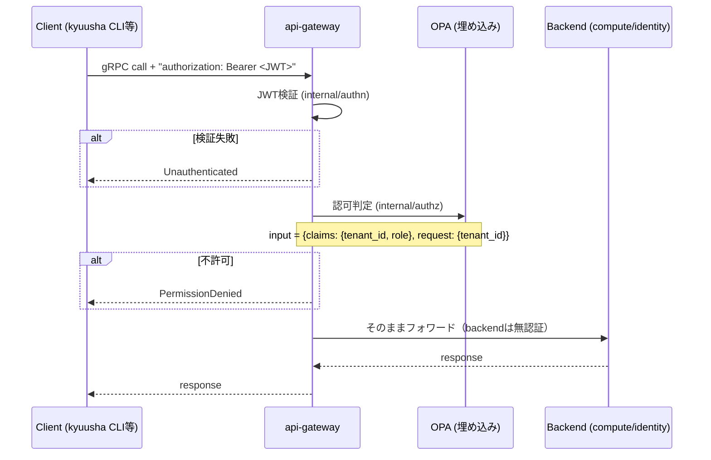

# 認証・認可仕様

## 概要

client → api-gateway 間（南北）の認証・認可を規定する。api-gatewayが唯一の認証・認可の実施点であり、
backendサービス（compute/identity）自体は認証・認可を持たない。

## 全体フロー



## JWT検証（internal/authn）

- Claims: `tenant_id` (string, 必須。空なら拒否)、`sub`（標準claim、誰が。任意、監査ログ専用で認可判定には使わない）、
  `role` (string, 任意)、その他標準クレーム(`exp`/`iat`等)
- `tenant_id`/`role`はOIDCの標準クレームではない**カスタムクレーム**。接続するOIDC基盤（Keycloak/Dex等）側で
  必ずこの名前でトークンに埋め込む設定（Keycloakなら protocol mapper）が要る
- アルゴリズム: 許可リスト方式（`ES256`, `RS256`）。トークン自身の`alg`ヘッダを無条件に信用しない
  （alg confusion攻撃対策）。`ES256`はdevonly署名（`hack/devkeys`）、`RS256`はKeycloakの既定値に対応
- gRPC unary/stream interceptorとして実装。streamはRecvMsgをラップして最初のメッセージ受信時に検証する
- 検証済みClaimsは`context.Context`に格納し、以後のinterceptor（authz）や各RPCハンドラから`authn.FromContext(ctx)`で取得する

### 検証鍵の入手方法（2種類、設定で選択）

`Verifier`は`jwt.Keyfunc`を差し替え可能な構造になっており、鍵の入手方法を切り替えられる。

| 方法 | 生成関数 | 用途 |
|---|---|---|
| 固定の公開鍵（PEMファイル） | `NewStaticKeyVerifier` | devonly。`hack/devkeys`とペアで`kyuusha token mint`が使う |
| JWKSエンドポイント | `NewJWKSVerifier`（`github.com/MicahParks/keyfunc/v3`使用） | 実際のOIDC基盤（Keycloak等）。`kid`で鍵を引き、鍵セットは自動キャッシュ・更新される |

api-gatewayは`-jwt-jwks-url`が指定されていればJWKSモード、そうでなければ`-jwt-public-key`
（PEMファイルパス、既定`hack/devkeys/jwt-dev.pub`）のPEMモードで起動する。

信頼するissuer（JWKSエンドポイント）は1デプロイにつき1つのみ。テナントごとに異なるIdPを
信頼する、といった構成は想定していない。

### トークン発行

- 現状: `kyuusha token mint`によるローカル署名のみ（`hack/devkeys/jwt-dev.key`）。開発・playground専用
- 本番相当のOIDC発行元（Keycloak/Dex/ORY Hydra等）は未接続。kyuusha自身はOIDCのフロー
  （認可コード、client_credentials等）を一切実装しない。発行元が何であってもkyuushaのロジックには
  影響しない（検証鍵の入手方法とクレームマッピングさえ合っていれば良い）

## OPA認可（internal/authz）

- `github.com/open-policy-agent/opa/v1/rego`をGoライブラリとして埋め込み、別サービスは立てない
- ポリシー本体は`internal/authz/policy.rego`（`package kyuusha.authz`）:

```rego
default allow := false
allow if { input.claims.role == "admin" }
allow if {
    input.claims.tenant_id != ""
    input.claims.tenant_id == input.request.tenant_id
}
```

- 評価入力:
  - `input.claims.tenant_id` / `input.claims.role`: JWTのclaim
  - `input.request.tenant_id`: リクエストメッセージの`tenant_id`フィールド（`TenantIDGetter`インターフェースで取得）
- **リクエストメッセージが`tenant_id`フィールドを持たない場合**（例: `CreateTenantRequest`, Hypervisor系の各Request）、`input.request.tenant_id`は空文字列として扱われる。`claims.tenant_id`は空になり得ないため、この場合は事実上 **admin roleのみ許可**になる（ポリシー自体の変更は不要）
- gRPC unary/stream interceptorとして実装。streamはauthnと同様、RecvMsgラップで最初のメッセージ受信時に評価する
- interceptorの適用順序: authn → authz（authzはauthnが設定したClaimsに依存する）

## 適用範囲・既知のギャップ

- api-gatewayで集約検証されるのは南北（client→api-gateway）のみ
- 東西（compute↔identity、compute-agent↔compute）はmTLS設計だが未実装。現状は平文・無認証
- `UpdateVirtualMachineRequest`/`UpdateTenantRequest`は`vm.meta.tenant_id`/`tenant.meta.tenant_id`と別に、認可用の`tenant_id`をトップレベルに持つ。gRPCサーバー側でこの2つの一致を検証し、不一致は`InvalidArgument`で拒否する
