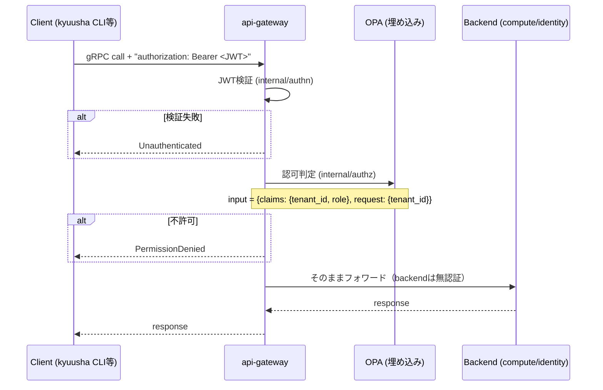

# 認証・認可仕様

## 概要

client → api-gateway 間（南北）の認証・認可を規定する。api-gatewayが唯一の認証・認可の実施点であり、
backendサービス（compute/identity）自体は認証・認可を持たない。

## 全体フロー



## JWT検証（internal/authn）

- Claims:
  - `tenant_id`（string、必須。空なら拒否）
  - `role`（string、任意）と`roles`（文字列か文字列の配列、任意）: テナント横断のロール。
    2つは合わせて1つの集合として扱う（`roles`は1つのトークンに複数のロールを持たせるため。
    例: networkは書き込み、それ以外は読み取りのコントローラなら`["network-admin", "viewer"]`）
  - `tenant_role`（string、任意）: テナント内のロール
  - `sub`（標準claim、誰が。任意、OPA認可判定（`internal/authz`）には使わない——ただし
    `internal/authn/propagate.go`経由でbackendへ転送され、Finalizer所有権チェックのような
    サービス層の個別認可では使う。詳細は「将来の拡張」節）
  - `azp`（OIDCの「トークンを受け取ったクライアント」）と`preferred_username`: 認可には使わず、
    監査ログに残す（`sub`がUUIDのような読めない値でも、どのサービスアカウントか分かるように）
  - その他標準クレーム（`exp`/`iat`/`iss`/`aud`等）
- `tenant_id`/`role`/`roles`/`tenant_role`はOIDCの標準クレームではない**カスタムクレーム**。接続するOIDC基盤（Keycloak/Dex等）側で
  必ずこの名前でトークンに埋め込む設定（Keycloakなら protocol mapper）が要る（下記「サービスアカウント」）
- アルゴリズム: 許可リスト方式（`ES256`, `RS256`）。トークン自身の`alg`ヘッダを無条件に信用しない
  （alg confusion攻撃対策）。`ES256`はdevonly署名（`hack/devkeys`）、`RS256`はKeycloakの既定値に対応
- gRPC unary/stream interceptorとして実装。streamはRecvMsgをラップして最初のメッセージ受信時に検証する
- 検証済みClaimsは`context.Context`に格納し、以後のinterceptor（authz）や各RPCハンドラから`authn.FromContext(ctx)`で取得する

### 検証鍵の入手方法（2種類、設定で選択）

`Verifier`は`jwt.Keyfunc`を差し替え可能な構造になっており、鍵の入手方法を切り替えられる。

| 方法 | 生成関数 | 用途 |
|---|---|---|
| 固定の公開鍵（PEMファイル） | `NewStaticKeyVerifier` | devonly。`hack/devkeys`とペアで`kyuusha token mint`が使う |
| JWKSエンドポイント | `NewJWKSVerifier`（`github.com/MicahParks/keyfunc/v3`使用） | 実際のOIDC基盤（Keycloak等）。`kid`で鍵を引き、鍵セットは自動キャッシュ・更新される |

api-gatewayは`-jwt-jwks-url`が指定されていればJWKSモード、そうでなければ`-jwt-public-key`
（PEMファイルパス、既定`hack/devkeys/jwt-dev.pub`）のPEMモードで起動する。

信頼するissuer（JWKSエンドポイント）は1デプロイにつき1つのみ。テナントごとに異なるIdPを
信頼する、といった構成は想定していない。

### 発行元と宛先の検証

api-gatewayの`-jwt-issuer`を指定すると`iss`がそれと一致すること、`-jwt-audience`を指定すると
`aud`にそれが含まれることを要求する。未指定なら検査しない（起動時に警告を出す）。

署名鍵がkyuusha専用でなく、同じOIDCのrealm（同じ署名鍵）が他のアプリケーション向けにも
トークンを発行している場合は、**両方とも指定する**。指定しないと、他のアプリ向けに
発行されたトークンでも、`tenant_id`さえ付いていればkyuushaに通ってしまう。Keycloakなら
`-jwt-issuer`はrealmのURL（`https://<host>/realms/<realm>`）、`-jwt-audience`はkyuusha向けに
決めた名前（例: `kyuusha`）で、トークンへの`aud`の追加は下記のAudience mapperで行う。
playgroundは`kyuusha token mint`の既定値（`iss=kyuusha-dev`、`aud=kyuusha`）で両方を検査している。

### トークン発行

- 開発・playground: `kyuusha token mint`によるローカル署名（`hack/devkeys/jwt-dev.key`）。
  `-role`/`-roles`/`-tenant-role`/`-sub`/`-client-id`/`-username`/`-issuer`/`-audience`で
  クレームを指定できる（[CLI仕様](cli.md)）
- 本番: 外部のOIDC発行元（Keycloak/Dex/ORY Hydra等）。kyuusha自身はOIDCのフロー
  （認可コード、client_credentials等）を一切実装しない。発行元が何であってもkyuushaのロジックには
  影響しない（検証鍵の入手方法とクレームマッピングさえ合っていれば良い）

### サービスアカウント

kyuushaは人とサービスアカウント（コントローラ、CI、KaaSのCCM等、プログラムが使う
アカウント）を区別しない。どちらもクレームだけで判断するので、サービスアカウントは
OIDC発行元の側で作る。Keycloakの場合:

1. **クライアントを作る**: realmに、サービスアカウントごとにOpenID Connectのクライアントを
   作る（例: `kyuusha-vpc`）。Client authenticationをオン（confidential client）、
   Authentication flowは「Service accounts roles」だけをオンにする（人のログインに使わない
   ので、Standard flow等はオフ）。Keycloakは裏で`service-account-<client-id>`というユーザーを
   作り、トークンの`sub`はそのユーザーのID、`azp`はクライアントID、`preferred_username`は
   そのユーザー名になる
2. **クレームを載せる**: そのクライアントの専用のclient scope（Client scopes → `<client-id>-dedicated`）
   にmapperを足す。realm全体のclient scopeに足さないこと（他のアプリ向けのトークンにまで
   `tenant_id`が付いてしまう）
   - `tenant_id`: Hardcoded claim、Token Claim Name `tenant_id`、値はそのアカウントが属する
     テナント。テナントを持たない基盤のアカウントでも必須なので、運用用の名目上のテナント
     （例: `kyuusha-system`。identityに実在しなくてよい）を入れる
   - `roles`: Hardcoded claim、Token Claim Name `roles`、Claim JSON Typeを`JSON`にして配列を
     書く（例: `["network-admin","viewer"]`）か、文字列で1つだけ書く。テナント内だけで動く
     アカウントなら付けない（`tenant_role`が要るならHardcoded claimで`tenant_role`）
   - Audience: Included Custom Audienceにapi-gatewayの`-jwt-audience`と同じ値（例: `kyuusha`）
   - いずれも「Add to access token」をオンにする
3. **トークンの寿命を短くする**: kyuushaはトークンをローカルで検証するだけで、発行元に失効を
   問い合わせない。クライアントを無効にしたりシークレットを変えたりしても、発行済みの
   トークンは`exp`まで使える。クライアントの詳細設定でAccess Token Lifespanを数分にする
   （client_credentialsでは更新トークンを使わず、期限が近づいたら取り直すのが普通）
4. **トークンを取る**: `POST https://<host>/realms/<realm>/protocol/openid-connect/token`に
   `grant_type=client_credentials`、`client_id`、`client_secret`を送り、返った`access_token`を
   `Authorization: Bearer`で使う

用途ごとのクレームの例:

| 用途 | `tenant_id` | `roles` | 例 |
|---|---|---|---|
| テナント横断の基盤のコントローラ | 名目上の値（`kyuusha-system`） | 必要なロールだけ | kyuusha-vpc: `["network-admin", "viewer"]`（networkの書き込みと、VM・Hypervisorの読み取り） |
| 1つのテナントの中だけで動く自動化 | そのテナント | 無し（読み取りだけなら`tenant_role=viewer`） | KaaSクラスタのCCM（テナントごとにクライアントを作る） |
| 全体の監査 | 名目上の値 | `["viewer"]` | 監査用のツール |

注意:

- 名目上のテナントに`viewer`を含むロールを持たせると、その名目上のテナント自身にも書き込めない
  （下記ポリシーの`not "viewer" in roles`）。基盤のアカウントが自分のテナントにリソースを
  作ることは普通は無いので問題にならない
- Finalizerは付けた`sub`だけが外せる（adminは別）。Keycloakでクライアントを作り直すと
  サービスアカウントのユーザーも作り直されて`sub`が変わり、以前に付けたFinalizerを
  自分では外せなくなる（adminが外す）。クライアントは作り直さず、シークレットの再発行で済ませる
- 監査ログには`sub`に加えて`client_id`（`azp`）と`username`（`preferred_username`）が残る
  （[監査ログ仕様](audit-logging.md)）

## OPA認可（internal/authz）

- `github.com/open-policy-agent/opa/v1/rego`をGoライブラリとして埋め込み、別サービスは立てない
- ポリシー本体は`internal/authz/policy.rego`（`package kyuusha.authz`）:

```rego
default allow := false

roles := {r | some r in input.claims.roles}

allow if { "admin" in roles }

allow if {
    "storage-admin" in roles
    input.rpc.service == "blockstorage"
}

allow if {
    "network-admin" in roles
    input.rpc.service == "network"
}

allow if {
    input.rpc.service != ""
    concat("", [input.rpc.service, "-admin"]) in roles
}

allow if {
    "viewer" in roles
    input.rpc.action == "read"
}

allow if {
    input.claims.tenant_id != ""
    input.claims.tenant_id == input.request.tenant_id
    input.claims.tenant_role != "viewer"
    not "viewer" in roles
}

allow if {
    input.claims.tenant_id != ""
    input.claims.tenant_id == input.request.tenant_id
    input.claims.tenant_role == "viewer"
    input.rpc.action == "read"
}
```

- 評価入力:
  - `input.claims.tenant_id` / `input.claims.tenant_role`: JWTのclaim
  - `input.claims.roles`: `role`と`roles`を合わせたロールの一覧（重複なし）。ロールごとの
    規則は独立していて、複数持てば許される範囲が足し算になる
  - `input.request.tenant_id`: リクエストメッセージの`tenant_id`フィールド（`TenantIDGetter`インターフェースで取得）
  - `input.rpc.service` / `input.rpc.action`: 呼ばれたgRPCメソッドの分類（`internal/authz/rpcclass.go`）。
    `service`はプロトのパッケージ名の2セグメント目（例: `/kyuusha.blockstorage.v1.StorageConnectionService/Create` → `blockstorage`）、
    `action`はメソッド名が`Get`/`List`/`Watch`で始まれば`read`、それ以外は`write`——どちらも
    手書きの対応表を持たず構造的に導出するので、新しいサービス/RPCを足しても
    このファイル自体は変更不要
- **リクエストメッセージが`tenant_id`フィールドを持たない場合**（例: `CreateTenantRequest`, Hypervisor系の各Request, `CreateStorageConnectionRequest`）、`input.request.tenant_id`は空文字列として扱われる。`claims.tenant_id`は空になり得ないため、この場合は事実上 **admin roleのみ許可**になる（ポリシー自体の変更は不要）——ただし対象がblock-storageサービスのRPCなら`storage-admin`、それ以外のサービスのRPCなら`<サービス名>-admin`（例: networkなら`network-admin`）、read系RPC（Get/List/Watch）なら`viewer`のロールを持っていれば同様に許可される
- gRPC unary/stream interceptorとして実装。streamはauthnと同様、RecvMsgラップで最初のメッセージ受信時に評価する
- interceptorの適用順序: authn → authz（authzはauthnが設定したClaimsに依存する）

## 適用範囲・既知のギャップ

- api-gatewayで集約検証されるのは南北（client→api-gateway）のみ
- 東西（api-gateway→backend各サービス、compute→identity/image/network、block-storage→identity、
  compute-agent→compute）は`internal/mtls`による相互TLS認証を実装済み（`-tls-cert`/`-tls-key`/`-tls-ca`、
  既定値はdev用の共有証明書`hack/devcerts/`）。これが保証するのは「呼び出し元が何らかの正規の
  kyuushaサービスであること」だけで、「どのサービスがどのRPCを呼べるか」という内部最小権限は
  別軸のまま未実装（`docs/architecture.md`「認可の粒度」参照）。`compute-agent`の`Register`は
  mTLSに加え、zoneスコープ付きbootstrapトークン（`internal/bootstraptoken`）でzoneクレームを
  検証するようになった——ハイパーバイザー自身が申告するzoneは信用せず、トークンのzoneだけを
  採用する。2026-09-11、トークンに任意で`hypervisor_id`クレームも持たせられるようにし、
  個体識別（`Register`時にリクエストの`hypervisor`と一致確認）と失効
  （`HypervisorSpec.revoked`、`SetRevoked` RPC）を軽量に実現した——ただし将来の`Register`を
  拒否するだけで、ハイパーバイザー専用のmTLS証明書は無いため、すでに確立している
  東西通信をその場で強制切断することはできない。トークン自体は使い捨てでもない
  （[Hypervisor登録・死活監視仕様](hypervisor-bootstrap.md)「個体識別と失効」参照）
- `UpdateVirtualMachineRequest`/`UpdateTenantRequest`は`vm.meta.tenant_id`/`tenant.meta.tenant_id`と別に、認可用の`tenant_id`をトップレベルに持つ。gRPCサーバー側でこの2つの一致を検証し、不一致は`InvalidArgument`で拒否する

## 将来の拡張: テナント内ロール/細粒度認可の設計方針（軸1・軸3・軸4は実装済み、軸2は未実装）

Finalizer所有権チェック（`compute.Service.Update`の`checkFinalizerMutation`。
`docs/architecture.md`「Finalizerの所有権」節参照）で、初めて「同じ呼び出し元の`sub`だけが
特定の操作を許可される」というABAC的な認可を実装した。これをきっかけに、他の操作にも
同種の細粒度認可を広げたくなった場合にどう設計するかをここに整理しておく。

現状の認可は独立した2つの仕組みでできている。

1. **OPA (`internal/authz`)**: テナント境界の認可。`input`はJWTのclaims
   (`tenant_id`/`role`/`tenant_role`)とリクエストの`tenant_id`、および呼ばれたRPCの
   分類(`rpc.service`/`rpc.action`、2026-09-11に追加)——リソースの現在の状態は見ていない
2. **サービス層の個別チェック**（例: `checkFinalizerMutation`）: OPAを通った後、ハンドラの
   中でストアから読んだ既存レコード（例: Finalizerの`added_by`）と、
   `internal/authn/propagate.go`が転送した呼び出し元の`sub`/admin判定を突き合わせて判定する

### 軸1: テナント内ロール（RBAC）— read-onlyな"viewer"（実装済み、2026-09-11）

現状の`role`クレームは`""`（テナントメンバー）と`"admin"`（テナント横断）の2値しかなく、
`"admin"`は「同じテナント内での権限の強さ」ではなく「別テナントも操作できる」という
直交する軸（`docs/architecture.md`「認可の粒度」節参照）。テナント内に読み取り専用ロールを
導入するため、`role`とは別のクレーム軸`tenant_role`を追加した（値は`""`(既定、
a.k.a. "member"、何でもできる)/`"viewer"`(読み取りのみ)）。

OPAの`input`に`claims.tenant_role`と`rpc.action`（RPCメソッド名からWatch/Get/Listなら
`read`、それ以外は`write`、という静的な分類を`internal/authz/rpcclass.go`が構造的に導出する）
を足すだけで、OPA側だけで完結して表現できた——サービス層の変更は不要だった。
`kyuusha token mint -tenant-role=viewer`で発行できる。「リソース種別ごとに権限を分ける」
（VMは書けるがVolumeは読むだけ、等）は、`docs/architecture.md`の既存の判断（主要な外部
クライアントはKaaSコントローラー1つで分割の実利が薄い）どおり今回も見送り、
「テナント内での読み書き」の1軸のみに留めた。

### 軸2: リソース単位の所有権（ABAC）— Finalizerパターンの一般化（未実装）

Finalizer所有権チェックが実際にやっているのは「このレコードの特定フィールドを変更するには、
それを設定した本人の`sub`と一致するか、adminである必要がある」というルール。これは
「レコードの現在の状態」を見る必要があるため、リクエストしか見ないOPAでは表現できず、
各サービスのUpdate/Delete実装の中で個別に書く以外にない（OPAをリソース状態対応に拡張する
設計もあり得るが、DBへの参照をOPA評価のたびに持ち込むことになり、複雑さに見合わないと
判断する）。

一般化する場合、`resource.ObjectMeta`に`Finalizer.AddedBy`と同じ発想で`CreatedBy`
（作成者の`sub`、Create時にサーバー側で刻む）を持たせ、各サービスが「Deleteは作成者か
adminのみ」のようなチェックをUpdate/Delete呼び出しの直前に挟む形になる。使い回すのは
`internal/authn/propagate.go`の`CallerSubFromContext`/`CallerIsAdminFromContext`——
Finalizer所有権チェックと全く同じプラミングで足りる。

### 軸3: サービス種別スコープのadmin — "storage-admin"（実装済み、2026-09-11）

軸1・軸2どちらにも当てはまらない、3つ目の軸。運用者ロールの中でも「block-storageの
運用（StorageConnection登録等）だけを任せたい相手に、tenant/hypervisor等まで含む
`admin`の全権限を渡したくない」という具体的なニーズから追加した——テナント内の
読み書きではなく、`admin`の持つ**テナント横断権限そのものを領域別に割る**軸なので、
軸1（`tenant_role`）とは別物。

`role`クレームに3つ目の値`"storage-admin"`を追加し、軸1で足した`rpc.service`
（プロトのパッケージ名から構造的に導出、`internal/authz/rpcclass.go`）と組み合わせて
「`role=="storage-admin"`かつ`rpc.service=="blockstorage"`なら許可」という1ルールを
足すだけで足りた——ここでも新しいリソース種別・CRUD面は増やしていない。動的な
カスタムロール定義（Role/RoleBindingのようなリソースを作り、権限を実行時に組み立てる方式）
は検討したが、静的な列挙に対して実装・レビューコストが一桁大きく（新リソース種別・
CRUD面・権限昇格リスクのレビューが継続的に乗る）、「運用者が自由に権限セットを
定義したい」という要求はまだ無いため見送った。`kyuusha token mint -role=storage-admin`
で発行できる。scopeはblock-storageサービス全体（StorageConnection/Volume/
VolumeAttachment、テナント横断）——StorageConnectionだけに絞る案もあったが、
`rpc.service`単位の分類の上ではこちらの方が追加コストが無く自然に出てくる形だった。

2026-09-13、当時から予告していた通り`network-admin`を同じ形（`role=="network-admin"`
かつ`rpc.service=="network"`）で追加した——新しいルールを1つ足しただけで、
`internal/authz/rpcclass.go`・ポリシーの他の部分とも一切変更不要だった。
`kyuusha token mint -role=network-admin`で発行できる。

これは`role == "<rpc.service>-admin"`という命名規則として一般化してある（ポリシーの
1ルール）——`network-admin`はその一例で、`compute-admin`等も同じ意味で使える。
主な用途はapi-gatewayに登録した外部バックエンド（[外部システム連携仕様](external-integration.md)
「外部バックエンドの登録」）で、kyuushaがサービス名を列挙できないそれらにも、
例えば`kyuusha.vpc.v1.*`なら`vpc-admin`というサービス限定の管理ロールを付けられる。
`storage-admin`（サービス名は`blockstorage`）だけは規則に乗らない既存の名前として
個別のルールのまま残している。

### 軸4: グローバルなread-only — "viewer"（実装済み、2026-09-13）

軸1の`tenant_role=="viewer"`は「テナント内のread-only」だったが、今度は「全テナント・
全サービス横断のread-only」——`admin`と同じ到達範囲を持ちながら書き込み権限だけを
持たない、"監査役"的なロールが欲しくなった。テナント内admin（`tenant_role`に3値目を
足す案）も検討したが、既定のテナントメンバー(`tenant_role=""`)が既にテナント内フルR/W
であり、それと区別する具体的な追加権限が思いつかなかったため見送り、
グローバルread-onlyだけを実装した。

軸3と同じ`role`クレームに`"viewer"`という4つ目の値を足し、`rpc.action`（軸1で既に
導出済み）と組み合わせて「`role=="viewer"`かつ`rpc.action=="read"`なら許可」という
1ルールで表現できた——`tenant_id`を一切見ないルールなので、`CreateTenantRequest`や
`ListHypervisorsRequest`のような本来admin限定のunscopedリクエストも、read系であれば
この役割だけで見られる。

**実装時に見つかった落とし穴**: JWTの`tenant_id`は必須クレームなので、グローバル
viewerのトークンにも何らかの`tenant_id`が乗っている。既存の「テナント内フルR/W」
ルール（軸1、`claims.tenant_id == request.tenant_id`かつ`tenant_role != "viewer"`
なら許可）は`role`を一切見ていなかったため、viewerトークンの`tenant_id`がたまたま
リクエストの`tenant_id`と一致する場面（=自分のトークンに乗った`tenant_id`と同じ
テナントへのリクエスト）で、このルールが横から成立してしまい、「読み取り専用のはずが
自分のトークンのtenant_id分だけ書き込みできてしまう」という抜け穴になっていた。
テストを書いて初めて発覚し、当該ルールに`claims.role != "viewer"`を追加して塞いだ
（storage-admin/network-adminは自テナント内でこのルールにフォールバックする挙動を
意図的に維持しているので、除外するのは`viewer`だけ）。

`kyuusha token mint -role=viewer`で発行できる。

### 着手のタイミング

- 軸1・軸3は2026-09-11、軸4は2026-09-13に実装済み
- 軸2（リソース単位の所有権）は、Finalizer以外の場面（例: 誰かが作ったVolumeを他人が
  誤って消せてしまう、等）で実際に問題が顕在化した時点で、`CreatedBy`をそのリソース型に
  個別に足す形で対応する。全リソースへの一律導入は今のところ動機がない
