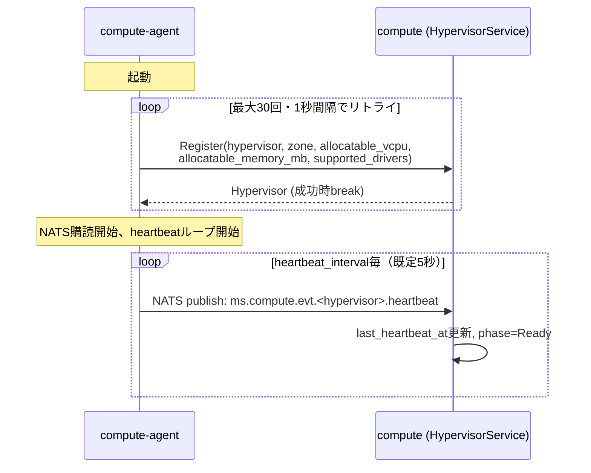
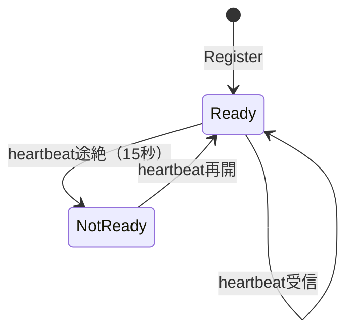

# Hypervisor登録・死活監視仕様

## 概要

compute-agentが起動時にcomputeへ自己登録し、以後heartbeatで死活監視される仕組み。
Hypervisorはcompute内部のスケジューリング対象であり、KaaS向けの公開リソースではない。

## Hypervisorリソース

`tenant_id`を持たない（テナントスコープ外）。IDは`hypervisor-1`のようなオペレーター/エージェントが
選ぶ文字列そのもので、NATSのsubjectにもそのまま使われる。

| フィールド | 説明 |
|---|---|
| `meta.id` / `meta.name` | hypervisor文字列（例: `hypervisor-1`）。両方同じ値 |
| `spec.schedulable` | オペレーターの意図。`false`ならフェーズに関わらずスケジュール対象外 |
| `status.phase` | `Ready` / `NotReady`。heartbeatの有無のみで自動的に決まる |
| `status.zone` | Availability Zone |
| `status.last_heartbeat_at` | 最終heartbeat受信時刻 |
| `status.allocatable_vcpu` / `allocatable_memory_mb` | 申告された総capacity |
| `status.allocated_vcpu` / `allocated_memory_mb` | スケジューラによる予約合計 |
| `status.supported_drivers` | 対応VMMドライバ一覧（例: `["FIRECRACKER"]`） |
| `status.available_devices` | PCIデバイス在庫（現状スケジューラは未使用） |

## 登録フロー

- `Register`は compute-agent が **compute へ直接gRPCで呼ぶ内部専用RPC**。api-gatewayは経由しない
- 冪等（upsert）: 同じhypervisor IDでの再登録は zone/capacity/supported_drivers を最新の値に上書きするが、
  以下は前回の値を保持する:
  - `status.allocated_vcpu` / `allocated_memory_mb`（既存のスケジューラ予約）
  - `spec.schedulable`（オペレーターが設定した意図。agentの再起動で意図せず解除されない）
- 新規登録時の初期値: `phase=Ready`, `allocated_vcpu=0`, `allocated_memory_mb=0`, `spec.schedulable=true`

## 死活監視

- ヘルスチェックスイープが5秒間隔で全Hypervisorを走査し、`last_heartbeat_at`が15秒より古い`Ready`を`NotReady`に遷移させる
- `NotReady`のHypervisorはスケジューラのフィルタで除外される（[VMスケジュール仕様](vm-scheduling.md)参照）
- heartbeatを受信すると即座に`Ready`へ復帰する

## スケジュール可否の制御（`spec.schedulable`）

- `phase`（heartbeatによる自動判定）とは独立した、オペレーターが明示的に設定するフラグ
- `SetSchedulable(hypervisor, schedulable bool)` RPCで変更する。`Register`では変更されない
- 計画メンテナンス等、ハイパーバイザー自体は正常でも新規VM配置だけ止めたい場合に使う

## 外部公開API

`Get` / `List` / `Watch` / `SetSchedulable` のみapi-gateway経由で公開される。いずれも
リクエストに`tenant_id`を持たないため、[認証・認可仕様](authn-authz.md)によりadmin-only。
`Register`はapi-gatewayに登録されておらず、外部から到達できない。

## 既知の未実装事項

- `Register`は無認証・平文gRPC。設計上はzoneスコープ付きbootstrapトークンの検証とmTLSクライアント証明書の発行を伴うが未実装
