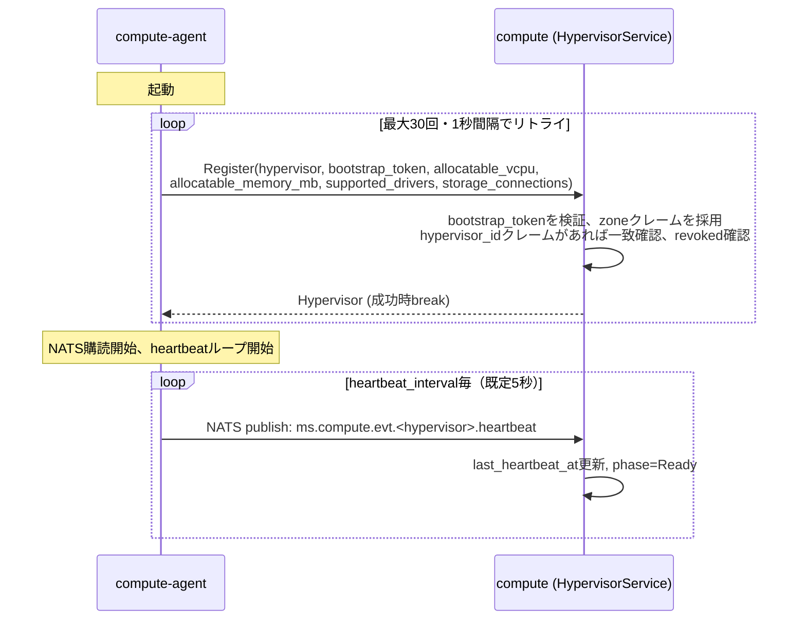
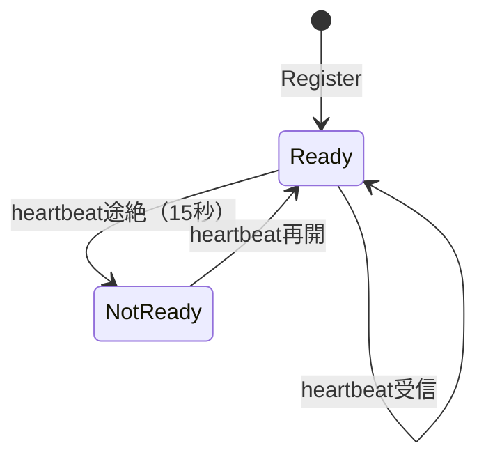

# Hypervisor登録・死活監視仕様

## 概要

compute-agentが起動時にcomputeへ自己登録し、以後heartbeatで死活監視される仕組み。
Hypervisorはcompute内部のスケジューリング対象であり、KaaS向けの公開リソースではない。

## Hypervisorリソース

`tenant_id`を持たない（テナントスコープ外）。IDは`hypervisor-1`のようなオペレーター/エージェントが
選ぶ文字列そのもので、NATSのsubjectにもそのまま使われる。

| フィールド | 説明 |
|---|---|
| `meta.id` / `meta.name` | hypervisor文字列（例: `hypervisor-1`）。両方同じ値 |
| `spec.schedulable` | オペレーターの意図。`false`ならフェーズに関わらずスケジュール対象外 |
| `spec.revoked` | オペレーターの意図（2026-09-11）。`true`ならこのhypervisor IDでの`Register`は以後拒否される（`PermissionDenied`）。設定と同時に`spec.schedulable`も強制的に`false`になる。下記「個体識別と失効」参照 |
| `status.phase` | `Ready` / `NotReady`。heartbeatの有無のみで自動的に決まる |
| `status.zone` | Availability Zone |
| `status.last_heartbeat_at` | 最終heartbeat受信時刻 |
| `status.allocatable_vcpu` / `allocatable_memory_mb` | 申告された総capacity |
| `status.allocated_vcpu` / `allocated_memory_mb` | スケジューラによる予約合計 |
| `status.supported_drivers` | 対応VMMドライバ一覧（例: `["FIRECRACKER", "QEMU"]`） |
| `status.storage_connections` | このHypervisorが既に確立済みのストレージ接続一覧（`{name, local_path}`）。自己申告——kyuusha自身はここに何も接続しない。詳細は[Volume仕様](volume.md)「StorageConnection」参照。現状スケジューラは未使用（同参照） |
| `status.available_devices` | PCIデバイス在庫（現状スケジューラは未使用） |

## 登録フロー

- `Register`は compute-agent が **compute へ直接gRPCで呼ぶ内部専用RPC**。api-gatewayは経由しない
- `bootstrap_token`は必須。空、署名不正、期限切れのいずれでも`Unauthenticated`で拒否される
  （[認証・認可仕様](authn-authz.md)「Hypervisor自己登録の認証」参照）。`zone`は**リクエストの
  フィールドとしては存在しない**——`status.zone`に採用されるのはトークンの`zone`クレームのみで、
  compute-agent自身の設定値は一切関与しない
- トークンが`hypervisor_id`クレームも持つ場合、リクエストの`hypervisor`フィールドと完全一致しないと
  `PermissionDenied`で拒否される（下記「個体識別と失効」参照）
- 既存のhypervisor IDが`spec.revoked=true`の場合、`PermissionDenied`で拒否される（下記参照）
- 冪等（upsert）: 同じhypervisor IDでの再登録は zone（トークン由来）/capacity/supported_driversを
  最新の値に上書きするが、以下は前回の値を保持する:
  - `status.allocated_vcpu` / `allocated_memory_mb`（既存のスケジューラ予約）
  - `spec.schedulable`（オペレーターが設定した意図。agentの再起動で意図せず解除されない）
  - `spec.revoked`（`Register`は常に`false`のままにする——このフィールド自体を`true`に
    することはない。すでに`true`なら上記の通りそもそも拒否される）
- 新規登録時の初期値: `phase=Ready`, `allocated_vcpu=0`, `allocated_memory_mb=0`,
  `spec.schedulable=true`, `spec.revoked=false`

## 死活監視

- ヘルスチェックスイープが5秒間隔で全Hypervisorを走査し、`last_heartbeat_at`が15秒より古い`Ready`を`NotReady`に遷移させる
- `NotReady`のHypervisorはスケジューラのフィルタで除外される（[VMスケジュール仕様](vm-scheduling.md)参照）
- heartbeatを受信すると即座に`Ready`へ復帰する

## スケジュール可否の制御（`spec.schedulable`）

- `phase`（heartbeatによる自動判定）とは独立した、オペレーターが明示的に設定するフラグ
- `SetSchedulable(hypervisor, schedulable bool)` RPCで変更する。`Register`では変更されない
- 計画メンテナンス等、ハイパーバイザー自体は正常でも新規VM配置だけ止めたい場合に使う

## 個体識別と失効（軽量版、2026-09-11）

元の設計にある「identityが軽量CAを兼ねてハイパーバイザー専用のmTLSクライアント証明書を
動的発行する」という本格的なPKIは、運用コストの重い自前実装を避けるkyuusha全体の路線と
合わないため見送った（libvirt見送り・Ceph不採用と同じ判断）。代わりに、既存のbootstrap
トークンの仕組みだけで「個々のハイパーバイザーの識別」と「失効」を軽量に実現する:

- **個体識別**: `kyuusha hypervisor bootstrap-token create -zone=<zone> -hypervisor=<id>`
  で、特定の1台向けにスコープしたトークンを発行できる（`-hypervisor`は省略可——省略時は
  従来通り、同じzoneの複数台に同じトークンを配って良い、ゾーンのみスコープの挙動のまま）。
  `hypervisor_id`クレームを持つトークンは、`Register`リクエストの`hypervisor`フィールドと
  完全一致しないと`PermissionDenied`で拒否される——他のハイパーバイザー向けに発行された
  トークンを流用して別の名前で登録することはできない
- **失効**: `SetRevoked(hypervisor, revoked bool)` RPC（`kyuusha hypervisor set-revoked
  -id=<id> -revoked=true`）で、そのhypervisor IDでの以後の`Register`を一律拒否できる。
  設定と同時に`spec.schedulable`も強制的に`false`になる（失効済みなのにスケジュール対象に
  残る組み合わせは意味をなさないため）。`revoked=false`に戻しても`schedulable`は自動復帰
  しない——再度スケジュール対象に戻すかどうかは別途明示的な判断とする

**割り切っている点**（本格PKIとの違い、意図的なスコープ）: これは**将来の`Register`呼び出しを
拒否するだけ**で、すでに確立している東西通信（heartbeat等）をその場で強制切断することは
できない。ハイパーバイザーごとに固有のmTLS証明書が無い以上、既存のセッションを
個別に識別して止める手段自体が無い——`internal/mtls`は全サービス共通の事前生成証明書の
ままで、この変更でも変わらない。悪意あるハイパーバイザーの存在を強く警戒するシナリオでは
不十分だが、そこは今のkyuushaの脅威モデルでは優先度が低いと判断している。

## bootstrapトークン（`internal/bootstraptoken`）

`kyuusha hypervisor bootstrap-token create -zone=<zone> [-hypervisor=<id>] [-ttl=24h]
[-key=hack/devkeys/jwt-dev.key]` でzone（および任意でhypervisor_id）クレーム付きJWTを
ローカル署名する（`kyuusha token mint`と同じ「api-gatewayを経由しないローカル署名」
パターン）。compute-agentは`-bootstrap-token-file=<path>`でこのトークンのファイルを
指定し、起動時の`Register`呼び出しに載せる。computeは`-bootstrap-token-public-key`
（既定`hack/devkeys/jwt-dev.pub`）で検証し、**トークンの`zone`クレームだけをそのまま
`status.zone`に採用する**——compute-agentが自分で「私はzone rack3です」と申告する余地はない。

playgroundでは全compute-agentがzone-aを使うため、`hack/devkeys/bootstrap-token-zone-a.jwt`
（10年有効の開発用トークン、`hack/devkeys`と同じ「dev-onlyでコミット済み」方針、
hypervisor_idクレーム無し＝フリート共有）を`docker/Dockerfile`のcompute-agentステージに
焼き込んで共有している。

## 外部公開API

`Get` / `List` / `Watch` / `SetSchedulable` / `SetRevoked` のみapi-gateway経由で公開される。
いずれもリクエストに`tenant_id`を持たないため、[認証・認可仕様](authn-authz.md)によりadmin-only。
`Register`はapi-gatewayに登録されておらず、外部から到達できない。`hypervisor bootstrap-token
create`もapi-gatewayを経由しない（ローカル署名のみ）。

## 既知の未実装事項

- bootstrapトークンは(hypervisor_idでスコープしても)使い捨て（single-use）ではない。
  `-ttl`による有効期限切れが無効化手段の1つだが、同じトークンをそのハイパーバイザーの
  再起動のたびに繰り返し使うこと自体は妨げない（単一ハイパーバイザー向けにスコープしても
  「毎回違うトークンを要求する」ところまではやっていない）
- 上記「個体識別と失効」の割り切りの通り、すでに確立している東西通信をその場で
  強制切断する手段は無い——`Register`を将来拒否するだけ
- ハイパーバイザー専用のmTLSクライアント証明書の動的発行（元の設計にある本格PKI）は
  意図的に見送ったまま。現状の`internal/mtls`は全サービス共通の事前生成証明書のみ
  （[認証・認可仕様](authn-authz.md)参照）
