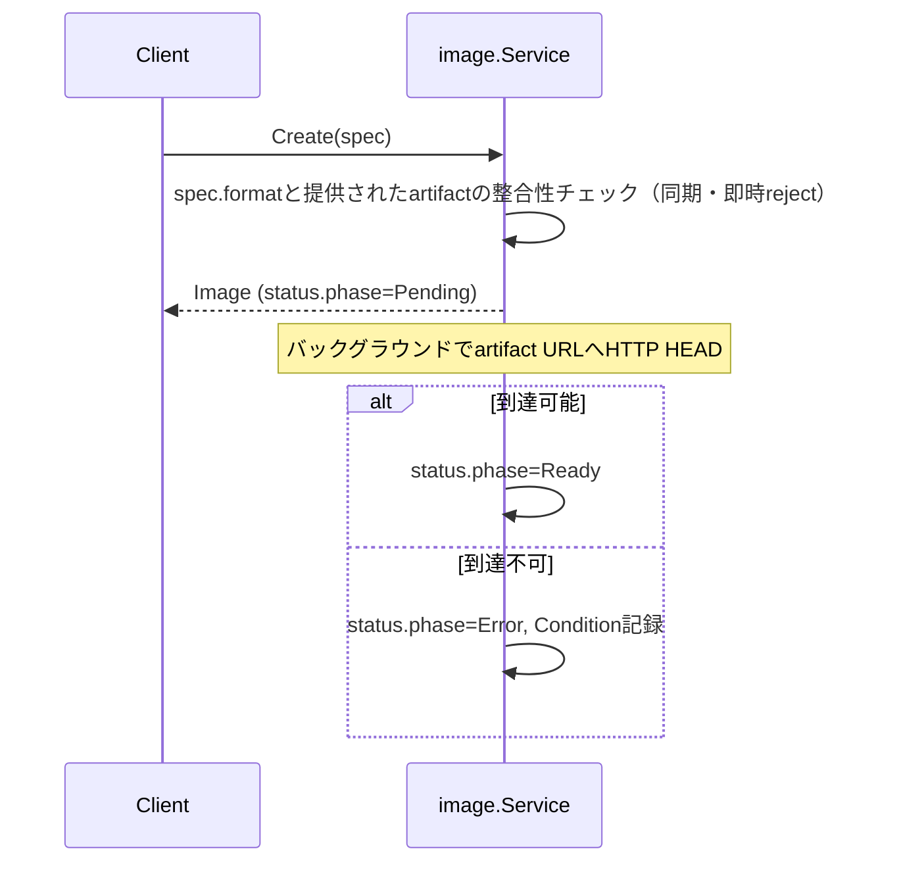

# Image仕様

## 概要

VMを起動するためのカーネル/rootfs（またはディスクイメージ）の**メタデータのみ**を管理するサービス。
kyuusha自体はイメージのバイト列を一切コピー・保管しない。`Image.spec`は外部URL＋digestへの参照に徹する。

## リソース

| フィールド | 説明 |
|---|---|
| `spec.format` | `KERNEL_ROOTFS`（カーネル+rootfsペア、直接カーネルブートする軽量VMM用） / `QCOW2`（自己完結ディスク、QEMU/libvirt用） |
| `spec.kernel` / `spec.rootfs` | `{url, digest}`。`KERNEL_ROOTFS`時のみ必須 |
| `spec.disk` | `{url, digest}`。`QCOW2`時のみ必須 |
| `spec.boot_args` | 直接カーネルブート時の起動引数 |
| `status.phase` | `Pending`（URL到達性チェック中） / `Ready` / `Error` |
| `status.size_bytes` | 判明していれば |

`tenant_id`を持つテナントスコープのリソース（VM/Volumeと同様）。

## Create時の検証

- **同期バリデーション（Create時に即reject）**: `format`に対応するartifactが揃っているか
  （`KERNEL_ROOTFS`なら`kernel.url`/`rootfs.url`両方、`QCOW2`なら`disk.url`）
- **非同期バリデーション**: 提供されたURLへのHTTP HEADのみ（`軽く検証する程度`。実際のバイト列は
  取得しない、digestの検証もしない）。到達不可なら`Error`+`Condition{type: URLUnreachable}`
- digestの検証は行わない。実際にartifactを取得するハイパーバイザー側の責務（未実装）

## computeとの連携（VM Create時）

`internal/compute`が`image_id`をVM Create時に同期検証する（[VMスケジュール仕様](vm-scheduling.md)とは
別の、VM Create自体のバリデーション）。

1. `image_id`でImageをGet。存在しなければ`ErrValidation`
2. `status.phase != Ready`なら`ErrValidation`（Pending/ErrorのImageからVMは作れない）
3. `spec.format`と`VirtualMachineSpec.driver_hint`の対応チェック:
   `KERNEL_ROOTFS`↔`FIRECRACKER`、`QCOW2`↔`QEMU`。不一致なら`ErrValidation`
   （フォーマットの自動変換はしない）

いずれも同期的なCreate時拒否で、Quotaと同じ「doomedなVirtualMachineを作ってからErrorにしない」
という設計に従う。`spec.image_id`自体も必須項目（空文字は`ErrValidation`）。

## 未実装

- ハイパーバイザー間の軽量ピアフェッチ（heartbeatでキャッシュ済みdigestを報告、同一zone優先の直接転送）
- Dragonfly導入（バルクVM作成×新規Imageのthundering herd対策）
- private S3互換ホスティング（`url`が何を指すか区別しないため、kyuusha側の対応は元々不要）
- `kyuusha image build`（OCI/Dockerfileからrootfsを作るビルドツール）
