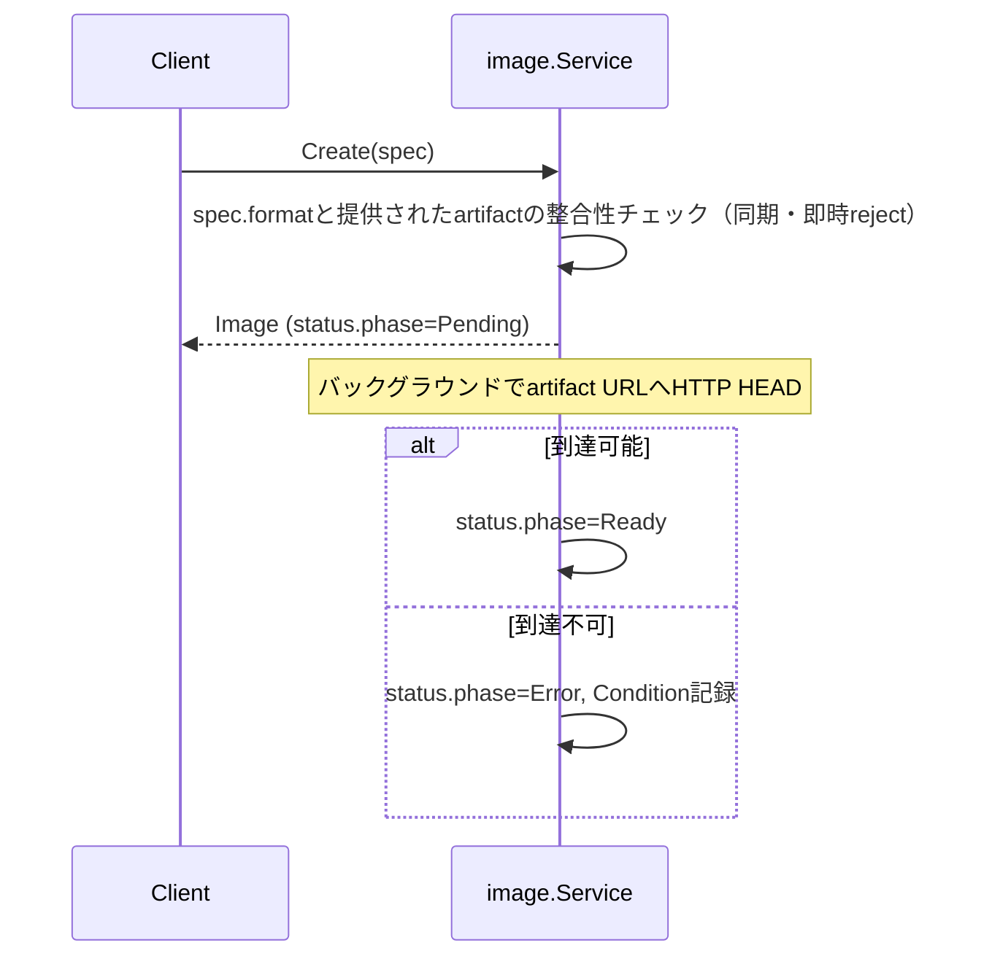
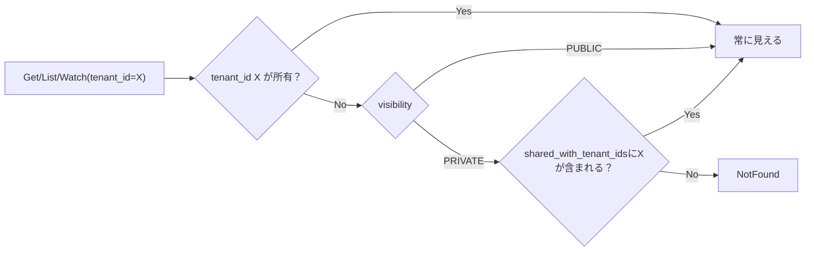

# Image仕様

## 概要

VMを起動するためのカーネル/rootfs（またはディスクイメージ）の**メタデータのみ**を管理するサービス。
kyuusha自体はイメージのバイト列を一切コピー・保管しない。`Image.spec`は外部URL＋digestへの参照に徹する。

## リソース

| フィールド | 説明 |
|---|---|
| `spec.format` | `KERNEL_ROOTFS`（カーネル+rootfsペア、直接カーネルブート。FIRECRACKER/CLOUD_HYPERVISORどちらの`driver_hint`でも使える——下記参照） / `QCOW2`（自己完結・ブートローダー内蔵ディスク、CLOUD_HYPERVISOR専用。まだどのドライバも消費しない） |
| `spec.kernel` / `spec.rootfs` | `{url, digest}`。`KERNEL_ROOTFS`時のみ必須 |
| `spec.disk` | `{url, digest}`。`QCOW2`時のみ必須 |
| `spec.boot_args` | 直接カーネルブート時の起動引数 |
| `spec.visibility` | `PRIVATE`（既定）/ `PUBLIC`。下記「マルチテナント対応（可視性/共有）」参照 |
| `spec.shared_with_tenant_ids` | `PRIVATE`時のみ意味を持つ。ここに列挙されたテナントも参照可能になる |
| `status.phase` | `Pending`（URL到達性チェック中） / `Ready` / `Error` |
| `status.size_bytes` | 判明していれば |

`tenant_id`を持つテナントスコープのリソース（VM/Volumeと同様）。ただし`spec.visibility`/
`spec.shared_with_tenant_ids`により、所有テナント以外からの参照が可能になる場合がある。

## Create時の検証

- **同期バリデーション（Create時に即reject）**: `format`に対応するartifactが揃っているか
  （`KERNEL_ROOTFS`なら`kernel.url`/`rootfs.url`両方、`QCOW2`なら`disk.url`）
- **非同期バリデーション**: `url`のスキームで分岐する（下記「OCIレジストリ参照（Track 2）」参照）
  - `https://`/`http://`: 従来通りHTTP HEADのみ（軽く検証する程度。実際のバイト列は取得しない、
    digestの検証もしない）。到達不可なら`Error`+`Condition{type: URLUnreachable}`
  - `oci://`/`oci+http://`: OCIレジストリのマニフェスト解決（`oras-go/v2`の`Resolve`、
    マニフェスト本体・blobは取得しない）。解決できなければ同じく`Error`+
    `Condition{type: URLUnreachable}`
- image.Service自体はdigestの検証を行わない。実際にartifactを取得するハイパーバイザー側の
  責務——`internal/compute-agent/imagestore.Store`がVM起動時のダウンロードをこの
  `digest`と照合する（`spec.kernel.digest`/`spec.rootfs.digest`が空でない場合のみ。
  [Firecracker起動仕様](firecracker-boot.md)「compute-agent側の起動処理」参照）

## OCIレジストリ参照（Track 2、`docs/architecture.md`「Track 2実装方針」参照）

`spec.kernel`/`spec.rootfs`/`spec.disk`の`url`は、プレーンなHTTP(S) URLに加えて
OCIレジストリ参照も許容する（proto変更なし、`url`フィールドの意味を拡張しただけ）。

- `oci://<registry>/<repository>:<tag-or-digest>` — HTTPS経由のOCIレジストリ
- `oci+http://<registry>/<repository>:<tag-or-digest>` — 平文HTTP経由（TLSを前面に
  置かないレジストリ向け。playgroundの`registry`サービスがこれ）

kyuushaのkernel/rootfs/qcow2はそれぞれ**1レイヤーのOCIアーティファクト**として
配布される想定（OCIレイヤーをコンテナのroot filesystemとして展開するのではなく、
生のバイナリ/ディスクイメージ1ファイルをそのままレイヤーに収める。KubeVirtの
`containerDisk`と同じ発想）。`internal/compute-agent/imagestore`（VM起動時の
実取得）・`internal/image`（Create時の到達性チェック）ともに、マニフェストの
`layers`が1つであることを前提とする——複数レイヤーのアーティファクトは
エラーになる。

pullクライアントは`oras.land/oras-go/v2`を採用（実際に`go-containerregistry`・
containerdの`remotes/docker`と依存の重さを比較した上での選定。
`docs/architecture.md`参照）。

## computeとの連携（VM Create時）

`internal/compute`が`image_id`をVM Create時に同期検証する（[VMスケジュール仕様](vm-scheduling.md)とは
別の、VM Create自体のバリデーション）。

1. `image_id`でImageをGet。存在しなければ`ErrValidation`
2. `status.phase != Ready`なら`ErrValidation`（Pending/ErrorのImageからVMは作れない）
3. `spec.format`と`VirtualMachineSpec.driver_hint`の対応チェック:
   `KERNEL_ROOTFS`は`FIRECRACKER`・`CLOUD_HYPERVISOR`どちらでも可（同じkernel+rootfsを、
   [Firecracker起動仕様](firecracker-boot.md)/[cloud-hypervisor起動仕様](cloud-hypervisor-boot.md)それぞれが
   自分の直接カーネルブート機構で起動する）、`QCOW2`は`CLOUD_HYPERVISOR`必須。不一致なら
   `ErrValidation`（フォーマットの自動変換はしない）

いずれも同期的なCreate時拒否で、Quotaと同じ「doomedなVirtualMachineを作ってからErrorにしない」
という設計に従う。`spec.image_id`自体も必須項目（空文字は`ErrValidation`）。

上記1.の`Get`は`internal/compute`から見て呼び出し元テナント自身の`tenant_id`で行われるが、
下記「マルチテナント対応」により、`image.Service.Get`自身が可視性を見て他テナント所有の
PUBLIC/共有Imageも透過的に解決する。compute側のコード自体は一切変更不要——`image_id`が
「自分のImageか、見える他人のImageか」を区別する必要がない。

## マルチテナント対応（可視性/共有）

当初Imageは`tenant_id`による完全なテナント分離のみで、Subnetの`shared_with_tenant_ids`の
ような共有の仕組みが一切なかった。kyuusha想定スケール（~500テナント）ではUbuntu/Talos/
Flatcarのような共通ベースイメージをテナントごとに再アップロードさせるのは無駄なため、
`spec.visibility`（`PRIVATE`既定 / `PUBLIC`）と、`PRIVATE`時のみ効く
`spec.shared_with_tenant_ids`を追加した。

- **強制されるのは読み取り/参照だけ**: Update相当の`SetVisibility`とDeleteは常に所有テナント
  のみ（共有先テナントは可視性を変えたり削除したりできない）
- **汎用リソース層(`resource.Store`)は一切変更していない**: `Store.Get`は今も厳密な
  `tenant_id`一致のみを見る（VM/Hypervisor/Subnet/NetworkInterfaceと共有する汎用実装に
  Image固有の可視性ルールを持ち込まないため）。`image.Service`側で
  「まず自分のstoreをGet、NotFoundなら`store.List(ctx, "")`（全テナント横断、内部用途と
  同じ既存の抜け道）を舐めて可視性チェック」というフォールバックにしている
- **List/Watchも同様に全テナント横断でスキャン/フィルタ**——このシステムの想定スケール
  （VM数万に対しImageカタログはずっと小規模、かつ多くが共有される想定）では許容範囲
- **存在の秘匿**: 見えないImageへのGetは「他人のPRIVATE Imageが存在する」ことを教えない
  よう、常に`NotFound`を返す（`PermissionDenied`にしない）
- **`SetVisibility`という専用RPCで、Update RPC自体は追加していない**:
  kernel/rootfs/disk URLは作成後不変であるべきなので、汎用Updateを開けるのではなく
  `compute.SetSchedulable`と同じ思想の狭いミューテーションにした
- CLI: `kyuusha image create -visibility=public`、または作成後に
  `kyuusha image share -id=... -visibility=private -shared-with-tenant-ids=tenant-b,tenant-c`

## 未実装

- ハイパーバイザー間の軽量ピアフェッチ（heartbeatでキャッシュ済みdigestを報告、同一zone優先の直接転送）
- Dragonfly導入（バルクVM作成×新規Imageのthundering herd対策）
- private S3互換ホスティング（`url`が何を指すか区別しないため、kyuusha側の対応は元々不要）
- `kyuusha image build`（OCI/Dockerfileからrootfsを作るビルドツール）
