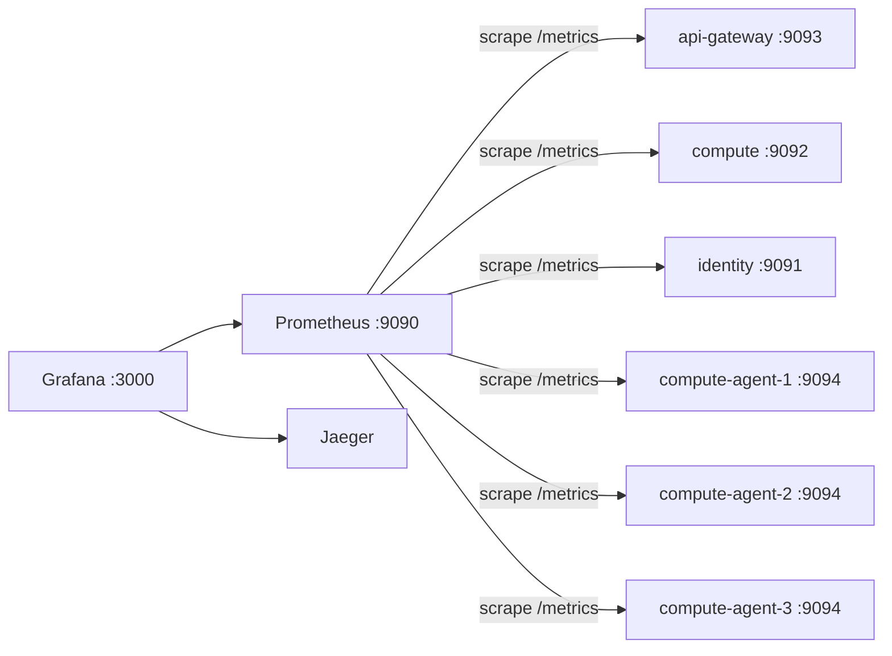

# メトリクス仕様

## 概要

各サービスがOpenTelemetry MeterProvider（Prometheusエクスポータ）経由で`/metrics`を公開し、
Prometheusがpull型でscrapeする。gRPC呼び出しのメトリクスはトレーシングと同じ
`otelgrpc`計装から自動的に得られる（[トレーシング仕様](observability-tracing.md)参照）。

## 構成

- `internal/telemetry.SetupMetrics(serviceName)`が各バイナリの起動時に呼ばれ、グローバルな
  `MeterProvider`（Prometheusエクスポータ）を設定し、`/metrics`用の`http.Handler`を返す
- 各バイナリは`-metrics-addr`フラグで指定したアドレス（gRPCポートとは別）でこれを配信する
- トレーシングと異なり無効化フラグはない（pull型なので、誰もscrapeしなければコストはほぼ0）
- Go runtimeメトリクス（goroutine数、GC、メモリ）も`go.opentelemetry.io/contrib/instrumentation/runtime`
  経由で同じMeterProviderに登録される

## エンドポイント一覧

| サービス | `-metrics-addr`既定値 |
|---|---|
| identity | `:9091` |
| compute | `:9092` |
| api-gateway | `:9093` |
| compute-agent | `:9094` |

## 主要メトリクス（実測値）

| メトリクス | 種別 | 主なラベル | 用途 |
|---|---|---|---|
| `rpc_server_call_duration_seconds_{count,sum,bucket}` | Histogram | `job`, `rpc_method`, `rpc_response_status_code` | gRPCサーバー側のリクエスト数・レイテンシ・エラー率 |
| `rpc_client_call_duration_seconds_{count,sum,bucket}` | Histogram | 同上 | gRPCクライアント側（呼び出し元から見た計測） |
| `go_goroutine_count` | Gauge | `job`, `instance` | goroutineリーク等の早期検知 |
| `process_resident_memory_bytes` | Gauge | `job`, `instance` | メモリ使用量 |

`rpc_response_status_code`にはgRPCステータスコード（`OK`/`NotFound`/`ResourceExhausted`等、
[認証・認可仕様](authn-authz.md)や[Quota仕様](quota.md)がリクエストを拒否するコードも含む）が
そのまま入るため、エラー率はこのラベルで直接集計できる。

## Grafanaダッシュボード

`playground/grafana/provisioning/dashboards/json/kyuusha-overview.json`として
自動プロビジョニングされる`kyuusha overview`ダッシュボードに、以下のパネルがある。

- gRPCリクエストレート（service/method別）
- gRPCエラーレート（`rpc_response_status_code != OK`）
- gRPCサーバーp95レイテンシ（service別）
- goroutine数（service別）
- 常駐メモリ（service別）

Prometheus/Jaegerのデータソースは`playground/grafana/provisioning/datasources/datasources.yml`で
`uid: prometheus`/`uid: jaeger`として固定プロビジョニングされており、ダッシュボードJSONは
このUIDを直接参照する。
