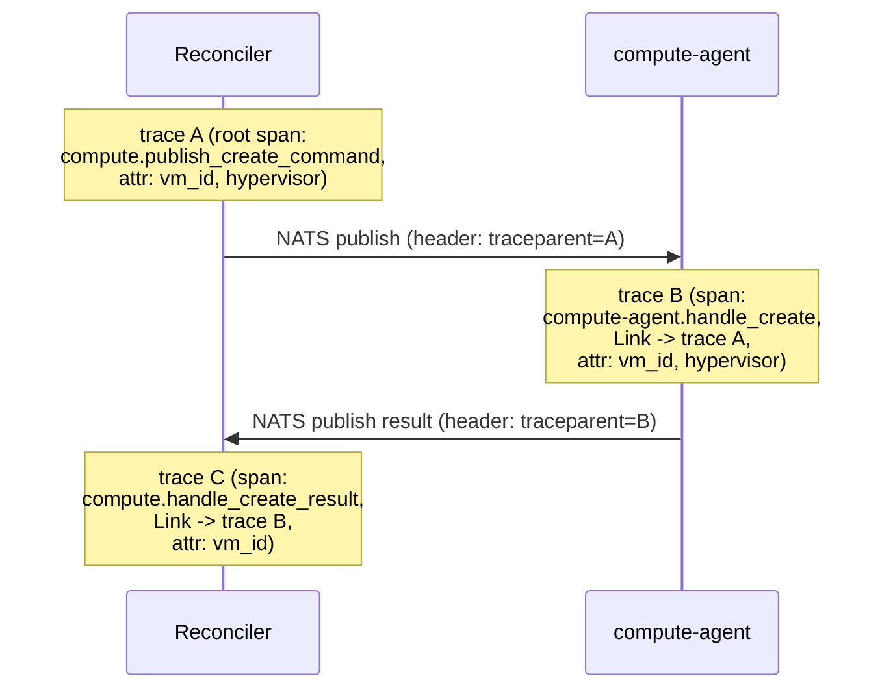

# トレーシング仕様

## 概要

OpenTelemetry（OTel）でトレースを収集し、OTLP/gRPCでエクスポートする。送信先は
`-otlp-endpoint`で指定するバックエンド非依存の設計（OTel Collector、Jaeger、Tempo等
OTLPを受け付けるものなら何でもよい。playgroundではJaegerを直接使っている——具体的な配線は
[playground/README.md](../../playground/README.md)参照）。gRPC呼び出しは自動計装、NATSを
挟む区間はSpan Linkと`vm_id`相関で繋ぐ（詳細は[NATSメッセージ仕様](nats-messaging.md)）。

## 構成

- `internal/telemetry.Setup(ctx, serviceName, otlpEndpoint)`が各バイナリの起動時に呼ばれ、
  グローバルな`TracerProvider`と`propagation.TraceContext{}`（W3C traceparent）を設定する
- `-otlp-endpoint`フラグが空文字列の場合、トレーシングは無効（no-op）になる。ローカルの
  `go run`/テストがOTLPバックエンド起動を前提にしなくて済むようにするため
- サンプリングは`AlwaysSample`（全件収集）。このシステムの規模では間引く理由がない
- 対象バイナリ: api-gateway、compute、identity、image、compute-agent

## gRPC呼び出しの計装

`go.opentelemetry.io/contrib/instrumentation/google.golang.org/grpc/otelgrpc`の
`stats.Handler`を、サーバー側は`grpc.StatsHandler(otelgrpc.NewServerHandler())`、
クライアント側は`grpc.WithStatsHandler(otelgrpc.NewClientHandler())`で全てのgRPCサーバー・
クライアントに設定している。W3C traceparentのgRPCメタデータでの伝播も含めて自動処理されるため、
個々のRPCハンドラでの追加コードは不要。

対象: api-gateway(server+2 client)、compute(server+1 client)、identity(server)、
compute-agent(1 client)。

## NATSを挟む区間の計装

gRPCの同期呼び出しと異なり、NATSのpublish側とconsume側は別プロセス・別タイミング
（数秒〜数分後）で動くため、単純な親子spanでは繋がない（継続時間がメッセージの滞留時間まで
含んでしまうため）。2つの相関手段を役割分担して使う。

1. **`vm_id`を全てのspan属性・構造化ログに含める。** VirtualMachine一つの一生
   （Create→Reconcilerがcmd発行→agentが処理→Reconcilerがresult反映）を横断して追うための
   主たる相関キー
2. **NATSメッセージのヘッダにW3C `traceparent`を載せ、consume側はSpan Link
   （親子ではない関連づけ）として扱う。** `internal/telemetry.InjectNATSHeader`/
   `LinkFromNATSHeader`が`nats.Header`との相互変換を行う

実装箇所: `internal/compute/reconciler.go`（`PhaseScheduled`でのcommand publish、
`consumeResults`でのresult受信）、`internal/compute-agent/agent.go`（`handleCreate`）。
heartbeatメッセージはトレーシング対象外（fire-and-forgetで個々の呼び出しに意味がないため）。

## 動作確認

playgroundでVMを1台作成し、Jaegerの UI（[playground/README.md](../../playground/README.md)参照）で
`service=compute-agent`を検索すると、`compute-agent.handle_create`スパンが`compute.publish_create_command`への
`FOLLOWS_FROM`参照（Span Link）を持ち、`vm_id`タグが両端で一致していることを確認できる。
