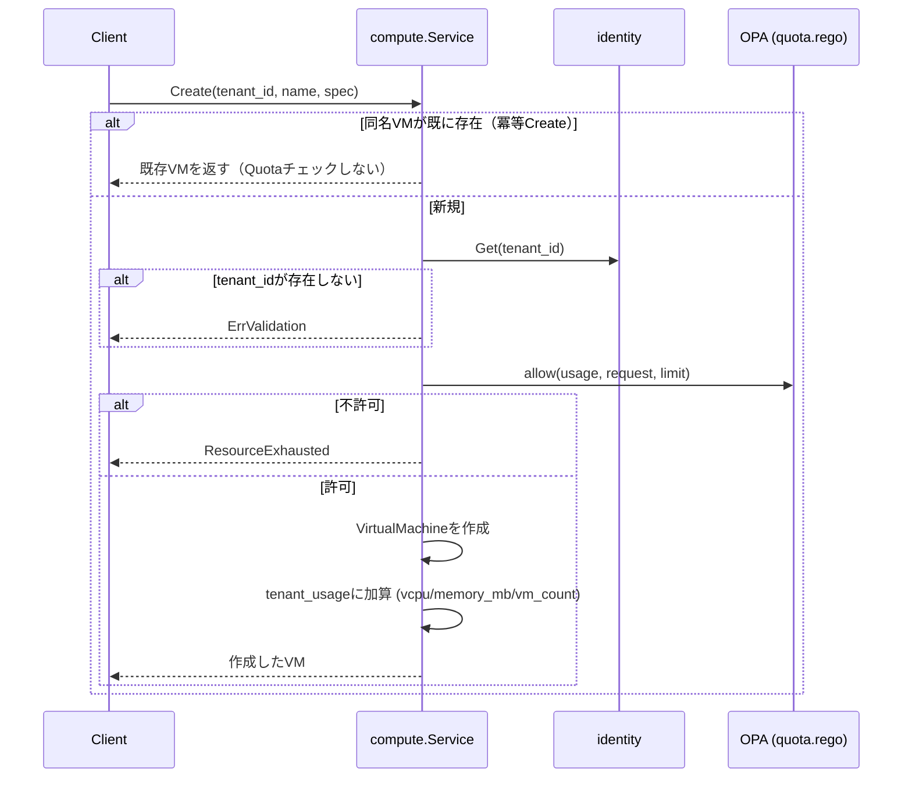

# Quota仕様

## 概要

Tenantが持つ利用上限（Quota）の値はidentityが保持し、使用量の集計・強制は各リソース所有サービス
（compute、block-storage）が自分自身の責務として行う。identityは他サービスの使用量を一切把握しない。

## Quotaの上限値（identity.Tenant.spec.quota）

| フィールド | 意味 |
|---|---|
| `max_vcpu` | テナント合計vCPU上限 |
| `max_memory_mb` | テナント合計メモリ上限(MB) |
| `max_volume_gb` | テナント合計ボリューム容量上限(GB)。block-storageが強制する |
| `max_vms` | テナント合計VM数上限 |
| `max_vcpu_per_vm` | VM1台あたりのvCPU上限 |
| `max_memory_mb_per_vm` | VM1台あたりのメモリ上限(MB) |
| `pci_devices` | `(vendor_id, device_id)`ごとのPCIパススルー上限（`PciDeviceQuota{vendor_id, device_id, max_count}`の配列）。テナント合計で、VM1台あたりの上限は無い |
| `max_images` | テナント合計Image数上限。imageが強制する |
| `max_subnets` | テナント合計Subnet数上限。networkが強制する |
| `max_network_interfaces` | テナント合計NetworkInterface数上限。networkが強制する（VM作成に伴う内部的なNetworkInterface作成にも同じ判定がかかる） |

`max_images`/`max_subnets`/`max_network_interfaces`も`pci_devices`と同じく、
未設定（0）は無制限ではなく**上限0**を意味する: Tenant作成時にこれらを指定しなければ、
そのテナントはImage/Subnet/NetworkInterfaceを1つも作れない。

`pci_devices`は他のフィールドと違い、リストに存在しない`(vendor_id, device_id)`の
組は**上限0（無制限ではない）**を意味する。GPU等の物理的に希少なリソースは、
vcpu/memory_mbのような「デフォルトで自由、上限だけ管理者が絞る」方式ではなく、
「管理者が明示的に許可した組だけがテナントに割り当て可能」という opt-in
方式にしている（[VirtualMachine仕様](virtual-machine.md)「PCIデバイスパススルー」参照）。

## 各サービスが保持する使用量（tenant_usage）

- compute内のin-memoryマップ（`tenant_id -> {vcpu, memory_mb, vm_count, pci_devices}`）。
  `pci_devices`は`(vendor_id, device_id) -> count`のマップで、他3フィールドと同じ
  マップ本体に同居する
- block-storage内のin-memoryマップ（`tenant_id -> {volume_gb}`）
- image内のin-memoryマップ（`tenant_id -> {image_count}`）
- network内のin-memoryマップ（`tenant_id -> {subnet_count, network_interface_count}`）

どれもDBではなくプロセス内状態。プロセス再起動やレプリカ入れ替えのたびに`Service`の
コンストラクタが対応するetcd上のリソース（VM/Volume/Image/Subnet/NetworkInterface）を
全件走査して`tenant_usage`を再構築する——in-memoryである以上、この再構築なしでは
再起動直後の使用量がゼロから数え直され、実際の使用量を大きく下回った状態でquota判定が
通ってしまう。

## 強制フロー（VM Create時）



- Quota判定は`internal/compute/quota.rego`（`package kyuusha.compute.quota`）に対するOPA評価で行う:

```rego
allow if {
	input.usage.vcpu + input.request.vcpu <= input.limit.max_vcpu
	input.usage.memory_mb + input.request.memory_mb <= input.limit.max_memory_mb
	input.usage.vm_count + 1 <= input.limit.max_vms
	input.request.vcpu <= input.limit.max_vcpu_per_vm
	input.request.memory_mb <= input.limit.max_memory_mb_per_vm
	every req in input.request.pci_devices {
		some lim in input.limit.pci_devices
		lim.vendor_id == req.vendor_id
		lim.device_id == req.device_id
		pci_usage_count(req.vendor_id, req.device_id) + req.count <= lim.max_count
	}
}
```

- `every`ブロックは`spec.pci_devices`が空なら自明に真（vacuous truth）——vcpu/memory_mbのみの
  既存Createと判定を分岐させる必要がない
- 該当する`(vendor_id, device_id)`が`limit.pci_devices`に一件も無ければ`some lim in ...`自体が
  失敗し、その時点で`allow`全体が不許可になる（上限0の意味。上の「Quotaの上限値」参照）
- 拒否は`Create`自体への同期的な`ResourceExhausted`。VMオブジェクトは作られない（`Error`フェーズへ倒すことはしない）
- `tenant_usage`への加算は、VM作成（`resource.Store.Create`）が成功した**後**に行う。作成が失敗した場合は加算しない

## 強制フロー（VM Resize時）

`VirtualMachineService.Resize`（[VirtualMachine仕様](virtual-machine.md)「リサイズ」参照）は
Createとは別の判定を行う: リサイズ対象のVMは既にtenant_usageに自分の**現在の**
vcpu/memory_mbが算入済みなので、Createの`usage+request<=limit`という絶対値の判定ではなく
`usage-old+new<=limit`（＝`usage+delta<=limit`）というデルタの判定が必要になる。また
`vm_count`はResizeで変化しない（VMを新しく作りも消しもしない）ため、`allow`の
`vm_count+1<=max_vms`項はResizeには一切現れない。

この形の違いから、`allow`をそのまま流用せず`internal/compute/quota.rego`に
`allow_resize`という別ルールを追加している（同じpackage内の兄弟ルール、Rego内で
mode分岐させるのではなく）:

```rego
allow_resize if {
	input.usage.vcpu + input.request.delta_vcpu <= input.limit.max_vcpu
	input.usage.memory_mb + input.request.delta_memory_mb <= input.limit.max_memory_mb
	input.request.new_vcpu <= input.limit.max_vcpu_per_vm
	input.request.new_memory_mb <= input.limit.max_memory_mb_per_vm
}
```

- 集計側（`max_vcpu`/`max_memory_mb`）はデルタで判定し、1台あたり上限
  （`max_vcpu_per_vm`/`max_memory_mb_per_vm`）は新しい絶対値で判定する
- `allow_resize`は`pci_devices`を一切判定しない: Resize（cold/`allow_migrate`併用とも）は
  `spec.vcpu`/`spec.memory_mb`のみを変更し、`spec.pci_devices`は常に元のVMのものを
  そのまま引き継ぐ（[VirtualMachine仕様](virtual-machine.md)「容量不足時の
  マイグレーションフォールバック」参照）ため、PCIデバイスのquota使用量はResizeで変化しない
- 縮小のみ（両軸ともdeltaが0以下）のリサイズはquotaを絶対に超過しえないため、
  identityへの`lookupQuota`呼び出し自体を省略する（`allow_resize`の評価にも進まない）
- 判定後の`tenant_usage`更新もCreateと同じくデルタ加算（`vcpu += delta_vcpu`等）で、
  `vm_count`は触らない
- `usageMu`はCreate/Delete同様、Resizeの「取得→判定→Hypervisor容量調整→
  VM更新→tenant_usage更新」の一連の処理全体を通して保持する

## 解放（VM/Volume Delete時）

削除対象VMの`spec.vcpu`/`spec.memory_mb`分を`tenant_usage`から減算し、`vm_count`を1減らす。
VMの取得・削除・減算は同一の呼び出し内で行う。block-storageも同様に、削除対象Volumeの
`spec.size_gb`分を`tenant_usage`から減算する（[Volume仕様](volume.md)参照）。

## 排他制御

`Service.usageMu`という単一の`sync.Mutex`が、Create/Deleteそれぞれの
「冪等チェック→Quota取得→判定→加算/減算」の一連の処理全体をロックする。
テナント単位ではなく**全テナント共通**のロックであるため、Create/Delete全体が直列化される。
compute/block-storage/image/networkそれぞれが自分専用の`usageMu`を持つ
（サービスを跨いだ排他は不要——`max_vcpu`/`max_memory_mb`/`max_vms`はcomputeだけが、
`max_volume_gb`はblock-storageだけが、`max_images`はimageだけが、
`max_subnets`/`max_network_interfaces`はnetworkだけが見るフィールドで、互いに独立しているため）。

## block-storageのQuota判定

`internal/block-storage/quota.go`（`internal/compute/quota.go`と同型）が、
`kyuusha.blockstorage.quota`パッケージに対するOPA評価で`max_volume_gb`のみを判定する:

```rego
allow if {
	input.usage.volume_gb + input.request.size_gb <= input.limit.max_volume_gb
}
```

VMのような1台あたり上限（`max_vcpu_per_vm`相当）はVolumeには存在しない
（`QuotaSpec`に`max_volume_gb`一つしかなく、Volume単体の上限や個数上限は無い）。

## imageのQuota判定

`internal/image/quota.go`（`internal/block-storage/quota.go`と同型、単一次元）が、
`kyuusha.image.quota`パッケージに対するOPA評価で`max_images`のみを判定する:

```rego
allow if {
	input.usage.image_count + 1 <= input.limit.max_images
}
```

- 判定対象はテナント合計のImage数のみ。Volumeと同じく1件あたりの上限や
  サイズに応じた上限は無い
- 拒否は`Create`自体への同期的な`InvalidArgument`（`ErrQuotaExceeded`）。Imageは
  Finalizer/soft-deleteを持たないため、`Delete`は即座に`tenant_usage`の
  `image_count`を1減らす

## networkのQuota判定

`internal/network/quota.go`が、`kyuusha.network.quota`パッケージに対する
OPA評価でSubnet/NetworkInterfaceそれぞれの上限を判定する。両者は独立した
リソースなので、compute同様「同じpackage内の兄弟ルール」として`allow_subnet`/
`allow_network_interface`の2つに分けている（1つの`allow`にmode分岐を持たせない）:

```rego
default allow_subnet := false
allow_subnet if {
	input.usage.subnet_count + 1 <= input.limit.max_subnets
}

default allow_network_interface := false
allow_network_interface if {
	input.usage.network_interface_count + 1 <= input.limit.max_network_interfaces
}
```

- `CreateSubnet`は`allow_subnet`を、`CreateNetworkInterface`は
  `allow_network_interface`を判定する。どちらも単一次元（VM1台あたり上限に相当する
  概念が無い）ため、Create時の絶対値判定のみで、Resize相当の判定は存在しない
- `CreateNetworkInterface`は直接のテナント操作（`kyuusha netif create`）と、
  VM作成に伴ってcomputeが内部的に呼ぶ経路（[VirtualMachine仕様](virtual-machine.md)
  のネットワーク構成参照）の両方から呼ばれるが、`Service.CreateNetworkInterface`
  一箇所でのみ判定するため、呼び出し元による特別扱いは無い——VM作成時に
  自動生成されるNetworkInterfaceも同じ`max_network_interfaces`を消費する
- quota判定は、既存のSubnet存在チェック・Ready状態チェックより**後**に行う
  （存在しないSubnetを指しているだけの不正なリクエストで先にquotaを消費させない）
- 拒否は`Create*`自体への同期的な`InvalidArgument`（`ErrQuotaExceeded`）。
  `DeleteSubnet`/`DeleteNetworkInterface`はSubnet/NetworkInterfaceが
  ハードデリートのため、削除成功後に即座に`tenant_usage`の該当カウントを1減らす
