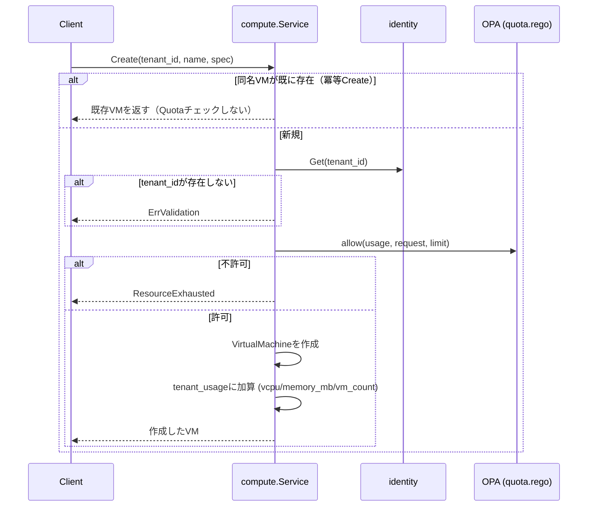

# Quota仕様

## 概要

Tenantが持つ利用上限（Quota）の値はidentityが保持し、使用量の集計・強制は各リソース所有サービス
（現状はcomputeのみ）が自分自身の責務として行う。identityは他サービスの使用量を一切把握しない。

## Quotaの上限値（identity.Tenant.spec.quota）

| フィールド | 意味 |
|---|---|
| `max_vcpu` | テナント合計vCPU上限 |
| `max_memory_mb` | テナント合計メモリ上限(MB) |
| `max_volume_gb` | テナント合計ボリューム容量上限(GB)。block-storage未実装のため現状未使用 |
| `max_vms` | テナント合計VM数上限 |
| `max_vcpu_per_vm` | VM1台あたりのvCPU上限 |
| `max_memory_mb_per_vm` | VM1台あたりのメモリ上限(MB) |

## computeが保持する使用量（tenant_usage）

compute内のin-memoryマップ（`tenant_id -> {vcpu, memory_mb, vm_count}`）。DBではなくプロセス内状態。

## 強制フロー（VM Create時）



- Quota判定は`internal/compute/quota.rego`（`package kyuusha.compute.quota`）に対するOPA評価で行う:

```rego
allow if {
	input.usage.vcpu + input.request.vcpu <= input.limit.max_vcpu
	input.usage.memory_mb + input.request.memory_mb <= input.limit.max_memory_mb
	input.usage.vm_count + 1 <= input.limit.max_vms
	input.request.vcpu <= input.limit.max_vcpu_per_vm
	input.request.memory_mb <= input.limit.max_memory_mb_per_vm
}
```

- 拒否は`Create`自体への同期的な`ResourceExhausted`。VMオブジェクトは作られない（`Error`フェーズへ倒すことはしない）
- `tenant_usage`への加算は、VM作成（`resource.Store.Create`）が成功した**後**に行う。作成が失敗した場合は加算しない

## 解放（VM Delete時）

削除対象VMの`spec.vcpu`/`spec.memory_mb`分を`tenant_usage`から減算し、`vm_count`を1減らす。
VMの取得・削除・減算は同一の呼び出し内で行う。

## 排他制御

`Service.usageMu`という単一の`sync.Mutex`が、Create/Deleteそれぞれの
「冪等チェック→Quota取得→判定→加算/減算」の一連の処理全体をロックする。
テナント単位ではなく**全テナント共通**のロックであるため、Create/Delete全体が直列化される。
