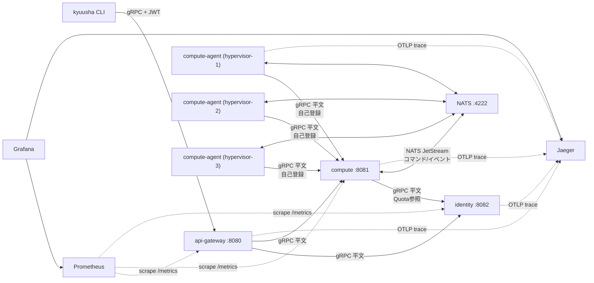

# システム構成仕様

## コンポーネント一覧

| コンポーネント | 役割 |
|---|---|
| `kyuusha`（CLI） | api-gateway経由でVM/Tenant/Hypervisorを操作するクライアント。開発用トークン発行(`token mint`)も持つ |
| `api-gateway` | client向けの唯一の公開エンドポイント。JWT検証＋OPA認可を行い、backendへフォワードする |
| `identity` | Tenant（テナント・Quota上限値）を管理するCRUD+Watchサービス |
| `compute` | VirtualMachine・Hypervisorを管理するサービス。スケジューラ、Quota強制、compute-agentとのNATSやり取りを持つ |
| `compute-agent` | 各ハイパーバイザー上で動くagent。起動時にcomputeへ自己登録し、NATS経由でVM作成コマンドを受けて処理する（現状VMM呼び出しはstub） |
| `NATS (JetStream)` | compute ↔ compute-agent間の非同期コマンド/イベントバス |
| `Jaeger` | トレースの収集・表示（[トレーシング仕様](observability-tracing.md)） |
| `Prometheus` | メトリクスのscrape（[メトリクス仕様](observability-metrics.md)） |
| `Grafana` | Prometheus/Jaegerを可視化するダッシュボード |

未実装のコンポーネント（設計のみ）: network, block-storage, image, Dragonfly。

## 通信経路

- clientが到達できるのは`api-gateway`のみ。`compute`/`identity`はネットワーク的に到達可能でも
  クライアントが直接叩くことは想定しない構成（docker-compose上はホストにポート公開しない）
- `compute-agent`は`compute`に**直接**gRPCで接続する（自己登録用。api-gatewayは経由しない、東西通信）
- `compute` → `identity`もサービス間の直接gRPC呼び出し（Quota参照。同じく東西通信）
- 現状すべての通信は平文（mTLS未実装）

## エンドポイント一覧

| サービス | デフォルトアドレス | 提供API |
|---|---|---|
| `api-gateway` | `:8080` | `VirtualMachineService`, `HypervisorService`（Get/List/Watch/SetSchedulableのみ）, `TenantService` |
| `compute` | `:8081` | `VirtualMachineService`, `HypervisorService`（Registerを含む全RPC） |
| `identity` | `:8082` | `TenantService` |
| `NATS` | `:4222`（client）, `:8222`（監視用HTTP、compose環境のみ） | JetStream |
| `Jaeger` | `:4317`（OTLP/gRPC受信）, `:16686`（UI） | - |
| `Prometheus` | `:9090` | - |
| `Grafana` | `:3000` | - |

各サービス自身の`/metrics`（`-metrics-addr`）: identity `:9091`, compute `:9092`,
api-gateway `:9093`, compute-agent `:9094`。詳細は[メトリクス仕様](observability-metrics.md)。

## docker-composeサービス構成

`docker-compose.yml`（playground用）:

| compose service | 実行バイナリ | 備考 |
|---|---|---|
| `nats` | 公式`nats:2-alpine`イメージ | `-js`でJetStream有効化 |
| `identity` | `cmd/identity` | ホストにポート非公開 |
| `compute` | `cmd/compute` | ホストにポート非公開 |
| `api-gateway` | `cmd/api-gateway` | `8080:8080`のみホストへ公開 |
| `compute-agent-1/2/3` | `cmd/compute-agent` | それぞれ`-hypervisor=hypervisor-N`で起動、compute/NATSへ接続 |
| `jaeger` | 公式`jaegertracing/all-in-one`イメージ | `16686`をホストへ公開 |
| `prometheus` | 公式`prom/prometheus`イメージ | `playground/prometheus.yml`をマウント。`9090`をホストへ公開 |
| `grafana` | 公式`grafana/grafana`イメージ | `playground/grafana/provisioning`をマウント。`3000`をホストへ公開、匿名admin有効 |

## 認証・認可

api-gatewayが唯一の実施点。詳細は[認証・認可仕様](authn-authz.md)を参照。
