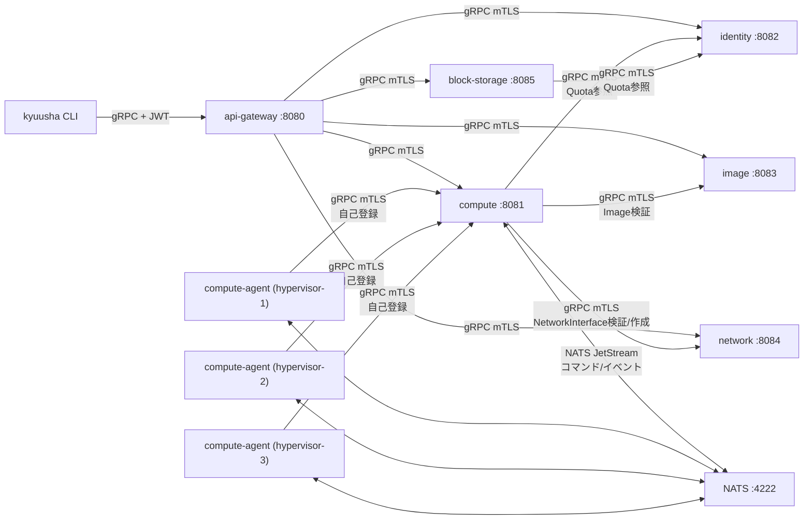

# システム構成仕様

playgroundで使っている具体的なオブザーバビリティ基盤（Jaeger/Prometheus/Loki/Grafana等）は
kyuusha自体の構成要素ではない。それらのエンドポイント・docker-composeでの配線は
[playground/README.md](../../playground/README.md)を参照。ここに書くのはkyuusha自身が
持つサービスのみ。

## コンポーネント一覧

| コンポーネント | 役割 |
|---|---|
| `kyuusha`（CLI） | api-gateway経由でVM/Tenant/Hypervisor/Image/Subnet/NetworkInterface/Volume/VolumeAttachmentを操作するクライアント。開発用トークン発行(`token mint`)も持つ |
| `api-gateway` | client向けの唯一の公開エンドポイント。JWT検証＋OPA認可を行い、backendへフォワードする |
| `identity` | Tenant（テナント・Quota上限値）を管理するCRUD+Watchサービス |
| `image` | Image（外部URL参照+digestのメタデータ）を管理するCRUD+Watchサービス。Create時にURL到達性・format整合性を検証し、Pending→Ready/Errorへ非同期遷移させる。`visibility`（PRIVATE/PUBLIC）+`shared_with_tenant_ids`によるテナント間共有も実装済み（[Image仕様](image.md)参照） |
| `network` | Subnet・NetworkInterfaceを管理するCRUD+Watchサービス（[network仕様](network.md)参照）。VLAN ID/IPアドレスの払い出し（IPAM）は実装済み |
| `block-storage` | Volume・VolumeAttachmentを管理するCRUD+Watchサービス（[Volume仕様](volume.md)参照）。Quota（max_volume_gb）強制と、同一Volumeへの二重アタッチを防ぐ排他制御は実装済み。ボリュームの作成/削除やHypervisor側の接続確立は一切行わない——既存の（iSCSI/NVMe-oF/NFSで到達可能な）ボリュームを参照するだけ（[Volume仕様](volume.md)「概要」参照） |
| `compute` | VirtualMachine・Hypervisorを管理するサービス。スケジューラ（zoneフィルタ含む）、Quota強制、Image/NetworkInterface/Volume検証（identity/image/network/block-storageへの同期参照）、compute-agentとのNATSやり取りを持つ。`-volumes`で指定したVolumeAttachmentの作成・起動コマンドへの連携も実装済み |
| `compute-agent` | 各ハイパーバイザー上で動くagent。起動時にcomputeへ自己登録し、NATS経由でVM作成/削除コマンドを受けて処理する。`driver_hint=FIRECRACKER`/`QEMU`どちらも実際にVMを起動する（[Firecracker起動仕様](firecracker-boot.md)/[QEMU起動仕様](qemu-boot.md)参照）。`network_interfaces`を持つVMには実タップデバイス+ローカルブリッジも配線する（同一Hypervisor内のみ、[network仕様](network.md)参照） |
| `NATS (JetStream)` | compute ↔ compute-agent間の非同期コマンド/イベントバス |

未実装のコンポーネント（設計のみ）: Dragonfly。

## 通信経路

- clientが到達できるのは`api-gateway`のみ。`compute`/`identity`/`image`/`network`/`block-storage`は
  ネットワーク的に到達可能でもクライアントが直接叩くことは想定しない構成（docker-compose上は
  ホストにポート公開しない）
- `compute-agent`は`compute`に**直接**gRPCで接続する（自己登録用。api-gatewayは経由しない、東西通信）
- `compute` → `identity`（Quota参照）・`compute` → `image`（Image検証）・`compute` → `network`
  （NetworkInterface検証/作成、[network仕様](network.md)「compute側の統合」参照）・
  `compute` → `block-storage`（Volume検証、VolumeAttachment作成、[Volume仕様](volume.md)
  「compute側の統合」参照）もサービス間の直接gRPC呼び出し（同じく東西通信）。
  `block-storage` → `identity`（Quota参照）も同様
- `block-storage`はNATSにも直接つながる（gRPC経由ではない）: `compute`が発行する
  Hypervisorの`zone`+`storage_connections`イベントのsubscribe、`compute-agent`との
  StorageConnection/Volume検証コマンド/応答のやり取り（[Volume仕様](volume.md)
  「検証フロー」参照）——`compute`のHypervisor情報をgRPCで取得すると
  `compute` ↔ `block-storage`が双方向依存になってしまうため、あえてcomputeの
  gRPCを経由せずNATSで直結している
- 東西通信（上記すべて）は`internal/mtls`による相互TLS認証済み（[認証・認可仕様](authn-authz.md)
  「適用範囲・既知のギャップ」参照）。南北（clientとapi-gateway間）はJWT認証のみで、mTLSではない

## エンドポイント一覧

| サービス | デフォルトアドレス | 提供API |
|---|---|---|
| `api-gateway` | `:8080` | `VirtualMachineService`, `HypervisorService`（Get/List/Watch/SetSchedulableのみ）, `TenantService`, `ImageService`, `SubnetService`, `NetworkInterfaceService`, `VolumeService`, `VolumeAttachmentService`, `StorageConnectionService` |
| `compute` | `:8081` | `VirtualMachineService`, `HypervisorService`（Registerを含む全RPC） |
| `identity` | `:8082` | `TenantService` |
| `image` | `:8083` | `ImageService` |
| `network` | `:8084` | `SubnetService`, `NetworkInterfaceService` |
| `block-storage` | `:8085` | `VolumeService`, `VolumeAttachmentService`, `StorageConnectionService` |
| `NATS` | `:4222`（client）, `:8222`（監視用HTTP、compose環境のみ） | JetStream |

各サービス自身が公開する`/metrics`（Prometheus形式、`-metrics-addr`で指定）と、`-otlp-endpoint`
で有効化されるトレースエクスポート、JSON構造化ログ（標準出力）は、kyuusha自身の設計として
バックエンド非依存（どのProm互換ツールでscrapeするか、どのOTLPコレクタへ送るかは運用者側の
自由）。詳細・既定ポート番号は[メトリクス仕様](observability-metrics.md)・
[トレーシング仕様](observability-tracing.md)・[監査ログ仕様](audit-logging.md)を参照。

## 認証・認可

api-gatewayが唯一の実施点。詳細は[認証・認可仕様](authn-authz.md)を参照。
