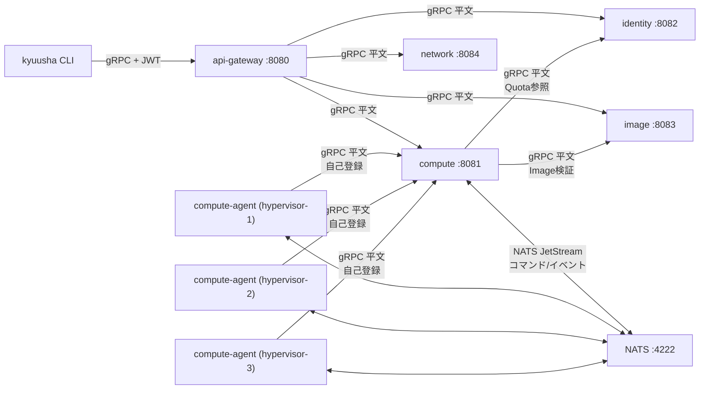

# システム構成仕様

playgroundで使っている具体的なオブザーバビリティ基盤（Jaeger/Prometheus/Loki/Grafana等）は
kyuusha自体の構成要素ではない。それらのエンドポイント・docker-composeでの配線は
[playground/README.md](../../playground/README.md)を参照。ここに書くのはkyuusha自身が
持つサービスのみ。

## コンポーネント一覧

| コンポーネント | 役割 |
|---|---|
| `kyuusha`（CLI） | api-gateway経由でVM/Tenant/Hypervisor/Image/Subnet/NetworkInterfaceを操作するクライアント。開発用トークン発行(`token mint`)も持つ |
| `api-gateway` | client向けの唯一の公開エンドポイント。JWT検証＋OPA認可を行い、backendへフォワードする |
| `identity` | Tenant（テナント・Quota上限値）を管理するCRUD+Watchサービス |
| `image` | Image（外部URL参照+digestのメタデータ）を管理するCRUD+Watchサービス。Create時にURL到達性・format整合性を検証し、Pending→Ready/Errorへ非同期遷移させる |
| `network` | Subnet・NetworkInterfaceを管理するCRUD+Watchサービス（[network仕様](network.md)参照）。VLAN ID/IPアドレスの払い出し（IPAM）は実装済み。tap配線・agent連携は別途 |
| `compute` | VirtualMachine・Hypervisorを管理するサービス。スケジューラ、Quota強制、Image検証（identity/imageへの同期参照）、compute-agentとのNATSやり取りを持つ |
| `compute-agent` | 各ハイパーバイザー上で動くagent。起動時にcomputeへ自己登録し、NATS経由でVM作成/削除コマンドを受けて処理する。`driver_hint=FIRECRACKER`は実際にFirecracker microVMを起動する（[Firecracker起動仕様](firecracker-boot.md)参照）。QEMUドライバは未実装のまま。tap配線が実装される際もnetwork-agentという別プロセスは作らず、ここに統合する方針（[network仕様](network.md)参照） |
| `NATS (JetStream)` | compute ↔ compute-agent間の非同期コマンド/イベントバス |

未実装のコンポーネント（設計のみ）: block-storage, Dragonfly。

## 通信経路

- clientが到達できるのは`api-gateway`のみ。`compute`/`identity`/`image`/`network`はネットワーク的に
  到達可能でもクライアントが直接叩くことは想定しない構成（docker-compose上はホストにポート公開しない）
- `compute-agent`は`compute`に**直接**gRPCで接続する（自己登録用。api-gatewayは経由しない、東西通信）
- `compute` → `identity`（Quota参照）・`compute` → `image`（Image検証）もサービス間の直接gRPC呼び出し
  （同じく東西通信）。`compute` → `network`の直接呼び出しはまだない（VM作成時に
  NetworkInterfaceを作る/参照する連携は未統合。[network仕様](network.md)参照）
- 現状すべての通信は平文（mTLS未実装）

## エンドポイント一覧

| サービス | デフォルトアドレス | 提供API |
|---|---|---|
| `api-gateway` | `:8080` | `VirtualMachineService`, `HypervisorService`（Get/List/Watch/SetSchedulableのみ）, `TenantService`, `ImageService`, `SubnetService`, `NetworkInterfaceService` |
| `compute` | `:8081` | `VirtualMachineService`, `HypervisorService`（Registerを含む全RPC） |
| `identity` | `:8082` | `TenantService` |
| `image` | `:8083` | `ImageService` |
| `network` | `:8084` | `SubnetService`, `NetworkInterfaceService` |
| `NATS` | `:4222`（client）, `:8222`（監視用HTTP、compose環境のみ） | JetStream |

各サービス自身が公開する`/metrics`（Prometheus形式、`-metrics-addr`で指定）と、`-otlp-endpoint`
で有効化されるトレースエクスポート、JSON構造化ログ（標準出力）は、kyuusha自身の設計として
バックエンド非依存（どのProm互換ツールでscrapeするか、どのOTLPコレクタへ送るかは運用者側の
自由）。詳細・既定ポート番号は[メトリクス仕様](observability-metrics.md)・
[トレーシング仕様](observability-tracing.md)・[監査ログ仕様](audit-logging.md)を参照。

## 認証・認可

api-gatewayが唯一の実施点。詳細は[認証・認可仕様](authn-authz.md)を参照。
