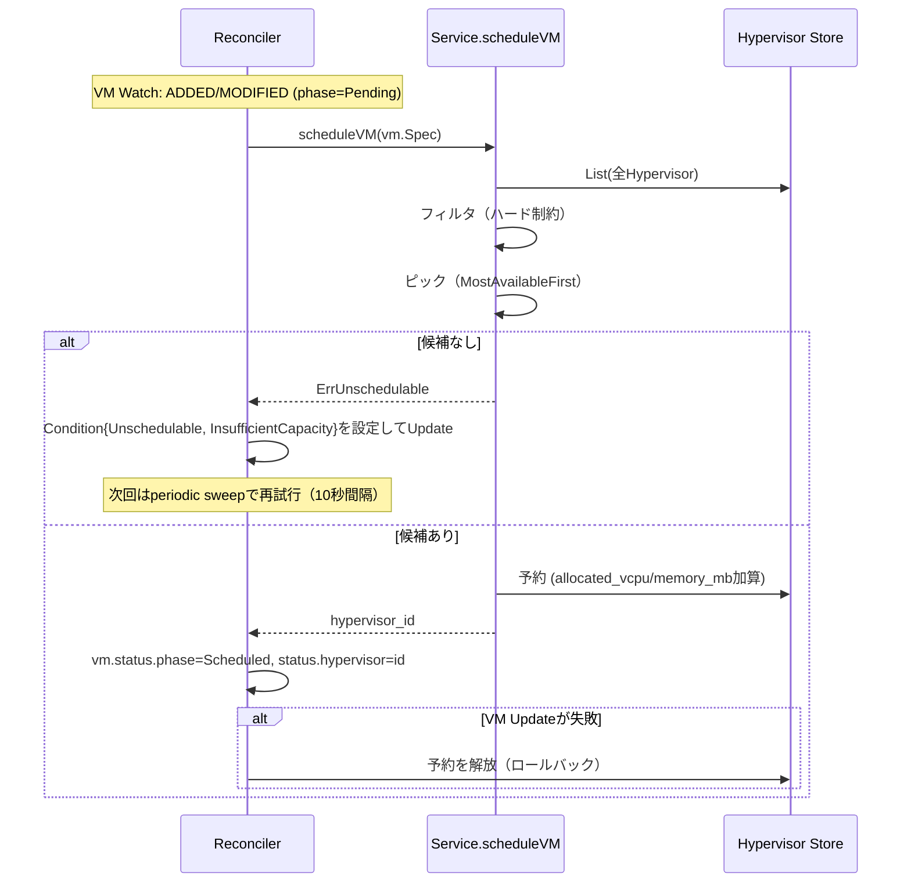

# VMスケジュール仕様

## 概要

`Pending`のVirtualMachineに配置先Hypervisorを決定し、`Scheduled`へ遷移させるcomputeの内部処理。
Reconcilerが VirtualMachine の Watch イベント駆動、および定期スイープの2経路で実行する。

## 全体フロー

## フィルタ（ハード制約）

`filterSchedulable`が以下を**すべて**満たすHypervisorのみを候補として残す。

1. `status.phase == Ready`
2. `spec.schedulable == true`（[Hypervisor登録仕様](hypervisor-bootstrap.md)参照）
3. `spec.driver_hint`（VMの要求。未指定なら`FIRECRACKER`）が`status.supported_drivers`に含まれる
4. `status.allocatable_vcpu - status.allocated_vcpu >= 要求vcpu`
5. `status.allocatable_memory_mb - status.allocated_memory_mb >= 要求memory_mb`
6. `status.zone == requiredZone`（`requiredZone`が空でない場合のみ）
7. `spec.volumes`が要求する`storage_connection`が全て`status.storage_connections`
   に含まれる（`requiredConnections`が空でない場合のみ）
8. `spec.pci_devices`が指定されている場合、要求を満たす未割当の`PciDevice`
   （`vendor_id`/`device_id`一致、`count`分の数量）が`status.available_devices`
   に十分な数だけ存在する（`spec.pci_devices`が空のVMには影響しない。
   [VirtualMachine仕様](virtual-machine.md)「PCIデバイスパススルー」参照）
9. `spec.numa_pinned`が`true`の場合、`status.numa_nodes`のうち**いずれか1つ**が
   要求vcpu/memory_mbを満たす（`spec.numa_pinned`が`false`のVMには影響しない。
   [VirtualMachine仕様](virtual-machine.md)「NUMA/CPUピニング」参照）

`requiredZone`は`spec.network_interfaces`が参照するSubnetのzoneから導出する
（[network.md](network.md)「compute側の統合」参照）。マルチAZにまたがる
VirtualMachineは作れない、という`docs/architecture.md`の決定を実際に強制する
のはこのフィルタで、`network_interfaces`が空のVM（zone制約なし）には影響しない。
PhasePendingの`reconcile()`が毎回Subnetを引き直してzoneを求めるため、
Create時点から実際のスケジュール時点までの間にSubnetが変わっていても
（例えば削除されていても）常に最新の状態で評価される。

`requiredConnections`は同様に`spec.volumes`が参照するVolumeの
`spec.storage_connection`から`validateVolumes`が毎回導出する（重複除去済み）
——zoneと全く同じ「Create時点でキャッシュせず、実際のスケジュール時点で
都度Volumeを引き直す」設計（[Volume仕様](volume.md)「スケジューリング時の
フィルタリング」参照）。`Migrate`・`Resize`の容量不足フォールバックが行う
再スケジュールもこの同じフィルタを通るため、移行先で対象Volumeが解決できない
Hypervisorへ移すことはない。`network_interfaces`が空のVMと同様、`volumes`が
空のVM（接続要件なし）には影響しない。

## ピック（MostAvailableFirst）

フィルタを通過した候補の中から、**空きvCPU（`allocatable_vcpu - allocated_vcpu`）が最大**のHypervisorを選ぶ。
候補が0件の場合は`ErrUnschedulable`。

`SchedulingStrategy`インターフェースとして抽象化されており、`MostAvailableFirst`はその唯一の実装。

## 予約（capacity reservation）

- 選定したHypervisorの`allocated_vcpu`/`allocated_memory_mb`に要求量を加算する
- Get→mutate→Updateの楽観的並行性制御（`resource_version`）で行い、衝突時は最大20回まで自動リトライする
- `spec.pci_devices`が非空なら、続けて`reservePciDevices`が同じHypervisorの
  `available_devices`から要求を満たす具体的なアドレスを選び`allocated`を
  `true`にする（オールオアナッシング——一部だけ確保して残りが足りない状態には
  しない）。失敗した場合は直前のvcpu/memory_mb予約を解放してから
  `ErrUnschedulable`を返す
- `spec.numa_pinned`が`true`なら、続けて`reserveNumaNode`が同じHypervisorの
  `numa_nodes`のうち要求を満たす**1つ**を選び、その`allocated_vcpu`/
  `allocated_memory_mb`に要求量を加算する（PCIデバイスと違い複数ノードへの分散は
  そもそも意味がないため、常にちょうど1つを選ぶ）。失敗した場合は直前の
  vcpu/memory_mb・PCIデバイスの予約を解放してから`ErrUnschedulable`を返す
- 予約の後にVMの`Scheduled`遷移（Update）を行う。VM側のUpdateが失敗した場合、
  直前の予約（vcpu/memory_mb・PCIデバイス・NUMAノードのすべて）を解放（ロールバック）する

## 解放（capacity release）

以下のいずれかのタイミングで、該当VMの`spec.vcpu`/`spec.memory_mb`分を
`allocated_vcpu`/`allocated_memory_mb`から減算し、`status.allocated_pci_devices`
の各アドレスの`allocated`を`false`に戻し、`status.allocated_numa_node`が
未固定（`-1`）でなければそのノードの`allocated_vcpu`/`allocated_memory_mb`からも
同じ分を減算する。

- VMが削除された時（`status.hypervisor`が設定済み、すなわち一度でもスケジュールされていた場合のみ）
- VM作成が失敗し`Error`へ遷移する時。このとき`status.hypervisor`を空文字列にクリアし、
  後続のVM削除で二重に解放されないようにする

ロールバック時（`Update`失敗直後にvcpu/memory_mb予約を復元する場合）は、
新規予約と同じ`reservePciDevices`（改めて空きを探す）ではなく、直前まで
確保していた**同じ**アドレスをそのまま`allocated=true`へ戻す専用の
`restorePciDevices`を使う——VMオブジェクト自体は書き換わっていない
（`Update`が失敗している）ため、ロールバックの結果が別の物理アドレスに
なってしまうと不整合になるため。NUMAノードも同じ理由で、直前まで固定していた
**同じ**ノードIDへそのまま加算し直す専用の`restoreNumaNode`を使う（新規予約と
同じ`reserveNumaNode`で改めて選び直すと別のノードになりうる）。

## リサイズ時の容量調整

`VirtualMachineService.Resize`（[VirtualMachine仕様](virtual-machine.md)「リサイズ」参照）は、
上記の予約/解放とは別の、より単純な経路を通る：

- VMが既に割り当て済みのHypervisor（`status.hypervisor`）に対する容量の**デルタ調整**のみ行う。
  `filterSchedulable`/`Pick`の再実行は一切しない——候補一覧も作らず、スケジューリングも
  やり直さない
- 成長方向（新vcpu/memory_mbが現在の値より大きい）の軸だけ、その軸の空き容量
  （`allocatable - allocated`）がデルタ以上あるか検証する。縮小方向の軸は常に収まる
  （容量を解放するだけなので）
- 収まらない場合は`ResourceExhausted`（`ErrHypervisorCapacityExceeded`）で拒否する。
  「予約」節のスケジューリング失敗時（`ErrUnschedulable`、候補が1つも無い）とは
  意味が異なる別エラーとして扱う——こちらは「候補が無い」のではなく
  「この1台に収まらない」ため
- **既定では他Hypervisorへの再スケジュールはしない**: 収まらなければそこで拒否して
  終わり。`ResizeVirtualMachineRequest.allow_migrate=true`を明示した場合のみ、
  この1台に収まらないことが唯一の失敗理由であるケースに限って、`Migrate`と同じ
  コールド移動（現在のHypervisorを除外した`scheduleVM`の自動選択、新サイズ基準）を
  併用して収まる別Hypervisorへ移す。既定`false`のままなら、ユーザーはVMを
  作り直す以外の手段がない（[VirtualMachine仕様](virtual-machine.md)
  「容量不足時のマイグレーションフォールバック」参照）
- 予約と同じくGet→mutate→Updateの楽観的並行性制御（`updateHypervisor`の
  リトライループ）を再利用する。成功後にVM側の`store.Update`が失敗した場合、
  適用したデルタと同じ値で逆方向の調整（`releaseHypervisorCapacity`相当）を行い
  ロールバックする
- `status.allocated_numa_node`が未固定（`-1`）でなければ、`resizeNumaNodeCapacity`が
  同じデルタ調整をその固定先ノードに対しても行う（`resizeHypervisorCapacity`の
  ノード単位版）——ノードの物理CPU数/メモリ量を超える成長は、Hypervisor全体の
  空き容量に関わらず拒否される（例: Hypervisor全体は空きがあっても、固定先ノードの
  CPU数自体が足りない）

## スケジュール失敗時の挙動

- VMは`Pending`のまま留まり、`Condition{type: Unschedulable, status: True, reason: InsufficientCapacity}`が設定される
- スケジューリングは通常VM側のWatchイベントでのみ起動されるが、容量が空くのはHypervisor側の変化であり
  VMイベントを発生させない。このため10秒間隔の定期スイープが全`Pending`のVMに対して再度スケジュールを試みる
- スケジュールに成功すると同じConditionが`status: False, reason: Scheduled`に更新される（削除はされない）
