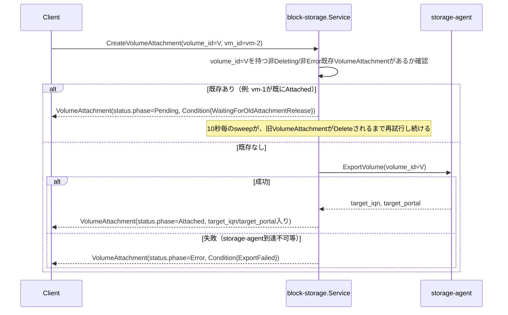

# Volume仕様

## 概要

ブロックストレージの塊である`Volume`と、`Volume`とVirtualMachineの結びつきを表す
`VolumeAttachment`を管理するCRUD+Watchサービス（`block-storage`）。NetworkInterfaceと同じ
「結びつきそのものをリソースにする」パターン（詳細は`docs/architecture.md`
「block-storageサービスのリソース: Volume / VolumeAttachment」参照）。

**実バックエンドあり**: `Volume`は実際に専用の`storage-agent`サービス
（`cmd/storage-agent`、`internal/storage-agent`）が持つZFSプール上のzvolとして作られ、
`VolumeAttachment`はその実iSCSIエクスポートへの接続として実現される（下記
「StorageBackendの実装」参照）。v1のデフォルトはiSCSI——`docs/architecture.md`
「block-storageのバックエンド抽象化」が想定するNVMe-oF/TCPではない（開発環境の
カーネルに`nvmet-tcp`が無く`nvmet-fc`しか無かったため。実FCハードウェアが要る
`nvmet-fc`は選べない）。

## リソース

| フィールド | 説明 |
|---|---|
| `Volume.spec.size_gb` | ボリュームサイズ(GB) |
| `Volume.status.phase` | `Pending`（実装上は一瞬） / `Ready` / `Deleting` / `Error` |
| `VolumeAttachment.spec.volume_id` / `vm_id` | 結びつけるVolumeとVirtualMachineのID |
| `VolumeAttachment.spec.device_hint` | 省略可。デバイスパスの希望（現状使われていない） |
| `VolumeAttachment.status.phase` | `Pending` / `Attaching` / `Attached` / `Detaching` / `Deleting` / `Error` |
| `VolumeAttachment.status.target_iqn` / `target_portal` | `tryAttach`の実`ExportVolume`呼び出しが成功すると入る、実iSCSIターゲットの接続情報。`Pending`中や`Error`（storage-agent到達不可等）では空のまま |
| `VolumeAttachment.status.device_path` / `hypervisor` | **常に空**（既知の未実装事項、下記参照） |

どちらも`tenant_id`を持つテナントスコープのリソース。

## Quota強制（Volume Create時）

`internal/compute/quota.go`と同じ形の`internal/block-storage/quota.go`が、identityの
`QuotaSpec.max_volume_gb`に対してOPA（`kyuusha.blockstorage.quota`パッケージ）で判定する:

```rego
allow if {
	input.usage.volume_gb + input.request.size_gb <= input.limit.max_volume_gb
}
```

`Service.usageMu`が同期Create/Deleteの一連（べき等チェック→Quota取得→判定→加算/減算）を
全テナント共通でロックする（compute/`internal/compute/quota.go`と全く同じ設計）。拒否は
`Create`自体への同期的な`ResourceExhausted`。Volumeオブジェクトは作られない——判定を
通ったら、実際に`storage-agent`へzvolの作成を依頼してから（下記参照）`Ready`にする。

## 排他制御（VolumeAttachment）

`docs/architecture.md`「未解決の危険: フェンシング問題」「具体的な排他制御」で決めた
「ある`volume_id`について`Deleting`/`Error`以外のphaseのVolumeAttachmentは同時に1つまで」
制約を実装している。



- network/Subnet・NetworkInterfaceのIPAM枯渇（`VlanPoolExhausted`/`IPPoolExhausted`）と
  全く同じ「Createは拒否せずPendingで受理し、`Run`の`pendingSweepInterval`（10秒）ごとの
  スイープで再試行する」設計。旧VolumeAttachmentが単に通常のDetach処理中なだけかもしれず、
  即座に拒否するのは不適切なため
- 判定は`hasActiveAttachment`が全テナント横断で`s.attachments`をスキャンして行う
  （Subnet固有のIPプールのような`volume_id`ごとの専用インデックスは持たない。この
  システムの想定スケール——同時に生きているアタッチメント数はVM数ほど大きくない——では
  許容範囲）
- **`tryAttach`の`hasActiveAttachment`チェック→`ExportVolume`→`Update`の一連は
  `attachMu`でロックする**——ライブ検証で実際に踏んだ実バグ: 同じ`volume_id`への
  VolumeAttachmentを2つ連続で作ると、ロックなしでは両方とも`hasActiveAttachment`の
  「ブロックされていない」判定を先に済ませてしまい、両方とも`Attached`になってしまう
  （排他制御が機能しないTOCTOU）。全体を通しての単一ロックで直した（`usageMu`と同じ
  「このスケールなら粗いグローバルロックで十分」という判断）
- `Error`フェーズ（`ExportVolume`失敗）も`Deleting`と同じく「アクティブ」から除外する
  ——除外しないと、一度でも`ExportVolume`に失敗したVolumeAttachmentが永久にそのVolumeを
  排他制御でブロックし続けてしまう（`Error`フェーズは定期スイープの対象外なので、
  自然に回復する見込みがない）

## StorageBackendの実装（`internal/storage-agent`）

`storage-agent`は1台のストレージノードの実ZFSプール（スパースファイル裏付け）+LIO iSCSI
ターゲットを持つ、独立したサービス（`docs/architecture.md`「専用ストレージノード」設計。
computeと`compute-agent`が別プロセスなのと同じ理由で、block-storageに畳み込まず別コンテナ/
プロセスにしている——実際にVM I/Oパス上に乗るのは`compute-agent`が直接ダイヤルする
`storage-agent`であって、block-storage自身は一度もI/Oパスに乗らない）。v1は単一ノード
固定・動的登録やスケジューリングは無し（この規模では十分、`docs/architecture.md`参照）。

- **Volume作成**: `zfs create -V <size>G <pool>/<volume_id>`でzvolを作る
- **エクスポート（`ExportVolume`）**: `iqn.2026-09.io.kyuusha:<volume_id>`という専用の
  LIOターゲット（1ターゲット1LUN）を作り、`0.0.0.0:<-portal-hostの実ポート>`へ
  ネットワークポータルをバインドする。**認可なし**（`generate_node_acls=1`,
  `demo_mode_write_protect=0`）——到達できる initiator は誰でもログインできる
  （下記「この実装がカバーしないもの」参照）
- **既知のgotcha（環境依存、コード外の運用注意）**: LIOのポート単位ネットワークポータルは
  複数ターゲットで共有される単一のカーネルオブジェクトで、そのネットワーク名前空間は
  「最後の全リセット以降、最初にそのポートのポータルを作ったプロセス」に恒久的に
  固定される。`storage-agent`コンテナ自身の最初のターゲット作成より前に、ホストの
  素のシェルから`targetcli`を直接叩いてしまうと、ポータルがホスト側の名前空間に
  縛られてコンテナ間の通常の到達性が壊れる——手動デバッグ時は必ず`storage-agent`自身に
  最初のターゲットを作らせてからにする

zpool/zfs/targetcli呼び出しはすべて`nsenter --mount=/proc/1/ns/mnt`経由——**ライブ検証で
実際に踏んだ実バグ**: `zpool create`はコンテナ自身のmount namespace内からだと
`ZFS_IOC_POOL_CREATE`ioctl自体が`ENOENT`を返して失敗する（straceで確認: 同一ホストで
直接実行すると即成功する）。`--privileged`単体、`--pid=host`単体、実ホスト`/dev`の
bind mount単体、cachefile設定では直らず、実際にホストのmount namespaceへ
`nsenter`することでのみ解決した。これには`storage-agent`の`pid: host`と、
バッキングファイルのパスがホスト・コンテナ双方のmount namespaceから同じ実体を指す
こと（`playground/docker-compose.yml`の同一source/targetのbind mount）が要る。

## compute-agent側の配線（`internal/compute-agent/iscsi`）

`fcvmm`/`qemuvmm`共通（[VirtualMachine仕様](virtual-machine.md)参照）。VMが
`Scheduled`→`Provisioning`へ遷移する際、Reconcilerが既に`Attached`まで到達した
VolumeAttachmentの`target_iqn`/`target_portal`を`CreateCommand.volumes`に載せる
（下記「compute側の統合」参照）。compute-agentは起動処理の中でVolumeごとに
`iscsiadm discovery`→`iscsiadm --login`を行い、できた実ブロックデバイス
（`/dev/disk/by-path/ip-<portal>-iscsi-<iqn>-lun-0`）を、rootディスク/seed diskと
並ぶ追加のvirtio-blockドライブとしてFirecracker/QEMUへ渡す。VM削除時
（プロセスの実終了後）は`iscsiadm --logout`+ノードレコード削除で後始末する
（tap配線の後始末と同じeventual-consistency、失敗しても致命的ではない）。

**実iSCSIログインはコンテナ自身のネットワーク名前空間からは動かない**——ライブ検証で
実際に踏んだ、この機能全体で最も深い実バグ。straceで確認: `iscsiadm --login`が実際の
カーネルセッションを作る際に使う`NETLINK_ISCSI`ソケットへの`sendmsg`が
`ECONNREFUSED`を返す（discoveryは単純なTCPのやり取りだけなので影響を受けない、
loginだけがこれを踏む）。`scsi_transport_iscsi`/`iscsi_tcp`カーネルモジュールは
その netlink family を**ホスト自身**のネットワーク名前空間にしか登録しない——
同じログインをホストの素のシェルから直接実行すると即成功することで確認した
（Alpine/Ubuntuどちらのopen-iscsiビルドでも同じ100%再現の失敗で、libcの違いが
原因ではないことも確認済み）。internal/storage-agentのmount namespace版と全く同じ
「カーネルのiSCSIサブシステムはホスト自身の名前空間からしか動かない」というテーマの
net namespace版。

対処（複数の要素が組み合わさっている）:

- `internal/compute-agent/iscsi`の全`iscsiadm`呼び出しを
  `nsenter --net=/proc/1/ns/net`経由にする
- compute-agentコンテナに`pid: host`が要る（`/proc/1/ns/net`が実ホストを指すように）
- compute-agentコンテナはホストの実`/dev`をbind mountする（個別の`devices:`列挙では
  なく`/dev:/dev`）——ログイン成功で作られる実デバイスノードはホストのものであり、
  bind mountしないとコンテナから見えず、Firecracker/QEMUが開けない
- `storage-agent`に固定IPが要る（compute-agentがnsenterした先のホスト自身の
  ネットワーク名前空間からは、Dockerの内蔵DNSで`storage-agent`という名前を解決できない）
- compute-agent自身はもう`iscsid`を起動しない——ホストに元から動いている
  `iscsid`（通常のsystemdユニット）にそのまま乗る。open-iscsiのIPC制御ソケットは
  それ自体がabstract（ネットワーク名前空間スコープ）なUnixソケットなので、
  `nsenter --net`した先でコンテナ自身のiscsidをもう1つ起動しようとすると、
  ホストの既存iscsidとソケットの奪い合いになって失敗する（「もう1つ動かせば直る」
  ものではなく、積極的に競合する）

## compute側の統合

`internal/compute/volume.go`が、`network_interfaces`の統合（[network仕様](network.md)
「compute側の統合」）と全く同じ形で実装している:

- **Create時バリデーション**（`validateVolumes`）: `spec.volumes[].volume_id`が指す
  各Volumeが存在し、同じテナントに属し、`Ready`であることを確認する（存在しない/
  他テナント/未Readyなら`ErrValidation`）。排他制御自体はここでは見ない——実際の
  VolumeAttachment Create時（下記）にしか正しく判定できないため（network統合の
  ゾーン再解決と同じ理由）
- **`Scheduled`→`Provisioning`遷移時**（`createVolumeAttachments`）:
  リクエストされたVolumeごとに、決定的な名前（`volattach-<vm_id>-<index>`、
  `docs/architecture.md`「子リソースIDの決定的生成ルール」）でVolumeAttachmentを作る。
  実際に`Attached`まで到達し実`target_iqn`を得たものだけが`CreateCommand.volumes`
  （compute-agentが使う）に載る——`Pending`（排他制御待ち）や`Error`（storage-agent
  障害）のままのものは、このVMの起動には含めない（IPが解決しなかった
  NetworkInterfaceと同じ「起動は諦めず、そのVolumeなしで進む」寛容さ）。作った
  VolumeAttachment IDは成否にかかわらず全て`VirtualMachineStatus.VolumeAttachmentRefs`
  へ記録する（下記「VM削除時のVolumeAttachment後始末」用）
- **アタッチ済みディスクのみ、VM起動時のみ**（後述「この実装がカバーしないもの」）:
  すでに`Running`なVMに後からVolumeを追加する経路（ホットプラグ）は無い。VM作成時に
  一度だけ解決される

### VM削除時のVolumeAttachment後始末

VM削除時、Reconcilerは（Hypervisor容量解放と同時に）compute-agentへの`DeleteCommand`を
publishした**後で**、そのVMの`VolumeAttachmentRefs`全件を削除する（fire-and-forget、
どちらも完了を待たない）。この順序は意図的——先にVolumeAttachmentを消すと実iSCSI
エクスポートが`UnexportVolume`で剥がされ、まだ動いているかもしれないゲストの下から
ディスクを引き抜いてしまう。DeleteCommandを先に出すことで、compute-agent側に自分で
detachする猶予を与える（それでも同期的な完了待ちはしない、tap/cgroup後始末と同じ
eventual-consistency）。これをしないと、そのVolumeは`Attached`のまま残り続け、
上記の排他制御に阻まれて別のVMへ永久に再アタッチできなくなる。

## Create時のバリデーション

- `VolumeAttachment.Create`は`spec.volume_id`が指す`Volume`が存在し、同じテナントに属し、
  `Ready`であることを検証する（存在しない/他テナント/未Readyなら`ErrValidation`）。
  compute/networkの既存Create時バリデーションと同じ「参照先が存在しない・使えない状態の
  リソースを作らない」原則
- 排他制御自体はこの検証とは別軸（上記参照。プール枯渇と同じくCreateを拒否しない）

## この実装がカバーしないもの

- **ホットプラグ**: すでに`Running`なVMへ後からVolumeをアタッチしても、実際には
  何も起こらない（VolumeAttachmentの制御プレーン状態自体は`Attached`になりうるが、
  compute-agentへは伝わらない——上記「compute側の統合」参照）。VM作成時に
  `-volumes`で指定したものだけが実際に接続される
- **iSCSIエクスポートの認可**: `storage-agent`のExportVolumeは到達できる initiator
  なら誰でもログインできる（per-hypervisorのACLが無い）。どのcompute-agentの
  initiator IQNがどのエクスポートへログインしてよいかを管理するレジストリが無い
  ——`internal/compute-agent/cgroup`とjailerの関係と同じ「隔離そのものではなく
  機構だけ」というこのシステム全体のスコープ設定の踏襲
- **VolumeAttachmentのオーファンGC**: `docs/architecture.md`が決めている「子リソースが
  親の存在を10分毎にGetで確認し、NotFoundなら自分を消す」パターン自体は未実装。
  ただしVM削除時の能動的な削除（上記「VM削除時のVolumeAttachment後始末」）で
  実運用上のオーファン化はほぼカバーされている——NetworkInterfaceが一切触られず
  そのまま残り続ける（[network仕様](network.md)参照）のとは異なる状況
- **`status.device_path`/`status.hypervisor`**: 常に空のまま。compute-agentが知っている
  実ローカルデバイスパスとどのHypervisorで実際にアタッチしたかをblock-storageへ
  報告し返す経路が無い
- **Volumeのリサイズ**: `size_gb`は作成後不変。Update RPC自体を用意していない
  （Imageと同じ判断——不変にすべきフィールドしかない段階でUpdateを開けない）
- **DRBDミラーリング等の冗長化**: 単一ストレージノード前提（v1のまま）
- **NVMe-oF/TCP**: `docs/architecture.md`の想定デフォルトだが、開発環境のカーネルに
  `nvmet-tcp`が無いため未実装（上記「概要」参照）。実際にサポートするホストが
  用意できたら別バックエンド実装を足す判断になる

## エンドポイント

`block-storage :8085`（`VolumeService`, `VolumeAttachmentService`）。api-gateway経由でのみ
到達可能（[システム構成仕様](system-overview.md)参照）。CLIは`kyuusha volume`/
`kyuusha volattach`（[CLI仕様](cli.md)参照）。`storage-agent`
（既定`:8092`、`StorageBackendService`）はblock-storageからのみダイヤルされ、
api-gateway/CLIからは到達不可能——VMのI/Oパス（iSCSI、既定`:3260`、playgroundでは
ポートブロック回避のため別ポート）はcompute-agentが直接ダイヤルする。
