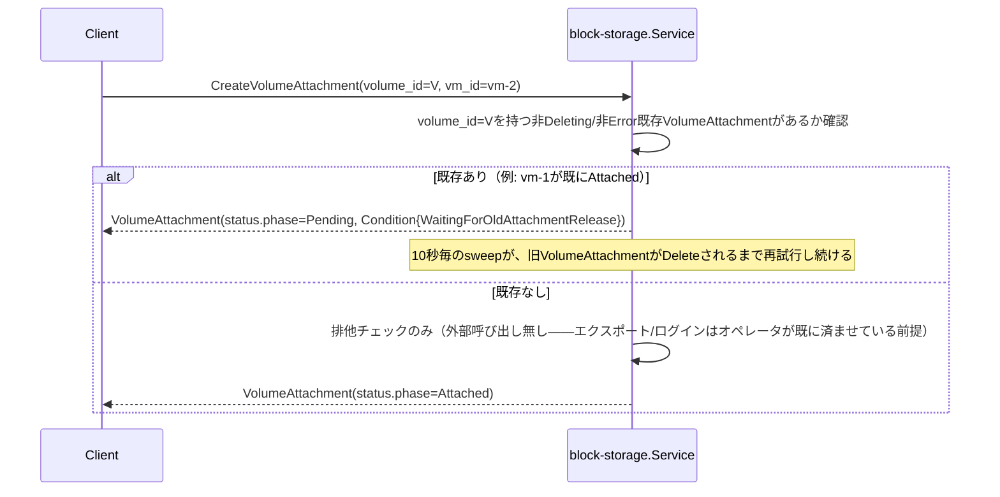

# Volume仕様

## 概要

ブロックストレージの塊である`Volume`と、`Volume`とVirtualMachineの結びつきを表す
`VolumeAttachment`を管理するCRUD+Watchサービス（`block-storage`）。NetworkInterfaceと同じ
「結びつきそのものをリソースにする」パターン（詳細は`docs/architecture.md`
「block-storageサービスのリソース: Volume / VolumeAttachment」参照）。

**責務境界（2026-09-10訂正）**: `Volume`は実バックエンドを**参照するだけ**——kyuusha自身は
ボリュームの作成/削除もエクスポート/マウントも一切行わない。iSCSI/NVMe-oF/NFSいずれの
プロトコルでも「Hypervisorが実接続を確立するのは1回だけ（セッション/マウント）、個々の
Volumeはその接続の中で発見されるだけ」という形に統一し、実接続の確立・維持自体は
完全にオペレータ側の責任とする（詳細と経緯は`docs/architecture.md`「訂正: 責務の境界を
『プロビジョニング＋export』から『参照＋接続』へ縮小」参照）。この訂正より前は専用の
`storage-agent`サービスが実ZFS zvol+LIO iSCSIエクスポートを持っていたが、その実装は
このコードベースから完全に削除済み——本ドキュメントは現行の「参照+接続」実装のみを
説明する。

## リソース

| フィールド | 説明 |
|---|---|
| `Volume.spec.size_gb` | ボリュームサイズ(GB)。**Create時は自己申告値**——kyuusha自身が作らないため作成前には検証できない。Quota計算に使う。検証で実測値と10%以上ずれていた場合、kyuusha側が実測値へ補正する（ユーザー向けのUpdate RPCは無いが、この1点だけシステム自身が書き換える。下記「検証フロー」参照） |
| `Volume.spec.protocol` | `ISCSI` / `NVME_OF` / `NFS`。このVolumeが到達可能なプロトコル |
| `Volume.spec.storage_connection` | このVolumeが属するHypervisor側のStorageConnection名。Hypervisorが自己登録時に宣言した`storage_connections[].name`のいずれかと一致していなければならない（下記「StorageConnection」参照） |
| `Volume.spec.identifier` | プロトコル固有の識別子。ISCSI/NVME_OFなら`/dev/disk/by-id/`配下のブロックデバイスの安定名（udevが振るserial/WWNベースの名前）、NFSならそのStorageConnectionのマウントポイントからの相対パス |
| `Volume.spec.annotations` | kyuusha自身は一切解釈しない参考情報（QoSティア等）。K8sのannotationsと同じ位置付け |
| `Volume.status.phase` | `Pending` / `Ready` / `Deleting`。参照する`StorageConnection`が`Ready`になり、かつ`identifier`の実在確認が取れて初めて`Ready`（非同期、下記「検証フロー」参照）。`Error`へは倒さない——確認できなければ`Pending`のまま |
| `VolumeAttachment.spec.volume_id` / `vm_id` | 結びつけるVolumeとVirtualMachineのID |
| `VolumeAttachment.spec.device_hint` | 省略可。デバイスパスの希望（現状使われていない） |
| `VolumeAttachment.status.phase` | `Pending` / `Attaching` / `Attached` / `Detaching` / `Deleting` / `Error` |
| `VolumeAttachment.status.device_path` / `hypervisor` | 実際に真VMが起動してVolumeが解決された時点でcompute-agentが報告する（2026-09-11実装、下記「device_path/hypervisorの報告」参照）。まだどのVMも起動していなければ空 |
| `StorageConnection.spec.zones` | ストレージ管理者が宣言する、このバックエンドが接続を許容するAvailability Zone一覧 |
| `StorageConnection.spec.annotations` | `Volume.spec.annotations`と同じ位置付けの参考情報（製品バージョン等） |
| `StorageConnection.status.phase` | `Pending` / `Ready`。`spec.zones`の**全ゾーン**が確認できて初めてReady（厳格）。`Error`は無い |
| `StorageConnection.status.verified_zones` | 実際に確認が取れたゾーンのみ |

Volume/VolumeAttachmentは`tenant_id`を持つテナントスコープのリソース。StorageConnectionは
Hypervisorと同じくテナント非スコープ（運用者向けリソース、`kyuusha storageconn`はadmin-only）。

## Quota強制（Volume Create時）

`internal/compute/quota.go`と同じ形の`internal/block-storage/quota.go`が、identityの
`QuotaSpec.max_volume_gb`に対してOPA（`kyuusha.blockstorage.quota`パッケージ）で判定する:

```rego
allow if {
	input.usage.volume_gb + input.request.size_gb <= input.limit.max_volume_gb
}
```

`Service.usageMu`が同期Create/Deleteの一連（べき等チェック→Quota取得→判定→加算/減算）を
全テナント共通でロックする（compute/`internal/compute/quota.go`と全く同じ設計）。拒否は
`Create`自体への同期的な`ResourceExhausted`。Volumeオブジェクトは作られない——判定を
通ったら、`protocol`/`storage_connection`/`identifier`のバリデーション（すべて必須、
下記「Create時のバリデーション」参照）を経て`Ready`にする。外部呼び出しは一切無い
（kyuusha自身は何も作らないため）。

## 排他制御（VolumeAttachment）

`docs/architecture.md`「未解決だった危険: フェンシング問題」「具体的な排他制御」で決めた
「ある`volume_id`について`Deleting`/`Error`以外のphaseのVolumeAttachmentは同時に1つまで」
制約を実装している。ストレージ側に実際のアクセス制御機構が無い（下記「この実装がカバー
しないもの」参照）ため、この排他ロックが唯一の安全網——同じVolumeを別のVMへ
再アタッチしようとした場合(オペレータの操作ミス、あるいは旧VMがまだ生きている場合を
含む)も、旧VolumeAttachmentが明示的に消されるまで新しい方は`Pending`のまま進まない。



- network/Subnet・NetworkInterfaceのIPAM枯渇（`VlanPoolExhausted`/`IPPoolExhausted`）と
  全く同じ「Createは拒否せずPendingで受理し、`Run`の`pendingSweepInterval`（10秒）ごとの
  スイープで再試行する」設計。旧VolumeAttachmentが単に通常のDetach処理中なだけかもしれず、
  即座に拒否するのは不適切なため
- 判定は`hasActiveAttachment`が全テナント横断で`s.attachments`をスキャンして行う
  （Subnet固有のIPプールのような`volume_id`ごとの専用インデックスは持たない。この
  システムの想定スケール——同時に生きているアタッチメント数はVM数ほど大きくない——では
  許容範囲）
- **`tryAttach`の`hasActiveAttachment`チェック→`Update`の一連は`attachMu`でロックする**
  ——ライブ検証で実際に踏んだ実バグ: 同じ`volume_id`へのVolumeAttachmentを2つ連続で
  作ると、ロックなしでは両方とも`hasActiveAttachment`の「ブロックされていない」判定を
  先に済ませてしまい、両方とも`Attached`になってしまう（排他制御が機能しないTOCTOU）。
  全体を通しての単一ロックで直した（`usageMu`と同じ「このスケールなら粗いグローバル
  ロックで十分」という判断）
- `Error`フェーズは`Deleting`と同じく「アクティブ」から除外する（現状、
  `tryAttach`自体が何かに失敗してErrorへ遷移する経路は無くなった——防御的/対称性のため
  残しているだけ）

## StorageConnection

`Volume.spec.storage_connection`が名前で参照する、独立したCRUD+Watchリソース
（block-storageで管理、Hypervisorと同じくテナント非スコープ）。ストレージ管理者が
「このバックエンドはどのAZから接続してよいか」を宣言する場所——物理的な冗長化構成
（単一AZか、複数AZから到達可能に構成されているか）はストレージ管理者だけが知っている
前提なので、kyuusha自身はそれを推測しない。`kyuusha storageconn create -name=... -zones=...`
（admin-only）で登録する。

### Hypervisor側の自己申告

kyuusha自身は何も接続しない（上記「概要」参照）ため、あるHypervisorがどのVolumeを
実際に見つけられるかは、そのHypervisorが自己登録時に宣言した`storage_connections`
（`compute.v1.HypervisorStatus.storage_connections`/`RegisterHypervisorRequest.storage_connections`、
各要素`{name, local_path}`）で決まる——「その名前の接続を、このホストは既に確立済み」
という自己申告。`local_path`はNFS用（マウントポイント）で、ISCSI/NVME_OFの接続は
`/dev/disk/by-id/`という固定の場所を見るため空でよい。

`cmd/compute-agent/main.go`の`-storage-connections=name[:local_path][,...]`フラグ1つが
両方の入力になる: 自己登録リクエストへ載る`[]StorageConnection`と、
`internal/compute-agent/volumeref.Connections`（起動時のVM boot処理がVolumeを解決する
ときに参照するローカルマップ）は、どちらもこの同じフラグ値から作られる——同じ事実
（このホストが何に既に接続しているか）を2つの呼び出し元向けに表現しているだけなので。

**静的な自己申告**（`docs/open-questions.md`「Hypervisorのストレージ接続自己申告を
動的化すべきか」参照）: `local_path`が空でない（NFS想定の）エントリだけ、
起動時に一度`os.Stat`でディレクトリとして実在するか確認し、失敗したものは警告つきで
申告から除外する——「一度も確認しない」わけではないが、以降は再チェックしない、という
意味での「静的」。ISCSI/NVME_OF想定のエントリ（`local_path`が空）は、この時点では
接続固有に確認できるものが無いため素通りする。

### 検証フロー（`internal/block-storage/verification.go`）

`StorageConnection`/`Volume`とも即座に`Ready`にはならない——`Pending`で受理し、
Image/NetworkInterface/VolumeAttachmentと同じ非同期パターンで確認が取れ次第
`Ready`へ進める（`pendingSweepInterval`＝10秒ごとのsweepに相乗り）。検証は独立した
2段階:

1. **接続レベル**（`StorageConnection`単位、ゾーンごとに1回でよい・複数Volumeで共有できる）:
   computeのReconcilerが、Hypervisorが登録/再登録されるたびにその`zone`+
   `storage_connections`をNATSイベント（`ms.compute.evt.<hypervisor>.storage-connections`、
   `compute.HypervisorStorageConnectionsMsg`）として発行する。block-storageはこれを
   直接subscribeし（`recordHypervisorConnections`）、`StorageConnection.spec.zones`の
   全ゾーンがどこかのHypervisorの自己申告でカバーされたら`Ready`にする
   （`sweepStorageConnections`）。**一部のゾーンが恒久的に確認できなくても`Pending`の
   まま**——`Error`へは倒さない
2. **Volumeレベル**（Volume単位、接続とは別に毎回必要）: block-storageが、その
   `storage_connection`を持つと自己申告しているHypervisorのうち任意の1台へ、
   `VerifyVolumeCommand`（`identifier`等一式）をNATSで直接送る
   （`ms.blockstorage.cmd.<hypervisor>.volume.verify`）。compute-agent側
   （`internal/compute-agent`の`handleVerifyVolume`）はVM起動時と全く同じ
   `volumeref.Resolve`を呼ぶだけ——ログイン/マウント/attachは一切せず、発見できるか
   どうかと実サイズだけを`VerifyVolumeResult`として返す
   （`ms.blockstorage.evt.<hypervisor>.volume.verify-result`）。結果は
   `Volume.status.conditions`の`IdentifierVerified`として記録され、そのVolumeの
   `StorageConnection`も`Ready`であれば`Ready`へ進む。**確認が取れなければ
   （identifier不在等）`Pending`のまま**——`Error`へは倒さない。失敗しても次のsweepで
   また聞きに行く（無期限リトライ、上限やバックオフは無い）。同じ結果に乗ってくる
   実サイズ（`size_bytes`）が申告`spec.size_gb`と10%以上ずれていれば、
   `correctDeclaredSize`（`internal/block-storage/verification.go`）が
   **`spec.size_gb`自体を実測値へ書き換え、`tenant_usage.volume_gb`もその差分だけ
   調整する**（2026-09-11）——単に警告を出すだけでなく実際に直す。ストレージ管理者が
   手入力する`size_gb`は入力ミスが起きやすく、実測値が分かった時点でQuota会計を
   ズレたままにしておく理由が無いという判断（kyuusha全体の「specは宣言、statusは
   観測された実態、非同期でreconcileする」という設計をそのまま踏襲——`Ready`への
   昇格自体はブロックしない、既存Volumeを壊したり止めたりもしない）。補正の結果
   テナントのQuota(`max_volume_gb`)を超えてしまった場合も、補正自体は適用した上で
   `conditions`の`QuotaExceededAfterCorrection`（True/False）で運用者に見えるように
   するだけに留める——事後的にQuota超過を理由にVolumeを破棄・detachすることはしない。
   `SizeMatchesDeclaration`（True/False）も同じ`conditions`に記録される
   （`kyuusha volume get`の`conditions=...`で見える）が、補正が入ればその時点で
   宣言＝実測になるため実質常にTrueになる

**computeとblock-storageの依存が双方向にならないよう、この2つのやり取りは両方とも
NATS直結**（computeのgRPCを経由しない）: block-storageが「どのHypervisorに聞けばよいか」
を知るためにcomputeのHypervisor一覧をgRPCで取得すると、今の一方向
（`compute → block-storage`、VM作成時のVolume検証）の依存が双方向になってしまうため。
`BLOCKSTORAGE_CMD`/`BLOCKSTORAGE_EVT`という新しいJetStreamストリームをblock-storage側
（`internal/block-storage/nats.go`）が持つ——compute-agentもこの2つのストリームの存在を
`EnsureStreams`で保証する（block-storageと起動順序が前後してもよいように）。

**スケジューリング時のフィルタリングは未実装**（`docs/open-questions.md`参照）:
あるVolumeを要求するVMが、そのVolumeの`storage_connection`を宣言していないHypervisorへ
スケジュールされる可能性は現状排除されていない。その場合、`volumeref.Resolve`がその
Hypervisor上で失敗し、そのVolumeだけアタッチされずにVMが起動する（IPが解決しなかった
NetworkInterfaceと同じ「寛容な劣化」——今のところこれで実害は無いという判断だが、v1の
スコープ外として明示的に先送り）。ただし、VolumeそのものはCreate時に既に
`storage_connection`が存在するStorageConnectionを参照しているか検証されるため
（下記「Create時のバリデーション」）、この寛容な劣化が起きるのは「Volumeは正しく
登録されているが、たまたま繋がっていないHypervisorへスケジュールされた」場合のみ。

## compute-agent側の配線（`internal/compute-agent/volumeref`）

`fcvmm`/`chvmm`共通（[VirtualMachine仕様](virtual-machine.md)参照）。VMが
`Scheduled`→`Provisioning`へ遷移する際、Reconcilerが既に`Attached`まで到達した
VolumeAttachmentについて、そのVolume自身の`protocol`/`storage_connection`/`identifier`
（`VolumeAttachmentStatus`はもうこれらを持たない——参照するVolumeから都度取得する）を
`CreateCommand.volumes`に載せる（下記「compute側の統合」参照）。

compute-agentは起動処理の中で、Volumeごとに`volumeref.Resolve`を呼ぶだけ——ログインも
マウントもエクスポートも一切行わない:

- `protocol`が`ISCSI`/`NVME_OF`なら、パスは`/dev/disk/by-id/<identifier>`固定
- `protocol`が`NFS`なら、パスは`<そのstorage_connectionのlocal_path>/<identifier>`
- どちらも、パスがまだ現れていない場合に備えて短時間ポーリングする
  （オペレータの接続確立とこのVolumeの登録は互いに順序保証が無いため）

見つかったパスは、rootディスク/seed diskと並ぶ追加のvirtio-blockドライブとして
Firecracker/cloud-hypervisorへ渡す:

- **chvmm**: jailが無いので、解決したパスをそのまま`--disk path=<path>`へ渡すだけ
- **fcvmm**: jailer chrootの中に実ファイル/デバイスを見せる必要がある
  （`fcvmm/jailer.go`の`placeVolumeLike`）。ブロックデバイス（ISCSI/NVME_OF）は
  従来通り同じmajor:minorで`mknod`——ゲストの書き込みは実デバイスへ直接届く。
  通常ファイル（NFS）は**コピーではなくbind mount**——コピーするとゲストの書き込みが
  jailローカルの複製にしか届かず、Volumeの存在意義（永続化）が壊れるため。bind mount
  はchownしない（同じinodeなので、chownするとNFSサーバ上の実ファイルまで変わって
  しまう）——jailのuid/gidが既に読み書きできる状態になっている必要があり、それを
  保証するのはkyuushaの仕事ではなくオペレータの仕事（上記「概要」参照）

VM削除時（プロセスの実終了後）は、fcvmmがbind mountしたものだけ`unmount`する
（`mknod`した特殊ファイルは削除しても実デバイスには影響しないため後始末不要）。
tap配線の後始末と同じeventual-consistency、失敗しても致命的ではない。

### device_path/hypervisorの報告（2026-09-11実装）

`VolumeAttachmentStatus.device_path`/`hypervisor`は元々「フィールドはあるが報告経路が無く
常に空」という既知の未実装事項だった。`fcvmm`/`chvmm`の`Boot()`は元々`error`だけを
返していたが、`volumeref.Resolve`が実際に見つけた実パス（`AttachedVolume{AttachmentID,
TenantID, DevicePath}`）を成功時に併せて返すよう変更し、`internal/compute-agent/agent.go`
（`reportAttachedVolumes`）がそれをVolumeごとに`ms.blockstorage.evt.<hypervisor>.
volume.attached`（`blockstorage.VolumeAttachedEvent`、`internal/block-storage/nats.go`）
へfire-and-forgetで発行する。block-storage側（`subscribeVolumeAttached`/
`handleVolumeAttached`、`internal/block-storage/verification.go`）はこれを受けて
該当`VolumeAttachment`の`status.device_path`/`hypervisor`を更新するだけ——**`status.phase`は
一切触らない**（`Attached`への遷移は排他制御の予約が決めるもので、実際にVMが起動して
この報告が届いたかどうかとは独立——上記「排他制御」節参照）。

`VerifyVolumeCommand`/`Result`（上記「検証フロー」）と違い、こちらはcompute-agentからの
一方向イベントのみで、block-storage側から何かを要求することはない。定期リトライも無い
——実際のVM起動のたびにしか発火しない性質のものなので、Volume検証のような
「確認が取れるまで無期限に聞き直す」設計は意味がない（この報告を取りこぼしても、
次にそのVolumeを使うVMが起動すれば再度報告される）。

`internal/compute/volume.go`が、`network_interfaces`の統合（[network仕様](network.md)
「compute側の統合」）と全く同じ形で実装している:

- **Create時バリデーション**（`validateVolumes`）: `spec.volumes[].volume_id`が指す
  各Volumeが存在し、同じテナントに属し、`Ready`であることを確認する（存在しない/
  他テナント/未Readyなら`ErrValidation`）。排他制御自体はここでは見ない——実際の
  VolumeAttachment Create時（下記）にしか正しく判定できないため（network統合の
  ゾーン再解決と同じ理由）
- **`Scheduled`/`Starting`→`Provisioning`遷移時**（`createVolumeAttachments`）:
  リクエストされたVolumeごとに、決定的な名前でVolumeAttachmentを作る（`docs/architecture.md`
  「子リソースIDの決定的生成ルール」）。この関数は新規Create直後だけでなく、`Stop`後の
  `Start`のたびに`vm.Spec.Volumes`から毎回再構築される（下記「Volume attach/detach
  （コールドのみ、2026-09-19実装）」参照）ため、名前は**VolumeIDベース**
  （`volattach-<vm_id>-<volume_id>`）——`vm.Spec.Volumes`の途中要素がDetachVolumeで
  削除されて後続要素のindexがずれても、既存attachmentの名前は変わらない。
  2026-09-19より前に作られた`volattach-<vm_id>-<index>`（位置ベース）named attachmentは、
  一度もDetachVolumeされていないVMに対しては引き続きそのまま解決・再利用される
  （新旧どちらの名前でも一致すれば再利用し、リネームはしない——移行ジョブ不要、
  DetachVolumeが実際に呼ばれた時点からそのVMの残りのattachmentだけ自然に新方式へ移る）。
  実際に`Attached`まで到達したものだけ、そのVolume自身を`volumeClient.Get`で取得し直して
  `protocol`/`storage_connection`/`identifier`を`CreateCommand.volumes`
  （compute-agentが使う）に載せる——`Pending`（排他制御待ち）のままのものは、この
  VMの起動には含めない（IPが解決しなかったNetworkInterfaceと同じ「起動は諦めず、
  そのVolumeなしで進む」寛容さ）。作ったVolumeAttachment IDは成否にかかわらず全て
  `VirtualMachineStatus.VolumeAttachmentRefs`へ記録する（下記「VM削除時のVolumeAttachment
  後始末」用）
- **アタッチ済みディスクのみ、VM起動時のみ**（後述「この実装がカバーしないもの」）:
  実際にゲストへ配線されるのはVM起動時（Create/Start）のみ。`Running`なVMへ後から
  Volumeを追加する経路（ライブホットプラグ）はまだ無い——ただし`Stopped`なVMに対する
  attach/detach自体は`Resize`と同じコールドパターンで実装済み（下記参照）

### Volume attach/detach（コールドのみ、`AttachVolume`/`DetachVolume`、2026-09-19実装）

`VirtualMachineService.AttachVolume(tenant_id, id, volume_id, device_hint)`/
`DetachVolume(tenant_id, id, volume_id)`は`Stopped`のVMのみに許可される
（[VirtualMachine仕様](virtual-machine.md)「リサイズ」で確立したコールドパターンと
全く同じ理由・同じ形——`Stop`/`Start`/`Resize`同様`resource_version`は取らない）。

- **AttachVolume**: `spec.volumes`が既に対象`volume_id`を含んでいれば無変更で返す
  （冪等no-op）。それ以外は`validateVolumes`（Create時と同じ検証: 存在/同テナント/Ready）
  を通し、`spec.volumes`へ追加して`store.Update`するだけ——**実際のVolumeAttachmentは
  ここでは作らない**。次の`Start`が`createVolumeAttachments`を再実行する際に自然に
  作られる（上記「compute側の統合」参照）。quotaチェック・Hypervisor容量予約は一切ない
  （既存Volumeのattach/detachはquotaに影響しない——`max_volume_gb`はVolume作成時に
  一度だけ課金され、attach/detachでは変動しない）
- **DetachVolume**: `spec.volumes`から対象`volume_id`が見つからなければ無変更で返す
  （冪等no-op）。見つかった場合、AttachVolumeと非対称に**即座に実体のVolumeAttachmentも
  削除する**——`status.volume_attachment_refs`の中から該当するものを`Get`で解決して
  `Delete`する。これはResizeには無い一手間だが必要：VolumeAttachmentは排他制御の
  ロックを握っている実リソースなので、spec側だけ書き換えて次のStartまで放置すると、
  そのVolumeが他所へアタッチできないまま塞がり続けてしまう（`createVolumeAttachments`
  は無いものを作る一方通行のロジックで、specから消えたエントリに対応する
  attachmentを消す処理は持たない）
- 両方とも`Running`のVM（cloud-hypervisorであっても）には使えず`FailedPrecondition`。
  ライブホットプラグは未実装（上記「この実装がカバーしないもの」、
  [docs/open-questions.md](../open-questions.md)参照）

### VM削除時のVolumeAttachment後始末

VM削除時、Reconcilerは（Hypervisor容量解放と同時に）compute-agentへの`DeleteCommand`を
publishした**後で**、そのVMの`VolumeAttachmentRefs`全件を削除する（fire-and-forget、
どちらも完了を待たない）。この順序は意図的——先にVolumeAttachmentを消してしまうと、
まだ動いているかもしれないゲストの下からディスクの制御プレーン状態だけ先に引き抜く
ことになる。DeleteCommandを先に出すことで、compute-agent側に自分でVMプロセス自体を
止める（bind mountの後始末を含む）猶予を与える（それでも同期的な完了待ちはしない、
tap/cgroup後始末と同じeventual-consistency）。これをしないと、そのVolumeは`Attached`の
まま残り続け、上記の排他制御に阻まれて別のVMへ永久に再アタッチできなくなる。

## Create時のバリデーション

- `Volume.Create`は`spec.size_gb`が正の値であること、`spec.protocol`が
  `ISCSI`/`NVME_OF`/`NFS`のいずれかであること、`spec.storage_connection`/
  `spec.identifier`がどちらも空でないこと、**かつ`spec.storage_connection`が指す
  `StorageConnection`が実在すること**を検証する（すべて`ErrValidation`）。
  `identifier`が指すファイル/デバイスが実在するか、どのHypervisorから到達可能かは
  ここでは検証しない——非同期の検証フロー（上記「検証フロー」）に委ねる
- `StorageConnection.Create`は`spec.zones`が最低1つ必要であることを検証する
  （`ErrValidation`）
- `VolumeAttachment.Create`は`spec.volume_id`が指す`Volume`が存在し、同じテナントに属し、
  `Ready`であることを検証する（存在しない/他テナント/未Readyなら`ErrValidation`）。
  compute/networkの既存Create時バリデーションと同じ「参照先が存在しない・使えない状態の
  リソースを作らない」原則
- 排他制御自体はこの検証とは別軸（上記参照。プール枯渇と同じくCreateを拒否しない）

## この実装がカバーしないもの

- **ライブホットプラグ**: `Stopped`のVMに対するコールドattach/detach（`AttachVolume`/
  `DetachVolume`、上記参照）は実装済み。実行中(`Running`)のVMへダウンタイム無しで
  Volumeを追加/削除する経路はまだ無い——cloud-hypervisorの`--api-socket`導入という
  別途大きめの設計が要る（[docs/open-questions.md](../open-questions.md)
  「cloud-hypervisor限定のライブホットプラグ（vcpu/memory resize + Volume attach）」
  参照）。`kyuusha volattach create`をcomputeを経由せず
  block-storageへ直接発行した場合は今も変わらず、VolumeAttachmentの制御プレーン状態
  自体は`Attached`になりうるがcompute-agentへは伝わらない（上記「compute側の統合」参照）
- **ストレージ接続自体のアクセス制御**: どのHypervisorがどのiSCSIターゲット/NVMe-oF
  サブシステム/NFSエクスポートへ接続してよいかは、完全にオペレータ側（実ストレージ
  バックエンド）の管理範囲——kyuusha自身はそこに一切関与しない。したがって
  `docs/architecture.md`が元々挙げていた「LIOのper-initiator ACLが無い」という
  弱点自体、kyuusha自身の責務ではなくなった（`docs/architecture.md`「正直な弱点」の
  訂正注記参照）
- **VolumeAttachmentのオーファンGC**: `docs/architecture.md`が決めている「子リソースが
  親の存在を10分毎にGetで確認し、NotFoundなら自分を消す」パターンは2026-09-13に
  実装済み（`blockstorage.Service.sweepOrphanedVolumeAttachments`、`Service.Run`から
  10分間隔で起動、network側の同等実装と同じ形でcomputeのVirtualMachineServiceへ
  直接gRPCで問い合わせる`computeClient`を新設）。主経路は引き続きVM削除時の能動的
  削除（上記「VM削除時のVolumeAttachment後始末」）——このGCはその取りこぼし
  （fire-and-forget呼び出しの失敗）と、VMが既にRunning中に直接作られた
  （`VirtualMachineStatus.VolumeAttachmentRefs`に載らない）VolumeAttachmentの
  両方をカバーするバックストップという位置付け
- **Volumeのリサイズ**: `size_gb`はユーザー向けには作成後不変。Update RPC自体を
  用意していない（Imageと同じ判断——不変にすべきフィールドしかない段階でUpdateを
  開けない）。唯一の例外は検証フローによる自動補正（上記）——ユーザー操作ではなく、
  申告と実測のズレをkyuusha自身が是正するものなので、この判断とは矛盾しない
- **スケジューリング時のstorage_connectionフィルタリング**: 上記「検証フロー」の
  最後の段落参照
- **ハイパーバイザ障害時のマウント/ログイン自動化**: Hypervisorが宣言した
  `storage_connections`に従って、そのホスト自身が実際にiSCSIへログインしたり
  NFSをマウントしたりする処理自体は、現状kyuusha側には無い（そこもオペレータの
  仕事——上記「概要」参照）。将来的にこの部分をkyuusha側で自動化する余地はある
  （`docs/open-questions.md`「Hypervisor↔ストレージバックエンドの接続確立を
  kyuusha側で自動化すべきか」参照、まだ設計していない）
- **StorageConnectionの削除保護のみ、GC無し**: `StorageConnection`は参照している
  Volumeが残っている間は削除できない（`ErrValidation`）が、逆に参照されなくなった
  StorageConnectionの自動削除は無い（明示的に消すまで残り続ける）
- **検証コマンドのリトライ間隔・上限は未チューニング**: 現状は無期限、
  `pendingSweepInterval`＝10秒ごと

## エンドポイント

`block-storage :8085`（`VolumeService`, `VolumeAttachmentService`, `StorageConnectionService`）。
api-gateway経由でのみ到達可能（[システム構成仕様](system-overview.md)参照）。CLIは
`kyuusha volume`/`kyuusha volattach`/`kyuusha storageconn`（`storageconn`はadmin-only、
[CLI仕様](cli.md)参照）。block-storageが直接ダイヤルする実ストレージサービスは存在しない
——実データパス（iSCSI/NVMe-oF/NFS）はすべてHypervisorとストレージバックエンドの間で
完結し、kyuushaのどのコンポーネントもその経路に乗らない。block-storageはNATSにも
直接つながる（`-nats-url`）——検証フロー用の`BLOCKSTORAGE_CMD`/`BLOCKSTORAGE_EVT`と、
computeが発行する`ms.compute.evt.*.storage-connections`のsubscribe用（上記「検証フロー」
参照）。
