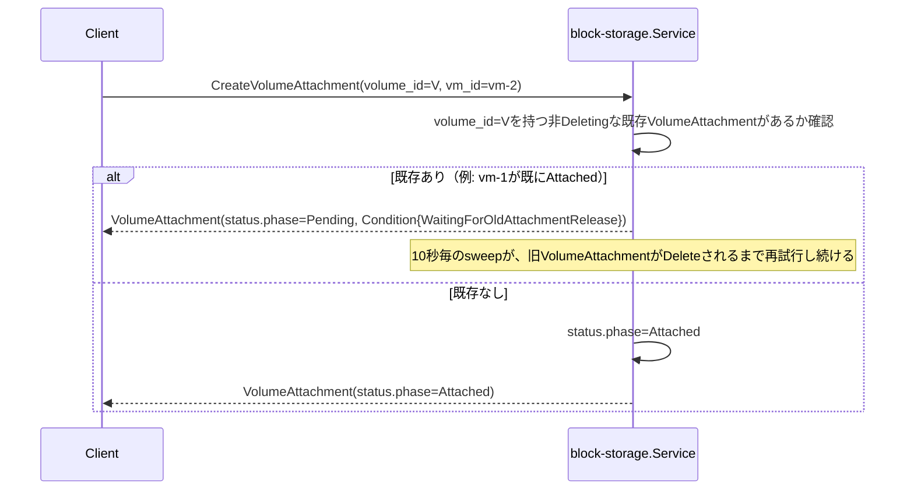

# Volume仕様

## 概要

ブロックストレージの塊である`Volume`と、`Volume`とVirtualMachineの結びつきを表す
`VolumeAttachment`を管理するCRUD+Watchサービス（`block-storage`）。NetworkInterfaceと同じ
「結びつきそのものをリソースにする」パターン（詳細は`docs/architecture.md`
「block-storageサービスのリソース: Volume / VolumeAttachment」参照）。

**実バックエンドはまだない**: `Volume`はCreate時に同期的にQuotaチェックを通れば即座に
`Ready`になる（ZFS/NVMe-oFのような実ストレージ基盤への確保処理は存在しない）。
`docs/architecture.md`「block-storageのバックエンド抽象化」が設計するv1のデフォルト
（専用ストレージノード+iSCSI/NVMe-oF、ZFSバックエンド）は未実装。この段階は
network/NetworkInterfaceの最初のCRUD+モック段階と同じ位置づけ。

## リソース

| フィールド | 説明 |
|---|---|
| `Volume.spec.size_gb` | ボリュームサイズ(GB) |
| `Volume.status.phase` | `Pending`（実装上は一瞬） / `Ready` / `Deleting` / `Error` |
| `VolumeAttachment.spec.volume_id` / `vm_id` | 結びつけるVolumeとVirtualMachineのID |
| `VolumeAttachment.spec.device_hint` | 省略可。デバイスパスの希望 |
| `VolumeAttachment.status.phase` | `Pending` / `Attaching` / `Attached` / `Detaching` / `Deleting` / `Error` |
| `VolumeAttachment.status.device_path` | 実際に割り当てられたデバイスパス。実バックエンドができるまでは常に空 |
| `VolumeAttachment.status.hypervisor` | 実バックエンド/compute連携ができるまでは常に空（NetworkInterfaceの`status.hypervisor`がtap配線実装前に常に空だったのと同じ段階） |

どちらも`tenant_id`を持つテナントスコープのリソース。

## Quota強制（Volume Create時）

`internal/compute/quota.go`と同じ形の`internal/block-storage/quota.go`が、identityの
`QuotaSpec.max_volume_gb`に対してOPA（`kyuusha.blockstorage.quota`パッケージ）で判定する:

```rego
allow if {
	input.usage.volume_gb + input.request.size_gb <= input.limit.max_volume_gb
}
```

`Service.usageMu`が同期Create/Deleteの一連（べき等チェック→Quota取得→判定→加算/減算）を
全テナント共通でロックする（compute/`internal/compute/quota.go`と全く同じ設計）。拒否は
`Create`自体への同期的な`ResourceExhausted`。Volumeオブジェクトは作られない。

## 排他制御（VolumeAttachment）

`docs/architecture.md`「未解決の危険: フェンシング問題」「具体的な排他制御」で決めた
「ある`volume_id`について`Deleting`以外のphaseのVolumeAttachmentは同時に1つまで」制約を
実装している。



- network/Subnet・NetworkInterfaceのIPAM枯渇（`VlanPoolExhausted`/`IPPoolExhausted`）と
  全く同じ「Createは拒否せずPendingで受理し、`Run`の`pendingSweepInterval`（10秒）ごとの
  スイープで再試行する」設計。旧VolumeAttachmentが単に通常のDetach処理中なだけかもしれず、
  即座に拒否するのは不適切なため
- 判定は`hasActiveAttachment`が全テナント横断で`s.attachments`をスキャンして行う
  （Subnet固有のIPプールのような`volume_id`ごとの専用インデックスは持たない。この
  システムの想定スケール——同時に生きているアタッチメント数はVM数ほど大きくない——では
  許容範囲）

## Create時のバリデーション

- `VolumeAttachment.Create`は`spec.volume_id`が指す`Volume`が存在し、同じテナントに属し、
  `Ready`であることを検証する（存在しない/他テナント/未Readyなら`ErrValidation`）。
  compute/networkの既存Create時バリデーションと同じ「参照先が存在しない・使えない状態の
  リソースを作らない」原則
- 排他制御自体はこの検証とは別軸（上記参照。プール枯渇と同じくCreateを拒否しない）

## この実装がカバーしないもの

- **実StorageBackend**: ZFS/NVMe-oFのような実ストレージ基盤が一切ない。`Volume`は
  Quotaさえ通ればCreate即`Ready`になる。`docs/architecture.md`
  「block-storageのバックエンド抽象化」の`StorageBackend`インタフェース
  （`CreateVolume`/`DeleteVolume`/`ExportVolume`/`UnexportVolume`）は未実装
- **compute側の統合**: VM Create時に`spec.volumes`/`persistent_root_disk`から
  VolumeAttachmentを作る/参照する連携がまだない。`VirtualMachineSpec.volumes`/
  `persistent_root_disk`、`VirtualMachineStatus.root_volume_ref`/
  `volume_attachment_refs`フィールド自体は存在するが、block-storageサービスへの
  問い合わせはしていない（network統合前の`compute.VirtualMachineSpec.network_interfaces`
  と同じ段階。[network仕様](network.md)「compute側の統合」参照）
- **compute-agent側のデバイス配線**: iSCSI/NVMe-oFイニシエータとしてストレージノードへ
  接続し、virtio-block経由でFirecracker/QEMUへ渡す処理（`docs/architecture.md`の
  `HypervisorDriver.AttachVolume`/`DetachVolume`）は未実装
- **VolumeAttachmentのオーファンGC**: `docs/architecture.md`が決めている「子リソースが
  親の存在を10分毎にGetで確認し、NotFoundなら自分を消す」パターンは未実装
  （NetworkInterfaceと同じ、既知のギャップ）
- **Volumeのリサイズ**: `size_gb`は作成後不変。Update RPC自体を用意していない
  （Imageと同じ判断——不変にすべきフィールドしかない段階でUpdateを開けない）
- **DRBDミラーリング等の冗長化**: 単一ストレージノード前提（v1のまま）

## エンドポイント

`block-storage :8085`（`VolumeService`, `VolumeAttachmentService`）。api-gateway経由でのみ
到達可能（[システム構成仕様](system-overview.md)参照）。CLIは`kyuusha volume`/
`kyuusha volattach`（[CLI仕様](cli.md)参照）。
