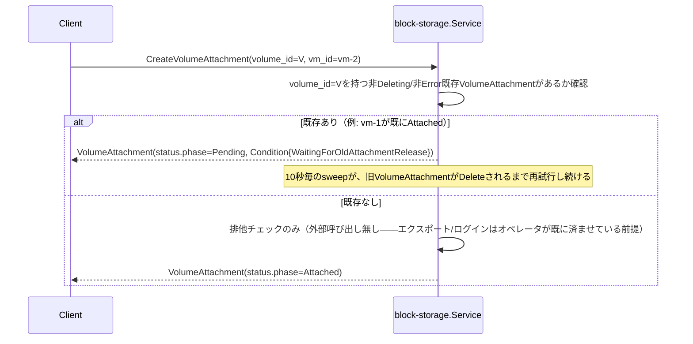

# Volume仕様

## 概要

ブロックストレージの塊である`Volume`と、`Volume`とVirtualMachineの結びつきを表す
`VolumeAttachment`を管理するCRUD+Watchサービス（`block-storage`）。NetworkInterfaceと同じ
「結びつきそのものをリソースにする」パターン（詳細は`docs/architecture.md`
「block-storageサービスのリソース: Volume / VolumeAttachment」参照）。

**責務境界（2026-09-10訂正）**: `Volume`は実バックエンドを**参照するだけ**——kyuusha自身は
ボリュームの作成/削除もエクスポート/マウントも一切行わない。iSCSI/NVMe-oF/NFSいずれの
プロトコルでも「Hypervisorが実接続を確立するのは1回だけ（セッション/マウント）、個々の
Volumeはその接続の中で発見されるだけ」という形に統一し、実接続の確立・維持自体は
完全にオペレータ側の責任とする（詳細と経緯は`docs/architecture.md`「訂正: 責務の境界を
『プロビジョニング＋export』から『参照＋接続』へ縮小」参照）。この訂正より前は専用の
`storage-agent`サービスが実ZFS zvol+LIO iSCSIエクスポートを持っていたが、その実装は
このコードベースから完全に削除済み——本ドキュメントは現行の「参照+接続」実装のみを
説明する。

## リソース

| フィールド | 説明 |
|---|---|
| `Volume.spec.size_gb` | ボリュームサイズ(GB)。**自己申告値**——kyuusha自身が作らないため検証できない。Quota計算にのみ使う |
| `Volume.spec.protocol` | `ISCSI` / `NVME_OF` / `NFS`。このVolumeが到達可能なプロトコル |
| `Volume.spec.storage_connection` | このVolumeが属するHypervisor側のStorageConnection名。Hypervisorが自己登録時に宣言した`storage_connections[].name`のいずれかと一致していなければならない（下記「StorageConnection」参照） |
| `Volume.spec.identifier` | プロトコル固有の識別子。ISCSI/NVME_OFなら`/dev/disk/by-id/`配下のブロックデバイスの安定名（udevが振るserial/WWNベースの名前）、NFSならそのStorageConnectionのマウントポイントからの相対パス |
| `Volume.status.phase` | `Pending`（実装上は一瞬） / `Ready` / `Deleting` / `Error` |
| `VolumeAttachment.spec.volume_id` / `vm_id` | 結びつけるVolumeとVirtualMachineのID |
| `VolumeAttachment.spec.device_hint` | 省略可。デバイスパスの希望（現状使われていない） |
| `VolumeAttachment.status.phase` | `Pending` / `Attaching` / `Attached` / `Detaching` / `Deleting` / `Error` |
| `VolumeAttachment.status.device_path` / `hypervisor` | **常に空**（既知の未実装事項、下記参照） |

どちらも`tenant_id`を持つテナントスコープのリソース。

## Quota強制（Volume Create時）

`internal/compute/quota.go`と同じ形の`internal/block-storage/quota.go`が、identityの
`QuotaSpec.max_volume_gb`に対してOPA（`kyuusha.blockstorage.quota`パッケージ）で判定する:

```rego
allow if {
	input.usage.volume_gb + input.request.size_gb <= input.limit.max_volume_gb
}
```

`Service.usageMu`が同期Create/Deleteの一連（べき等チェック→Quota取得→判定→加算/減算）を
全テナント共通でロックする（compute/`internal/compute/quota.go`と全く同じ設計）。拒否は
`Create`自体への同期的な`ResourceExhausted`。Volumeオブジェクトは作られない——判定を
通ったら、`protocol`/`storage_connection`/`identifier`のバリデーション（すべて必須、
下記「Create時のバリデーション」参照）を経て`Ready`にする。外部呼び出しは一切無い
（kyuusha自身は何も作らないため）。

## 排他制御（VolumeAttachment）

`docs/architecture.md`「未解決の危険: フェンシング問題」「具体的な排他制御」で決めた
「ある`volume_id`について`Deleting`/`Error`以外のphaseのVolumeAttachmentは同時に1つまで」
制約を実装している。ストレージ側に実際のアクセス制御機構が無い（下記「この実装がカバー
しないもの」参照）ため、この排他ロックが唯一のフェンシング安全網——SELF_HEALで
Hypervisor障害後に同じVolumeを新しいVMへ再アタッチしようとした場合も、旧
VolumeAttachmentが明示的に消されるまで新しい方は`Pending`のまま進まない。



- network/Subnet・NetworkInterfaceのIPAM枯渇（`VlanPoolExhausted`/`IPPoolExhausted`）と
  全く同じ「Createは拒否せずPendingで受理し、`Run`の`pendingSweepInterval`（10秒）ごとの
  スイープで再試行する」設計。旧VolumeAttachmentが単に通常のDetach処理中なだけかもしれず、
  即座に拒否するのは不適切なため
- 判定は`hasActiveAttachment`が全テナント横断で`s.attachments`をスキャンして行う
  （Subnet固有のIPプールのような`volume_id`ごとの専用インデックスは持たない。この
  システムの想定スケール——同時に生きているアタッチメント数はVM数ほど大きくない——では
  許容範囲）
- **`tryAttach`の`hasActiveAttachment`チェック→`Update`の一連は`attachMu`でロックする**
  ——ライブ検証で実際に踏んだ実バグ: 同じ`volume_id`へのVolumeAttachmentを2つ連続で
  作ると、ロックなしでは両方とも`hasActiveAttachment`の「ブロックされていない」判定を
  先に済ませてしまい、両方とも`Attached`になってしまう（排他制御が機能しないTOCTOU）。
  全体を通しての単一ロックで直した（`usageMu`と同じ「このスケールなら粗いグローバル
  ロックで十分」という判断）
- `Error`フェーズは`Deleting`と同じく「アクティブ」から除外する（現状、
  `tryAttach`自体が何かに失敗してErrorへ遷移する経路は無くなった——防御的/対称性のため
  残しているだけ）

## StorageConnection（Hypervisor側）

kyuusha自身は何も接続しない（上記「概要」参照）ため、あるHypervisorがどのVolumeを
実際に見つけられるかは、そのHypervisorが自己登録時に宣言した`storage_connections`
（`compute.v1.HypervisorStatus.storage_connections`/`RegisterHypervisorRequest.storage_connections`、
各要素`{name, local_path}`）で決まる——「その名前の接続を、このホストは既に確立済み」
という自己申告。`local_path`はNFS用（マウントポイント）で、ISCSI/NVME_OFの接続は
`/dev/disk/by-id/`という固定の場所を見るため空でよい。

`cmd/compute-agent/main.go`の`-storage-connections=name[:local_path][,...]`フラグ1つが
両方の入力になる: 自己登録リクエストへ載る`[]StorageConnection`と、
`internal/compute-agent/volumeref.Connections`（起動時のVM boot処理がVolumeを解決する
ときに参照するローカルマップ）は、どちらもこの同じフラグ値から作られる——同じ事実
（このホストが何に既に接続しているか）を2つの呼び出し元向けに表現しているだけなので。

**スケジューリング時のフィルタリングは未実装**（`docs/open-questions.md`参照）:
あるVolumeを要求するVMが、そのVolumeの`storage_connection`を宣言していないHypervisorへ
スケジュールされる可能性は現状排除されていない。その場合、後述する
`internal/compute-agent/volumeref.Resolve`がそのHypervisor上で失敗し、そのVolumeだけ
アタッチされずにVMが起動する（IPが解決しなかったNetworkInterfaceと同じ「寛容な劣化」
——今のところこれで実害は無いという判断だが、v1のスコープ外として明示的に先送り）。

## compute-agent側の配線（`internal/compute-agent/volumeref`）

`fcvmm`/`qemuvmm`共通（[VirtualMachine仕様](virtual-machine.md)参照）。VMが
`Scheduled`→`Provisioning`へ遷移する際、Reconcilerが既に`Attached`まで到達した
VolumeAttachmentについて、そのVolume自身の`protocol`/`storage_connection`/`identifier`
（`VolumeAttachmentStatus`はもうこれらを持たない——参照するVolumeから都度取得する）を
`CreateCommand.volumes`に載せる（下記「compute側の統合」参照）。

compute-agentは起動処理の中で、Volumeごとに`volumeref.Resolve`を呼ぶだけ——ログインも
マウントもエクスポートも一切行わない:

- `protocol`が`ISCSI`/`NVME_OF`なら、パスは`/dev/disk/by-id/<identifier>`固定
- `protocol`が`NFS`なら、パスは`<そのstorage_connectionのlocal_path>/<identifier>`
- どちらも、パスがまだ現れていない場合に備えて短時間ポーリングする
  （オペレータの接続確立とこのVolumeの登録は互いに順序保証が無いため）

見つかったパスは、rootディスク/seed diskと並ぶ追加のvirtio-blockドライブとして
Firecracker/QEMUへ渡す:

- **qemuvmm**: jailが無いので、解決したパスをそのまま`-drive file=<path>,...`へ渡すだけ
- **fcvmm**: jailer chrootの中に実ファイル/デバイスを見せる必要がある
  （`fcvmm/jailer.go`の`placeVolumeLike`）。ブロックデバイス（ISCSI/NVME_OF）は
  従来通り同じmajor:minorで`mknod`——ゲストの書き込みは実デバイスへ直接届く。
  通常ファイル（NFS）は**コピーではなくbind mount**——コピーするとゲストの書き込みが
  jailローカルの複製にしか届かず、Volumeの存在意義（永続化）が壊れるため。bind mount
  はchownしない（同じinodeなので、chownするとNFSサーバ上の実ファイルまで変わって
  しまう）——jailのuid/gidが既に読み書きできる状態になっている必要があり、それを
  保証するのはkyuushaの仕事ではなくオペレータの仕事（上記「概要」参照）

VM削除時（プロセスの実終了後）は、fcvmmがbind mountしたものだけ`unmount`する
（`mknod`した特殊ファイルは削除しても実デバイスには影響しないため後始末不要）。
tap配線の後始末と同じeventual-consistency、失敗しても致命的ではない。

## compute側の統合

`internal/compute/volume.go`が、`network_interfaces`の統合（[network仕様](network.md)
「compute側の統合」）と全く同じ形で実装している:

- **Create時バリデーション**（`validateVolumes`）: `spec.volumes[].volume_id`が指す
  各Volumeが存在し、同じテナントに属し、`Ready`であることを確認する（存在しない/
  他テナント/未Readyなら`ErrValidation`）。排他制御自体はここでは見ない——実際の
  VolumeAttachment Create時（下記）にしか正しく判定できないため（network統合の
  ゾーン再解決と同じ理由）
- **`Scheduled`→`Provisioning`遷移時**（`createVolumeAttachments`）:
  リクエストされたVolumeごとに、決定的な名前（`volattach-<vm_id>-<index>`、
  `docs/architecture.md`「子リソースIDの決定的生成ルール」）でVolumeAttachmentを作る。
  実際に`Attached`まで到達したものだけ、そのVolume自身を`volumeClient.Get`で取得し直して
  `protocol`/`storage_connection`/`identifier`を`CreateCommand.volumes`
  （compute-agentが使う）に載せる——`Pending`（排他制御待ち）のままのものは、この
  VMの起動には含めない（IPが解決しなかったNetworkInterfaceと同じ「起動は諦めず、
  そのVolumeなしで進む」寛容さ）。作ったVolumeAttachment IDは成否にかかわらず全て
  `VirtualMachineStatus.VolumeAttachmentRefs`へ記録する（下記「VM削除時のVolumeAttachment
  後始末」用）
- **アタッチ済みディスクのみ、VM起動時のみ**（後述「この実装がカバーしないもの」）:
  すでに`Running`なVMに後からVolumeを追加する経路（ホットプラグ）は無い。VM作成時に
  一度だけ解決される

### VM削除時のVolumeAttachment後始末

VM削除時、Reconcilerは（Hypervisor容量解放と同時に）compute-agentへの`DeleteCommand`を
publishした**後で**、そのVMの`VolumeAttachmentRefs`全件を削除する（fire-and-forget、
どちらも完了を待たない）。この順序は意図的——先にVolumeAttachmentを消してしまうと、
まだ動いているかもしれないゲストの下からディスクの制御プレーン状態だけ先に引き抜く
ことになる。DeleteCommandを先に出すことで、compute-agent側に自分でVMプロセス自体を
止める（bind mountの後始末を含む）猶予を与える（それでも同期的な完了待ちはしない、
tap/cgroup後始末と同じeventual-consistency）。これをしないと、そのVolumeは`Attached`の
まま残り続け、上記の排他制御に阻まれて別のVMへ永久に再アタッチできなくなる。

## Create時のバリデーション

- `Volume.Create`は`spec.size_gb`が正の値であること、`spec.protocol`が
  `ISCSI`/`NVME_OF`/`NFS`のいずれかであること、`spec.storage_connection`/
  `spec.identifier`がどちらも空でないことを検証する（すべて`ErrValidation`）。
  Hypervisorが実際にその`storage_connection`を宣言しているか、`identifier`が指す
  ファイル/デバイスが実在するかはここでは検証しない——そのHypervisorが実際にVMを
  起動するまで分からない（上記「StorageConnection」参照）
- `VolumeAttachment.Create`は`spec.volume_id`が指す`Volume`が存在し、同じテナントに属し、
  `Ready`であることを検証する（存在しない/他テナント/未Readyなら`ErrValidation`）。
  compute/networkの既存Create時バリデーションと同じ「参照先が存在しない・使えない状態の
  リソースを作らない」原則
- 排他制御自体はこの検証とは別軸（上記参照。プール枯渇と同じくCreateを拒否しない）

## この実装がカバーしないもの

- **ホットプラグ**: すでに`Running`なVMへ後からVolumeをアタッチしても、実際には
  何も起こらない（VolumeAttachmentの制御プレーン状態自体は`Attached`になりうるが、
  compute-agentへは伝わらない——上記「compute側の統合」参照）。VM作成時に
  `-volumes`で指定したものだけが実際に接続される
- **ストレージ接続自体のアクセス制御**: どのHypervisorがどのiSCSIターゲット/NVMe-oF
  サブシステム/NFSエクスポートへ接続してよいかは、完全にオペレータ側（実ストレージ
  バックエンド）の管理範囲——kyuusha自身はそこに一切関与しない。したがって
  `docs/architecture.md`が元々挙げていた「LIOのper-initiator ACLが無い」という
  弱点自体、kyuusha自身の責務ではなくなった（`docs/architecture.md`「正直な弱点」の
  訂正注記参照）
- **VolumeAttachmentのオーファンGC**: `docs/architecture.md`が決めている「子リソースが
  親の存在を10分毎にGetで確認し、NotFoundなら自分を消す」パターン自体は未実装。
  ただしVM削除時の能動的な削除（上記「VM削除時のVolumeAttachment後始末」）で
  実運用上のオーファン化はほぼカバーされている——NetworkInterfaceが一切触られず
  そのまま残り続ける（[network仕様](network.md)参照）のとは異なる状況
- **`status.device_path`/`status.hypervisor`**: 常に空のまま。compute-agentが知っている
  実ローカルデバイスパスとどのHypervisorで実際にアタッチしたかをblock-storageへ
  報告し返す経路が無い
- **Volumeのリサイズ**: `size_gb`は作成後不変。Update RPC自体を用意していない
  （Imageと同じ判断——不変にすべきフィールドしかない段階でUpdateを開けない）
- **スケジューリング時のstorage_connectionフィルタリング**: 上記「StorageConnection」
  参照
- **ハイパーバイザ障害時のマウント/ログイン自動化**: Hypervisorが宣言した
  `storage_connections`に従って、そのホスト自身が実際にiSCSIへログインしたり
  NFSをマウントしたりする処理自体は、現状kyuusha側には無い（そこもオペレータの
  仕事——上記「概要」参照）。将来的にこの部分をkyuusha側で自動化する余地はある
  （`docs/open-questions.md`参照、まだ設計していない）

## エンドポイント

`block-storage :8085`（`VolumeService`, `VolumeAttachmentService`）。api-gateway経由でのみ
到達可能（[システム構成仕様](system-overview.md)参照）。CLIは`kyuusha volume`/
`kyuusha volattach`（[CLI仕様](cli.md)参照）。block-storageが直接ダイヤルする実ストレージ
サービスは存在しない——実データパス（iSCSI/NVMe-oF/NFS）はすべてHypervisorとストレージ
バックエンドの間で完結し、kyuushaのどのコンポーネントもその経路に乗らない。
