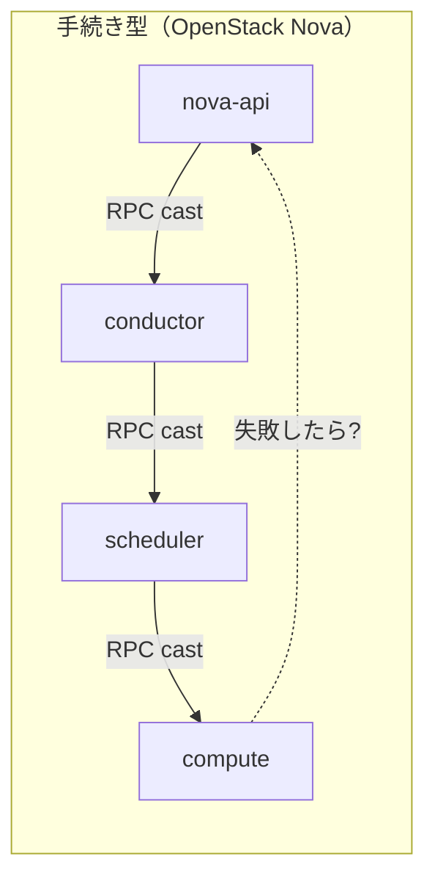
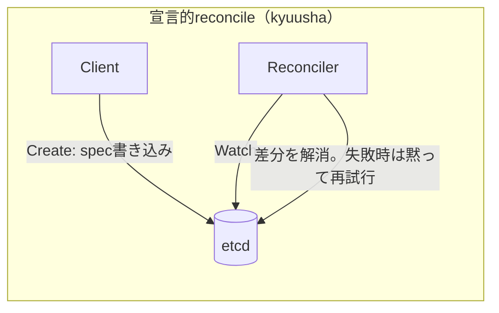

# なぜkyuushaか

`docs/architecture.md`の各所に散らばっている設計判断を1箇所にまとめたページ。
「OpenStackの構築・運用がつらい」という出発点は変えないが、その理由を
**「全部自分で実装しているから」という一枚岩の説明では終わらせない**——実際には
性質の異なる3つの原因があり、kyuushaはそれぞれに別々の対処を当てている。
同時に、OpenStackが（辛さと引き換えに）正しくやっていたことも3つあり、kyuushaは
それを引き継いでいる。各判断の詳しい経緯・議論・トレードオフはリンク先の
`docs/architecture.md`本編を参照——ここでは結論を並べる。

## OpenStackが抱えた3つの構造的な原因

「OpenStackは全部自分で実装しているから辛い」という説明は不正確ではないが粗すぎる。
実際には性質の異なる3つの原因があり、kyuushaはそれぞれに別々の対処を当てている。

### 1. 手続き型ワークフローとマイクロサービスの食い合わせの悪さ

Novaのインスタンス起動は`nova-api → nova-conductor → nova-scheduler → nova-compute`
というサービス境界をまたぐ手続き的なワークフローで、これを制御するためだけに
`taskflow`という補助ライブラリを自作する羽目になった。手続き型ワークフローは
「途中で失敗したらどこから再開するか」を呼び出し側が個別に設計する必要があり、
信頼性の低いRPC（メッセージ消失・部分失敗・バージョン不整合が常態のマイクロサービス間
通信）の上に乗せると本質的に脆くなる。同じ病理は外部APIの設計にも現れる——命令的
CRUD+ポーリングは、クライアント側にも「終わったか定期的に聞きにいく」手続き型を
強いる。

これはKubernetesのcontroller-runtimeが「宣言的desired state＋失敗したら
黙って再試行するreconcile」という設計に業界全体が収束していった理由そのもの。
kyuushaはWatch+`resource_version`+reconcileループを内部通信・外部APIの両方で
最初から採用しており、この病理を内部/外部どちらの面にも持ち込んでいない。

### 2. ストレージ/ネットワークのベンダープラグインの氾濫

Cinderは80以上のベンダー固有ドライバがそれぞれボリュームの作成/削除/エクスポートを
フルCRUDで実装し、Neutronも同様のML2プラグインエコシステムを抱える。これは
OpenStack本体の保守負荷であるだけでなく、運用者側にも跳ね返る——「OpenStackを
使っている」は実質「OpenStack + ベンダーAのストレージドライバ + ベンダーBのSDN
プラグイン」であり、組み合わせごとの枯れ具合・バグがバラバラで、プロジェクト全体を
一枚岩のテスト済みプラットフォームとして扱うことが実質的に難しい。

kyuushaはVolumeを「プロビジョニングせず参照するだけ」に境界を縮小し、抽象化の
単位をベンダードライバではなくプロトコル（iSCSI/NVMe-oF/NFS）に置くことで、
この病理を構造として持ち込まない。ネットワークもテナント＝KaaSクラスタ単位の
L2/L3分離のみに絞り、per-tenant SDNのようなベンダー領域には踏み込まない。

### 3. oslo: 標準が無かった時代の自前実装、その後も剥がせない負債

oslo.log/oslo.messaging、そしてCeilometer（MongoDB→Gnocchi→Aodh→Pankoという
迷走を経た監視基盤）は、Prometheus/OpenTelemetry/構造化JSONログが業界標準になる
**前**に、コア機能以外まで全て自前実装してしまった結果。重要なのは、これは
単なる「早すぎた」ではなく、**一度作ると後から標準へ乗り換えられない負債になる**
という点——標準が成熟した後も、Ceilometerに依存した運用者を抱えているせいで
簡単に捨てられなかった。

kyuushaがこの負債を持たないのは実力ではなく**タイミングの特権**であることは
自覚しておく。グリーンフィールドで始められたからこそ、最初からPrometheus
（pull型`/metrics`）+OpenTelemetryという既製品にそのまま乗れた。

## OpenStackから引き継ぐべき3つの強み

裏を返せば、OpenStackが辛さと引き換えに正しくやっていたこともある。kyuushaは
これらを引き継ぐ。

### 1. コアロジックの独自実装

VMのライフサイクル状態機械・スケジューラ・Quota強制ロジックのような
kyuusha固有のドメインロジックを外部プロジェクトへ委譲せず自前で持つことで、
上流プロジェクトの都合（リリースサイクル・API変更・開発停止）に進化の速度を
左右されない。OpenStackが10年以上この形を維持・拡張し続けられているのは、
コード全体にイニシアチブを握っているから。

**このプロジェクトでは個人が趣味として継続的にメンテナンスする前提**なので、
「独自実装の維持コストを誰が払い続けるか」という一般的な懸念（後述の
Flintlockの事例が示すような、組織的な後ろ盾が消えると勢いを失うリスク）は
ここでは当てはまらない——維持者と開発者が同一人物であり、外部の資金繰りに
依存しない。

### 2. 物理インフラ以外の基盤を要求しない

OpenStackはハイパーバイザー/物理マシンの上に直接構築され、それを動かすために
別のオーケストレーション基盤（例えばKubernetes）を必要としない。kyuushaも
同じ性質を持つ——後述するHarvester/KubeVirtとの比較で最も重要な差別化点になる。

### 3. マイクロサービスであること

独立したスケーリング・デプロイ・障害分離・所有境界の明確化というマイクロ
サービスの利点そのものは正しい。ただし「1. 手続き型ワークフロー」の節が
示す通り、**マイクロサービス自体は問題ではなく、その上に手続き型の制御フローを
乗せたことが問題だった**。kyuushaが「マイクロサービス＋宣言的reconcile」を
セットで採用しているのは、1番目の弱点への直接的な回答になっている。

## kyuushaの設計判断: 何を引き継ぎ、何を直したか

| OpenStackの性質 | 評価 | kyuushaでの扱い |
|---|---|---|
| マイクロサービス分割 | 引き継ぐ（3の強み） | 同様にサービス分割。ただし… |
| 手続き型ワークフロー | 直す（1の弱点） | …宣言的spec/status＋Watch+`resource_version`によるreconcileループに置き換え（内部通信・外部APIとも） |
| ベンダープラグインエコシステム | 直す（2の弱点） | Volumeは参照のみ、境界をプロトコルに縮小。ネットワークもテナント単位のL2/L3分離のみに限定 |
| oslo（自前observability基盤） | 直す（3の弱点） | Prometheus + OpenTelemetryという既製標準にそのまま乗る |
| コアドメインロジックの独自実装 | 引き継ぐ（1の強み） | VM状態機械・スケジューラ・Quota強制ロジックは自前実装 |
| 物理インフラ直上で完結 | 引き継ぐ（2の強み） | 同様。KubeVirt/Harvesterのような「動かすためにまずK8sが要る」循環参照を持たない |

## 対象読者・想定スケール

「OpenStackを導入するには大きすぎる（専任運用チームを抱えられない）が、VMwareは
一定規模からライセンスコストが厳しくなる」という間に落ちる企業の、単一組織の
社内プライベートクラウド（赤の他人同士が同居する公開マルチテナントクラウドではない）。

想定スケール（1デプロイ＝1リージョン相当）: ハイパーバイザー〜500台、VM〜1〜2万台、
テナント(KaaSクラスタ)〜500。この前提の上に、以下の全ての機能縮小判断が乗っている
（[docs/architecture.md](architecture.md)「想定するユーザー像とスケール」参照）。

## OpenStackとの機能比較表

| 領域 | OpenStackの辛さ | kyuushaの答え |
|---|---|---|
| VMのライフサイクル前提 | Novaは「VMが最終利用者に長期間ペットとして使われる」前提でライブマイグレーション等フル機能を持つ | KaaSクラスタへハイパーバイザーを供給するだけに機能を絞る。ハイパーバイザー障害の復旧はKaaS層(Pod再スケジュール)が担い、ライブマイグレーションは不要（[architecture.md](architecture.md)「コンセプト」参照） |
| ディスク永続化 | Cinderがスナップショット/レプリケーション等フル機能を持つ | 最小限。ルートディスクはイメージからのephemeral/copy-on-write、永続化が要る場合のみVolumeをattach（[architecture.md](architecture.md)「スコープ縮小の判断」参照） |
| ブロックストレージのバックエンド抽象化 | Cinderは80以上のベンダー固有ドライバがそれぞれボリュームの作成/削除/エクスポートまでフルCRUDを実装——バックエンドが増えるたびに実装コストが増える分裂したエコシステムになっている | ボリュームの作成/削除/host接続の確立は一切しない。「プロトコル（iSCSI/NVMe-oF/NFS）を抽象化の境界に置き、既存のボリュームを参照して"紐つける"だけ」に責務を縮小——実際の作成・接続はオペレータの仕事（ちょうど`/dev/kvm`と同じ、ホスト側の前提条件）。ベンダー固有ドライバが要らないので、Cinder的なドライバエコシステムそのものを持つ必要がない（[architecture.md](architecture.md)「訂正: 責務の境界を『プロビジョニング＋export』から『参照＋接続』へ縮小」、[Volume仕様](specs/volume.md)参照） |
| テナントネットワーク | Neutronがoverlay per-tenant/router/floating IP/per-tenant security policyまでフル機能を持つ | 最小限。テナント＝KaaSクラスタ単位のL2/L3分離のみ。クラスタ内Pod間の分離はCNI/NetworkPolicy層(KaaS側)の責務（同上） |
| APIエンドポイント | Keystoneのサービスカタログ方式——各コンポーネントが個別のpublic URLを持ち、クライアントがカタログを見て使い分ける | `api-gateway`という単一の公開エンドポイントに集約。認証・認可の実施点も1箇所（backendは無認証）。K8s API server/BFFパターンと同じ思想（[認証・認可仕様](specs/authn-authz.md)参照） |
| API設計・制御フロー | REST、命令的CRUD+ポーリング、手続き型のサービス間RPC（`taskflow`のような補助ライブラリが必要になるほど） | 宣言的API（spec/status分離、Watch、resource_versionによる楽観的並行性制御）を内部通信・外部APIの両方に適用。ただしKubernetes CRD/Aggregated API Serverそのものにはしない（[architecture.md](architecture.md)「スコープ縮小の判断」参照） |
| リソースの固定カタログ | Flavorという料理的比喩の間接層。実装都合の語彙で意味が読み取れない | `VirtualMachineSpec.vcpu`/`memory_mb`を直接指定。固定カタログ自体をQuotaと役割重複と判断し廃止（[architecture.md](architecture.md)「設計原則: 命名はOpenStackを踏襲しない」参照） |
| リソース命名 | Port（仮想スイッチの差し込み口という実装比喩）等、実装都合由来の用語が多い | 実態を直接表す語を選ぶ（`Port`→`NetworkInterface`等）。ただし`Volume`/`Subnet`のような業界共通語はそのまま使う（同上） |
| Web UI | Horizonは長年APIの新機能に追従できず、多くの運用者がCLI/APIを直接叩いている実態がある | 自前Web UIは作らない。CLI（`kubectl`/`terraform`的）+ 既存のPrometheusメトリクスをGrafanaで可視化（[architecture.md](architecture.md)「UI: 自前のWeb UIは作らない。CLIとGrafanaに任せる」参照） |
| テレメトリ基盤 | Ceilometerは自前基盤を一から作り、MongoDB→Gnocchi→Aodh→Pankoと分裂・作り直しを繰り返した。定期ポーリングが監視対象に負荷をかけ、RabbitMQ通知が制御プレーンの輻輳に直結した | 自前基盤は作らずPrometheus(pull型`/metrics`)+OpenTelemetryという業界標準に乗る。トレーシングは後付けでなく最初から設計に組み込む（[architecture.md](architecture.md)「Observability: OpenStack(Ceilometer)を反面教師にする」参照） |
| 外部システム連携（通知系） | RabbitMQ notificationは取りこぼしが起き得て、resumeできない | 既存のWatch（`resource_version`からの再開）で対応。取りこぼしても再開できるため専用の仕組みは不要（[architecture.md](architecture.md)「Finalizer: 外部システムによる削除ブロック」参照） |
| 外部システム連携（ゲート系） | Nova/Neutronに標準の拡張点がなく、パッチを当てるかポーリングでDBを覗く無理なやり方しかない | 削除側はKubernetesと同じ**Finalizer**パターンをそのまま借用（同上） |

## 類似プロジェクトとの比較: Harvester / Flintlock / KubeVirt

OpenStackだけでなく、「軽量なVM/マイクロVMオーケストレーション」という同じ
ニッチを狙う現行プロジェクトとの比較も置いておく。

- **KubeVirt**: Kubernetes上でVMをCRD拡張として動かす、Red Hat主導のCNCFプロジェクト。
  kyuushaが設計原則で名指しの「反面教師」にしている対象——VMのライフサイクルを
  Pod(コンテナ)のそれ、ボリュームをPVC/CDI、ネットワークをCNIへ、それぞれ
  コンテナ向けに設計された抽象へ押し込んでいる（`docs/architecture.md`
  「設計原則: KubeVirtを反面教師にする」参照）。OpenShift Virtualizationの
  投資で年々改善されており、この批判点は縮小傾向にある
- **Harvester（Rancher/SUSE）**: KubeVirt + Longhorn(分散ストレージ) + Multus(VLAN)を
  束ねたHCI基盤。想定ユーザー像（「OpenStackは大きすぎる・VMwareはライセンスが
  高い」）がkyuushaとほぼ同一で、**最も直接的な競合**。SUSEの後ろ盾でv1.5〜v1.8と
  継続的にリリースされている
- **Flintlock / Liquid Metal**: Firecracker/cloud-hypervisorのmicroVMを、
  containerdのcontent store経由でOCIアーティファクトとして配布し、Cluster API
  Provider経由でK8sノードとして供給する、技術的にはkyuushaと最も近い先行実装。
  開発元Weaveworksの倒産後はコミュニティ運営に移行し、Harvesterと比べて勢いは弱い
  ——個人/小規模チームでこの種の基盤を維持し続けることの難しさを示す実例

| 軸 | kyuusha | Harvester | Flintlock/CAPMVM | KubeVirt（単体） |
|---|---|---|---|---|
| 物理インフラ以外の基盤が必要か | **不要**（自分自身が基盤） | **必要**（K8sクラスタの上に構築） | 一部**必要**（フリート単位のオーケストレーションはCAPI＝K8s CRD） | **必要**（K8sクラスタ上のCRD拡張） |
| 制御プレーンの実体 | 自前gRPCマイクロサービス群＋宣言的Watch/reconcile | Kubernetes本体（CRD拡張） | ホスト単位は自前gRPC、フリート単位は実CAPI CRD | Kubernetes本体（CRD拡張） |
| スケジューラ | 自前実装（MostAvailableFirst） | kube-scheduler | CAPI Machineコントローラー | kube-scheduler |
| イメージ配布 | HTTP URL参照＋OCIレジストリ参照（`oras-go/v2`、2026-09-14実装） | CDI経由でLonghorn PVCへ | containerdのcontent store（OCIネイティブ） | CDI/コンテナレジストリ |
| ストレージ | プロビジョニングせず参照のみ（iSCSI/NVMe-oF/NFS） | Longhornによる実分散レプリケーション | containerdスナップショッタ（ローカルのみ） | CSI経由（バックエンド依存） |
| ネットワーク | 自前Subnet/NetworkInterfaceサービス＋VLAN/IPAM | Multus CNI | 未標準化（呼び出し側次第） | Multus CNI |
| プロジェクトの後ろ盾 | 個人（趣味として継続メンテ） | SUSE（企業、継続的リリース） | 旧Weaveworks→コミュニティ（勢い弱） | Red Hat（企業、OpenShift Virtualization） |

技術選定（イメージ管理でcontainerdではなく`oras-go/v2`を採用したこと等）は
Flintlockの設計から学んだ部分が大きい。一方で「物理インフラ以外の基盤を
要求しない」という一点は、Harvester/KubeVirtどちらに対してもkyuushaが
譲らない差別化軸になっている。

## 非ゴール（正直な線引き）

上記はいずれも「想定スケール・想定ユーザー」という前提の上での判断であり、OpenStackを
全面的に置き換えることを目指したものではない。以下は意図的にスコープ外:

- 赤の他人同士が同居する公開マルチテナントクラウド（テナント分離の脅威モデルが違う）
- 数千ハイパーバイザー・10万VM超のような1桁上のスケール（スケジューラのキャッシュ/インデックス戦略、DBシャーディング等、別の前提の見直しが要る）
- OpenStackが持つドライバ/プラグインの広いエコシステム（ネットワークバックエンド等の選択肢の広さ）。ただしブロックストレージについては、広いドライバエコシステムが要らないこと自体が上表の設計判断——非ゴールというより意図的な回避

詳しい経緯・議論・トレードオフは[docs/architecture.md](architecture.md)を、現状の
機能単位の仕様は[docs/specs/](specs/README.md)を参照。
